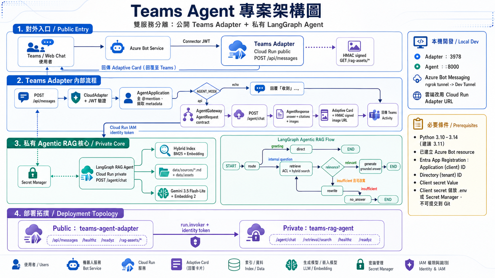

# Teams Agent Backend

> English (this page) | [繁體中文](./README-TW.md)

This is an **internal enterprise IT assistant POC** that runs in Microsoft Teams, built with Python,
[Microsoft Teams SDK](https://microsoft.github.io/teams-sdk)
(`microsoft-teams-apps`), and LangGraph. Colleagues can ask questions in a channel or 1:1 chat, and the system will:

1. Decide whether the question is IT-related and split it into at most three independent Issues
2. Prefer FAQ hits; otherwise run Hybrid RAG over internal knowledge and attach sources / images
3. Ask follow-up questions when information is missing; when it cannot resolve the issue, create or query a ticket after explicit confirmation
4. Persist conversation context and collect 👍 / 👎 feedback

Teams Adapter, LangGraph Workflow, Hybrid RAG, Mock Ticket, Firestore conversation
persistence, progress streaming, and GCP Cloud Run deployment are all complete. See the spec in
[`teams_agent_requirement_architect_revised.md`](teams_agent_requirement_architect_revised.md);
acceptance mapping is in [`docs/poc-acceptance-checklist.md`](docs/poc-acceptance-checklist.md).

> **2026-08 architecture change: Microsoft 365 Agents SDK → Microsoft Teams SDK.**
> The group has no Azure Subscription and cannot create an Azure Bot Service resource, so
> the Teams Adapter now uses the Microsoft Teams SDK, and bot registration is done in the [Teams Developer
> Portal](https://dev.teams.microsoft.com/apps)—only an Entra ID
> app registration is required (included with Microsoft 365 licensing); no Azure subscription is needed.
> The three `CONNECTIONS__SERVICE_CONNECTION__SETTINGS__*` environment variables have been replaced by
> `CLIENT_ID` / `CLIENT_SECRET` / `TENANT_ID`.
> See [`docs/teams-app-setup.md`](docs/teams-app-setup.md).
> Later sections of this document still retain a few acceptance notes from the earlier Azure Bot
> period for historical context; current setup and test flows follow this section, sections 1 and 2, and `docs/teams-app-setup.md`.

```text
使用者：vpn無法連線
Bot：依知識庫回覆排除步驟 + 來源引用（可附圖）+ 👍/👎
```

Service endpoints:

| Service | Port | Access | Description |
| :--- | :--- | :--- | :--- |
| **AI Ops Console** | `8092` | Public / Ops | **Primary Unified Operations Portal & BFF** (Native UI, Bento Grid metrics, Closed-Loop Ops) |
| **Teams Adapter** | `3978` | Public / Teams | Microsoft Teams SDK Messaging Endpoint (`/api/messages`) & Adaptive Card renderer |
| **Agent Service** | `8000` | Private / Internal | LangGraph Workflow main entry (`/agent/chat`), Hybrid RAG, & Evaluation engine |
| **Knowledge Portal** | `8091` | Loopback Only | Internal Headless Knowledge Engine (Bridged directly into Port `8092`) |
| **Mock Ticket** | `8090` | Internal / Test | Local Mock Service Desk Ticket System |
| **Agents Playground** | `3979` | Internal / Test | Web Chat Testing Interface with Knowledge Backend Switcher (`/login`) |

Detailed endpoints by service:

- **AI Operations Console (Port 8092; Unified Operations Entrypoint & BFF)**:
  - `GET /`: AI Operations Console Web UI (Double-Bezel hardware architecture, Bento Grid metrics, native DOM components)
  - `POST /api/quality-cases/*`: Quality Case closed-loop management (triage candidates, merge, link content, observation, lifecycle transitions)
  - `POST /api/knowledge/*`: BFF bridge for native knowledge document operations (draft, review, publish, rollback)
  - `GET /api/governance/*`: Prompts, Models, Feature Flags, Roles, Retention, Masking, Search & Audit
  - `POST /api/exports`: Async background report generation (CSV / XLSX)

- **Teams Adapter (Port 3978; public webhook)**:
  - `POST /api/messages`: Messaging endpoint registered by the Teams SDK (Bot Framework JWT verified by SDK)
  - `GET /healthz`: Health check for deployment platforms
  - `GET /readyz`: Readiness check for Teams credentials and Agent mode
  - `GET /rag-assets/{path}`: Signed, protected source images (loaded by Teams clients)

- **Agent Service (Port 8000; private; called by Adapter and Backoffice)**:
  - `POST /agent/chat`: LangGraph Workflow main entry
  - `POST /agent/chat/stream`: Same as above, with SSE progress updates
  - `POST /feedback`: Records 👍 / 👎 feedback (spec §14)
  - `POST /retrieval/search`: Retrieval-only debug endpoint
  - `GET /healthz` / `GET /readyz`: Health check and index readiness check

- **Knowledge Portal (Port 8091; internal loopback)**:
  - Headless knowledge repository and document governance engine, consumed natively via the BFF on port 8092.

- **Mock Ticket Service (Port 8090)**:
  - `GET /`: Web UI for simulating and querying service desk incident tickets.

- **Agents Playground (Port 3979)**:
  - `GET /login`: Web test chat interface with knowledge-backend selector (`HYBRID` vs `GEMINI_FILE_SEARCH`).

> **After deployment, verify the service with `/readyz`, not `/healthz`.** Requests to `/healthz` on the Cloud Run
> service from the corporate network return Google's 404 error page, and the response has no
> `x-cloud-trace-context` or `server: Google Frontend` headers—meaning the path is intercepted
> before it reaches Cloud Run, so the request never enters the container. The same binary returns 200 for `/healthz`
> in local tests, and the existing online `teams-rag-agent` shows the same symptom, so this is environment-layer behavior rather than
> an application defect (verified 2026-08-06). `/readyz` is unaffected and additionally reports the loaded chunk count.
> Cloud Run's default container health check uses TCP and is not affected.

## Project status

As of 2026-09-04:

- **AI Operations Console & Knowledge Portal Consolidation (Phases 1–3 Complete)**:
  - Unified operational web portal (`http://127.0.0.1:8092/`) providing three major role-based workspaces: **Knowledge Ops** (`knowledge_ops`), **AI Ops** (`ai_ops`), and **Platform Ops** (`platform`).
  - **Native Component Architecture**: Completely replaced iframe containers with native DOM component views for seamless navigation, instant state hydration, and deep hash linking (`#/knowledge_ops/knowledgePortal`).
  - **High-End Visual Design System**: Modernized interface featuring Double-Bezel cards, machined 3D branding, Bento Grid dashboards with `tabular-nums` tabular alignment, semantic status badge pills, responsive table scroll-boxes with sticky headers, and structured audit logs.
  - **Closed-Loop Quality Operations**: Validated candidate triage & merge → Quality case creation → Native knowledge document draft/edit → Evaluation & conversation verification → Case lifecycle transitions (`NEW` → `TRIAGED` → `IN_PROGRESS` → `WAITING_REVIEW` → `OBSERVING` → `RESOLVED`).
  - **Evaluation Harness & Governance**: Fully automated benchmark evaluations, reproducible quality gates, prompt canary releases, and model fallback simulations.
  - Comprehensive test suite passing: 54 backoffice unit/integration tests and 35 acceptance/portal tests passing with 100% success.
- **Teams Adapter & Core Agent**:
  - Teams Adapter moved to Microsoft Teams SDK with bot registration managed in Teams Developer Portal.
  - LangGraph Workflow covers: conversation context, Issue extraction, IT classification, FAQ, follow-up questions, Hybrid RAG, ticket confirmation flow, Deterministic Response Builder, and Feedback.
  - Single-command orchestration via `./start.sh` launches all 6 local services cleanly.

GCP Cloud Run (from 2026-07-30, with ongoing redeploys):

- Teams Adapter: `https://teams-agent-adapter-jt7pjdeeoa-de.a.run.app`
- Private Agent: `https://teams-rag-agent-jt7pjdeeoa-de.a.run.app`
- Region: `asia-east1` / Project: `itr-aimasteryhub-lab`
- Adapter → Agent: Cloud Run IAM identity token
- Conversation persistence: Firestore (`CONVERSATION_REPOSITORY_MODE=FIRESTORE`)
- Secrets: API Key, Bot client secret, image signing key → Secret Manager
- Optional: Agents Playground / Mock Ticket short-lived test environments (see `deploy/`)

Local development path:

```text
Teams／simulate_teams／Devtools
→ HTTPS Dev Tunnel（或 localhost）
→ POST /api/messages
→ Microsoft Teams SDK Adapter
→ AGENT_MODE=api 時呼叫 Agent Service
→ LangGraph Workflow（FAQ／RAG／工單…）
→ Adaptive Card（答案 + 來源 + 圖片 + 👍/👎）
```

Cloud path (Adapter / Agent already deployed; becomes the production entry once the bot endpoint is switched):

```text
Teams
→ Bot Framework 服務（Teams Developer Portal 註冊）
→ Public Cloud Run Teams Adapter
→ Cloud Run IAM identity token
→ Private Cloud Run LangGraph Agent
→ Gemini 3.5 Flash-Lite + Embedding 2 hybrid retrieval
→ Answer + citation + signed source image + feedback
```

### Completed (summary)

AI Operations Console & Knowledge Portal (Phases 1–3):

- [x] Unified AI Operations Console (`:8092`) with 3 role workspaces (`knowledge_ops`, `ai_ops`, `platform`)
- [x] Native Component Architecture (100% native DOM embedding for Knowledge Portal, zero iframes)
- [x] High-End Visual Design System (Double-Bezel cards, Bento Grids, semantic badge pills, responsive tables)
- [x] Quality Case closed loop (Candidate merge → Case creation → Native draft/edit → Verification → Resolution)
- [x] Prompt versioning, canary evaluation, model allowlist & fallback simulation
- [x] Multi-dimensional cost analytics, budget policies, and alert routing
- [x] Dual-track audit logs (Operations + Governance) with structured payload inspection and export
- [x] Evaluation Harness with quality gates, scoring improvements, and test datasets

Communications and deployment:

- [x] Python 3.11 + `uv`, Dockerfile, unit / integration tests, Ruff
- [x] Microsoft Teams SDK Adapter (`CLIENT_ID` / `CLIENT_SECRET` / `TENANT_ID`)
- [x] `POST /api/messages`, `/healthz`, `/readyz`, `/rag-assets/*`
- [x] Echo / API dual modes, timeout / error degradation, correlation / trace ID
- [x] Dev Tunnel local connectivity; Teams app package upload and channel end-to-end
- [x] Cloud Run dual services, IAM, Secret Manager
- [x] 1:1 DM progress streaming (`/agent/chat/stream` SSE); channels use a single reply

Agent Workflow (spec §4–§14):

- [x] Conversation (MEMORY / FILE / FIRESTORE) with timeout and multi-turn follow-ups
- [x] Issue Extractor (up to 3 issues), IT / non-IT classification
- [x] FAQ fixed answers (no LLM call)
- [x] Hybrid RAG (BM25 + embedding), ACL, citation, source-image Adaptive Card
- [x] No fabrication without knowledge; HMAC-signed images, path protection, Teams size optimization
- [x] Tickets require explicit confirmation; HTTP Ticket Adapter + local / cloud Mock Ticket
- [x] Query the current user's own tickets; Feedback 👍 / 👎
- [x] Token / cost estimates written to backend logs; Retrieval A/B, security, and performance reports (`docs/`)

### In progress / TODO

- [ ] Switch the Teams Developer Portal bot endpoint to the Cloud Run Adapter and re-test in the cloud
- [ ] On the next deploy, apply Agent SA `roles/datastore.user` (Firestore takes effect in production)
- [ ] Connect a real ticket system (POC may keep Mock / DISABLED; Production Ticket is not a required acceptance item)
- [ ] Wire read-only internal API tools (Milestone 5)
- [ ] Production monitoring / alerting, FAQ evaluation set, and formal citation URL mapping

## Architecture

Two-service split: the public Teams Adapter handles Bot communications, streaming progress, image signing, and
Adaptive Cards; the private LangGraph Agent handles conversation, Issues, FAQ, knowledge retrieval, and tickets.



Locally: Adapter `:3978`, Agent `:8000`, with the bot endpoint pointing at a Dev Tunnel.
In the cloud: replace the tunnel with the Cloud Run Adapter URL. Answers can include citations and source images;
the Adapter signs relative paths into short-lived URLs, resizes thumbnails into Adaptive Cards, and can attach Feedback
buttons.

### Architecture decisions and constraints (spec §2.1, §3.2, §3.3)

These constraints are existing, reviewed architecture decisions—not unfinished gaps. Later development should not overturn them
without new evidence:

- **Do not rewrite language / framework on assumptions**: This project stays on Python and LangGraph. Whether to switch languages
  or frameworks must be decided from load-test results, confirmed capability gaps, operational capacity, or SDK support—
  not merely because “another language might be better for concurrency.”
  The 2026-08 move from Microsoft 365 Agents SDK to Microsoft Teams SDK is an example that follows this
  principle: not an assumption, but a confirmed blocking constraint—the group has no Azure Subscription and
  cannot create the Azure Bot Service resource that Agents SDK depends on. Language (Python),
  Agent Service, LangGraph, and the Cloud Run architecture were unchanged; the change was limited to the thin
  communication layer in `src/teams_agent/`.
- **Hybrid RAG remains the default**: `KNOWLEDGE_SERVICE_MODE=HYBRID`
  (`HybridKnowledgeService`) is the default and only formal knowledge backend.
  `GeminiFileSearchKnowledgeService` (`KNOWLEDGE_SERVICE_MODE=GEMINI_FILE_SEARCH`)
  is currently for technical Spike use only (see
  [`docs/gemini-file-search-spike.md`](docs/gemini-file-search-spike.md));
  it may become the default only after a Retrieval A/B Test (spec §18.7) proves a clear advantage in
  quality, cost, or operations.
- **External capabilities always go through interfaces**: Knowledge Service, Conversation Repository,
  Ticket Service, and User Directory Service are all wrapped by Protocol/Interface
  (see `agent_service/src/agent_service/{knowledge,conversation,ticket}.py`
  and `src/teams_agent/directory.py`). The LangGraph Workflow must not depend directly on a specific
  database, retrieval product, or ticket system.
- **POC phase does not pre-build future platform capabilities**: Do not build a full Issue Repository, full
  case lifecycle, ticket escalation platform, FAQ / knowledge-base admin console, Multi-Agent Framework,
  Approval Framework, or formal HA / disaster-recovery mechanisms. Leave those until after the POC validates business
  value, then evaluate against real needs.

## 1. Prerequisites

- Python 3.11–3.13 (Microsoft Teams SDK requires `>= 3.11`)
- An Entra ID app registration (included with Microsoft 365; **no Azure subscription required**)
- Bot configuration completed in the [Teams Developer Portal](https://dev.teams.microsoft.com/apps),
  with the messaging endpoint pointing at this service's `/api/messages`
- From that app registration:
  - Application (client) ID → `CLIENT_ID`
  - Directory (tenant) ID → `TENANT_ID`
  - Client secret **Value** → `CLIENT_SECRET`

**Not required**: Azure Subscription, Azure Bot Service resource, Azure Portal.
Full steps are in [`docs/teams-app-setup.md`](docs/teams-app-setup.md).

Keep the client secret only in local `.env` or cloud Secret Manager; never commit it to Git.

## 2. Local setup

Use `uv`. The repo root and Agent Service each have their own environment:

```bash
uv sync --extra dev
cp .env.example .env
cd agent_service && uv sync --extra dev && cp .env.example .env && cd ..
cp -r data/sources.sample data/sources   # 見下方說明
```

`data/sources/` holds real internal company knowledge documents and is gitignored, so a freshly cloned
repo has no corpus and Agent Service will fail to start. `data/sources.sample/` provides sample
corpus so local development can run immediately; replace it by putting real documents into `data/sources/` when you have them.

Edit `.env`:

```dotenv
CLIENT_ID=<Application (client) ID>
CLIENT_SECRET=<Client secret Value>
TENANT_ID=<Directory (tenant) ID>
PORT=3978
AGENT_MODE=echo
```

To verify RAG, also confirm that `agent_service/.env` uses the default `HYBRID` retrieval mode, and leave
`RAG_MODEL` and `RAG_EMBEDDING_MODEL` empty to use local mode that needs no external API key.
To test Gemini generation and embeddings, configure the model and API key per
[`agent_service/README.md`](agent_service/README.md).

Start:

```bash
uv run teams-agent
```

Or from the project root, start all local services in one go:

```bash
./start.sh
```

This single command orchestrates:
1. **AI Operations Console (`:8092`)**: The primary web entrance (`http://127.0.0.1:8092/`) with Knowledge Ops, AI Ops, and Platform Ops.
2. **Teams Adapter (`:3978`)**: Microsoft Teams SDK bot endpoint and webhook handler.
3. **Agent Service (`:8000`)**: LangGraph workflow, Hybrid RAG, and Evaluation engine.
4. **Knowledge Portal (`:8091`)**: Internal loopback knowledge engine (BFF-bridged).
5. **Mock Ticket Service (`:8090`)**: Local incident ticket system.
6. **Agents Playground (`:3979`)**: Local web chat testing interface (`http://127.0.0.1:3979/login`).

If Dev Tunnel is already running in another terminal:

```bash
START_TUNNEL=false ./start.sh
```

`Ctrl+C` stops all child processes started by the script. If any port is already occupied by an old process, the script stops first and tells you which service to close manually.

`start.sh` also launches the local Agents Playground with the knowledge-backend selector.
For Gemini File Search it first respects shell environment variables and
`agent_service/.env` values for `GEMINI_FILE_SEARCH_STORE`, `GOOGLE_API_KEY`
(or `GEMINI_API_KEY`). If the store is unset, it uses the same store as the
existing Cloud Run deployment. When no local API key is available but `gcloud`
is authenticated, the script securely loads the existing Secret Manager value
into the Agent child process without printing it. If that is unavailable, it
warns and keeps HYBRID running. You can also configure it explicitly:

```bash
GEMINI_FILE_SEARCH_STORE=fileSearchStores/helpdeskstore-1p3gu83qot1s \
GOOGLE_API_KEY=<secret> \
./start.sh
```

When that Google key is available and neither the shell nor
`agent_service/.env` sets `RAG_MODEL`, the script enables
`google_genai:gemini-3.5-flash-lite` as the local agentic model. This gives
the issue extractor, relevance grader, and handoff semantic router a model;
it does not rewrite `.env`, and any explicit `RAG_MODEL` wins. Without a
Google key, the no-external-model extractive-local mode remains available.

When the shared legacy store lacks ACL metadata that can be matched to the
local Playground identity, the no-tunnel Playground defaults to no metadata
filter, matching the existing Cloud Run configuration. A shell
`GEMINI_FILE_SEARCH_ENFORCE_ACL` setting always wins. If
`agent_service/.env` leaves the store blank, its copied template value of
`true` is treated as a placeholder so the legacy fallback can actually query;
to enforce filtering locally, explicitly set `true` in the shell, or set both
the store and ACL value in `.env`. If `START_TUNNEL=true` is enabled without
an explicit setting, the safe default remains `true`.

Without Teams, Azure, or devtunnel, you can still run one full conversation round (including the message the Bot would send):

```bash
uv run python scripts/simulate_teams.py                     # Echo 模式
uv run python scripts/simulate_teams.py \
    --agent-url http://localhost:8000/agent/chat            # 完整 RAG + 串流
```

Before a RAG simulation, start Agent Service in another terminal:

```bash
cd agent_service
uv run rag-agent
```

Confirm RAG readiness and run the smoke test:

```bash
curl http://localhost:8000/readyz
cd ..
uv run python scripts/simulate_teams.py \
  --agent-url http://localhost:8000/agent/chat
```

On success, readiness shows loaded `chunks` and `retrieval: "hybrid"`, and the simulator should finally print
`OK`. This test validates the full local path Adapter → Agent Service → RAG → Teams activity.

Acceptance order and checkpoints are in
[`docs/teams-app-setup.md` §5.5](docs/teams-app-setup.md).

Confirm health and readiness endpoints:

```bash
curl http://localhost:3978/healthz
curl http://localhost:3978/readyz
```

Expected results:

```json
{"status": "ok"}
{"status": "ready", "agentMode": "echo", "teamsAuth": "ready", "ragImages": "disabled"}
```

`teamsAuth` as `not_configured` (`/readyz` returns 503) means `.env` is missing
`CLIENT_ID` / `CLIENT_SECRET`, so the Teams SDK cannot verify incoming Bot Framework JWTs.

`POST /api/messages` is JWT-verified by the Teams SDK, so ordinary `curl` cannot
simulate a full Bot Activity. For local testing without credentials, you may temporarily set
`DANGEROUSLY_ALLOW_UNAUTHENTICATED_REQUESTS=true`—**local only**;
never use it on Cloud Run.

### Local logs

While `uv run teams-agent` stays running, Teams / Web Chat requests appear in the terminal:

```text
INFO teams_agent.agent Message received:
request_id=<uuid> channel=msteams conversation=<conversation-id>

POST /api/messages HTTP/1.1 200
```

Logs intentionally do not record the user's full question, Bot answer, Client Secret, or API Token.
Each request keeps request ID, channel, and conversation ID for troubleshooting.

Log level can be set in `.env`:

```dotenv
LOG_LEVEL=INFO
```

Temporarily switch to `DEBUG` for more local debug detail; restart the Bot after changing it.
The Dev Tunnel inspect URL can show HTTP traffic, but never share Authorization headers from it.

## 3. Connect Teams to local

During development you can use Microsoft Dev Tunnels or another tunnel that provides public HTTPS:

```bash
devtunnel user login -e
devtunnel host -p 3978 --allow-anonymous
```

Use the `Connect via browser` URL shown by the CLI; do not use the inspect URL or tunnel ID.
After you have the tunnel HTTPS URL, configure it in Teams Developer Portal:

```text
https://dev.teams.microsoft.com/apps
→ 選擇你的 app
→ App features → Bot
→ Endpoint address
→ https://<tunnel-domain>/api/messages
```

Save, then sideload the app package into Teams (see
[`docs/teams-app-setup.md`](docs/teams-app-setup.md)), @mention the Bot in a channel,
or open a 1:1 chat and send `hello`. On success the Bot should reply:

```text
收到：hello
```

During local testing you must keep both processes running:

```text
Terminal 1：uv run teams-agent
Terminal 2：devtunnel host -p 3978 --allow-anonymous
```

### Common errors

`Invalid audience` means the `CLIENT_ID` in `.env` does not exactly match the bot App ID in Teams Developer Portal.
Check carefully for extra characters, leading characters, and copy/paste mistakes; then
restart the backend after fixing.

Seeing 401 / `Method Not Allowed` when opening `/` or `/api/messages` directly in a browser
is expected. Browsers can only check `/healthz` and `/readyz` directly; `/api/messages`
must be called with `POST` and a Bot Framework JWT.

## 4. Agent modes

### Echo mode

Use during development and Teams connectivity validation:

```dotenv
AGENT_MODE=echo
```

This mode does not call external AI:

```text
hello → 收到：hello
```

### API mode

This project already provides a LangGraph Agent Gateway under `agent_service/`. After starting it, set:

```dotenv
AGENT_MODE=api
AGENT_API_URL=https://<agent-gateway-domain>/agent/chat
AGENT_API_TOKEN=<internal-service-token>
AGENT_API_TIMEOUT_SECONDS=10
```

Non-localhost `AGENT_API_URL` values must use HTTPS. Keep tokens only in `.env`,
Secret Manager, or Key Vault—never in code or Git.

Request sent by the Teams Adapter:

```json
{
  "requestId": "uuid",
  "channel": "msteams",
  "conversation": {
    "tenantId": "tenant-id",
    "teamId": "team-id",
    "channelId": "channel-id",
    "conversationId": "conversation-id"
  },
  "user": {
    "teamsUserId": "teams-user-id",
    "entraObjectId": "entra-object-id",
    "displayName": "Justin"
  },
  "message": {
    "text": "如何申請 API Key？",
    "locale": "zh-TW"
  }
}
```

Minimal Agent Gateway response:

```json
{
  "answer": "請至內部平台提出申請。",
  "traceId": "trace-uuid",
  "citations": [
    {
      "title": "API Key 申請流程",
      "url": "https://internal.example/docs/api-key",
      "chunkId": "chunk-8"
    }
  ],
  "images": [
    {
      "path": "大州系統_功能無法點選/p01.png",
      "title": "大州無法點選 — IE 安全性調整",
      "altText": "IE 安全性設定畫面",
      "sourceChunkId": "chunk-8"
    }
  ]
}
```

If the Agent API times out, fails to connect, or returns a bad payload, Teams receives a friendly degraded message plus
the request trace ID.

### RAG image Adaptive Card

Source Markdown uses relative image syntax:

```markdown

```

The Agent Gateway returns only validated relative image paths; the Teams Adapter creates a one-hour
HMAC signed URL, resizes the image so the longest side is 1024 pixels, caps size at 1 MB, then places it in an
Adaptive Card. Root `.env` needs:

```dotenv
BOT_PUBLIC_BASE_URL=https://<目前的-3978-dev-tunnel-domain>
RAG_ASSET_DIR=./data/sources/assets
RAG_ASSET_SIGNING_KEY=<至少 16 字元的隨機值>
RAG_ASSET_URL_TTL_SECONDS=3600
RAG_ASSET_MAX_DIMENSION=1024
RAG_ASSET_MAX_BYTES=1000000
```

Generate a development signing key:

```bash
openssl rand -hex 32
```

`BOT_PUBLIC_BASE_URL` is domain only—do not append `/api/messages`. When the Dev Tunnel URL
changes, update it and restart the Teams Adapter. `GET /readyz`
`ragImages` should be `ready`. Expired image signed URLs cannot be read again; in production put the
signing key in Secret Manager or Key Vault.

### 4.3 Progress streaming

When `AGENT_MODE=api`, the Adapter calls Agent Service
`POST /agent/chat/stream` (SSE) and shows LangGraph node progress to the user in real time,
so they do not wait for the whole workflow to finish before seeing the first update:

```text
已收到你的問題…
正在理解你的問題…      ← Load Conversation 完成
正在確認問題類型…      ← Extract Issues 完成
正在檢索知識庫…        ← Filter IT Issues 完成（最耗時的一段）
正在整理答案…          ← Process Issues 完成
[Adaptive Card 最終答案 + 來源 + 👍/👎]
```

**Only works in 1:1 DMs.** The Teams platform does not support streaming messages in channels or group chats; the Adapter
first checks `conversation.conversationType`, and for anything other than `personal` uses the original single-reply
path (no extra failed round-trip). This project's `defaultInstallScope` is `team`,
so **most channel traffic will not stream**—that is a Teams limitation, not a configuration issue.

Other behavior:

- The final Adaptive Card is the streaming closing message. Teams only allows attachments on the **last**
  streaming message, so progress text is cleared and replaced by the card rather than stacked underneath.
- If streaming fails mid-way, the user always gets something: Teams rejects streaming → fall back to a normal reply;
  Agent Service reports an error → show the standard error message and trace ID; user presses Stop or
  exceeds Teams' two-minute streaming limit → keep already-shown content and do not answer again.
- Answer content is **identical** to `POST /agent/chat`; streaming only changes *when* the user sees it,
  not *what* they see.
- `AGENT_STREAMING_ENABLED=false` turns streaming off entirely and returns to single-reply behavior.

> **Why “stages” instead of token-by-token streaming.** Spec §5.3 requires the Response
> Builder to be a pure string template with no LLM calls; the answer is already produced by FAQ /
> Knowledge Service before it reaches the builder—so by the time `final_response` is formed there is no
> token stream left to forward. What users actually wait on is Issue extraction and knowledge retrieval, which
> is exactly what these stages cover. True token streaming would require rewriting Knowledge
> Service grounded-answer generation (and redesigning output order for concurrent multi-issue cases),
> which is a separate topic.

## 5. Agent Service Workflow (LangGraph, spec §5)

`agent_service` `/agent/chat` is handled by a LangGraph Workflow
(`AgentWorkflow` in `agent_service/src/agent_service/workflow.py`),
replacing a single one-shot RAG call:

```text
Teams Message
      │
      ▼
Load Conversation      -- ConversationService：載入/建立 conversation，
      │                    套用 CONVERSATION_TIMEOUT_HOURS 逾時判斷
      ▼
Extract Issues          -- IssueExtractor：一次訊息最多拆解
      │                    MAX_ISSUES_PER_MESSAGE（預設 3）個獨立 Issue
      ▼
Filter IT Issues        -- 非 IT 問題不送入知識庫；混合訊息中的 IT
      │                    Issue 仍會個別處理
      ▼
Process Issues          -- 每個 IT Issue 依 route 並行處理（asyncio.gather，
  ├─ FAQ                   一個 Issue 失敗不阻塞其他 Issue，見 §4.2）：
  ├─ Ask More Info           FAQ         → FaqService（純查表，不呼叫 LLM）
  ├─ Knowledge Search         Ask More Info → 最多追問
  └─ Ticket Operation           MAX_MISSING_INFO_PER_ISSUE（預設 2）項
      │                       Knowledge Search → KnowledgeService（Hybrid RAG
      │                         或 Gemini File Search spike）
      │                       Ticket Operation → TicketService（需明確確認）
      ▼
Deterministic Response Builder
      │                    -- response_builder.py：純 Python template 組
      │                       裝多 Issue 回覆，不再呼叫 LLM（不重寫段落、
      │                       不改寫來源、不潤飾工單結果，見 spec §5.3）
      ▼
Save Conversation       -- 寫回本輪訊息與 Issue 結果
      │
      ▼
Teams Response
```

### Swappable service interfaces (spec §3.2)

The LangGraph Workflow does not depend directly on any concrete database, retrieval product, or ticket system; implementations are
injected through the interfaces below so they can be replaced later:

| Capability | Interface / module | Current implementation | How to switch |
|---|---|---|---|
| FAQ | `agent_service/src/agent_service/faq.py` | `FaqService` (pure lookup from `FAQ_PATH` JSON) | Edit `data/faq.json` |
| Knowledge Service | `agent_service/src/agent_service/knowledge.py` | `HybridKnowledgeService` (BM25 + embedding, default) / `GeminiFileSearchKnowledgeService` (spike; see below) | `KNOWLEDGE_SERVICE_MODE=HYBRID` \| `GEMINI_FILE_SEARCH` |
| Conversation Repository | `agent_service/src/agent_service/conversation.py` | `MEMORY` (in-process, local default) / `FILE` (JSON files) / `FIRESTORE` (managed; used on Cloud Run) | `CONVERSATION_REPOSITORY_MODE=MEMORY` \| `FILE` \| `FIRESTORE` |
| Ticket Service | `agent_service/src/agent_service/ticket.py` | `DISABLED` / `HTTP` (calls internal ticket API) | `TICKET_SERVICE_MODE=DISABLED` \| `HTTP` |
| User Directory Service | `src/teams_agent/directory.py` (Teams Adapter side) | `disabled` (no Graph lookup) / `graph` (`GET /users/{id}`) | `USER_DIRECTORY_MODE=disabled` \| `graph` |

### Conversation persistence: why Cloud Run must use Firestore (spec §10.3)

The code default is `MEMORY`, which is fine for local development and tests, but on Cloud Run it directly
breaks the “continuous Q&A / user follow-up info / ticket confirmation” required by spec §10.1:

- Cloud Run **scale-to-zero**: when an instance is reclaimed, in-memory conversations disappear;
  when the user returns with more information, the system no longer remembers the previous turn.
- Cloud Run allows up to **3 instances**: consecutive turns of the same conversation may land on different
  instances. They share neither memory nor local disk, so `FILE` mode cannot save you either—this is not
  “only broken after restart”; every turn can break.

Therefore `deploy/deploy-gcp.sh` always uses `FIRESTORE` in the cloud. Reasons for choosing Firestore over
Redis or PostgreSQL (matching the selection criteria in spec §10.3):

| Consideration | Firestore | Memorystore/Redis | Cloud SQL |
|---|---|---|---|
| Cloud Run network reachability | Direct; no VPC connector | Needs VPC connector | Needs connector or VPC |
| scale-to-zero cost | Pay for what you use | Always-on instance billing | Always-on instance billing |
| Data retention | Native TTL policy | Native TTL | Custom cleanup required |
| Operational complexity | No schema migration | None | Must manage schema |

The Workflow itself did not change: all three modes sit behind the same `ConversationRepository`
Protocol (spec §3.2), and **the same behavior tests are parametrized across all three
implementations** to keep them consistent. Firestore tests are driven by an in-process Fake client—no
network, no credentials.

Key points:

- **Timeout and TTL are separate.** `CONVERSATION_TIMEOUT_HOURS` is enforced by the application on every read
  via `lastActivityAt`; it does not depend on TTL having already run. TTL only controls
  retention so the store does not grow forever.
- **Appending messages is not read-modify-write.** Each message is its own document; two
  instances writing at once will not overwrite each other.
- Document structure, ordering guarantees, and concurrency rationale are in the
  `FirestoreConversationRepository` docstring in
  `agent_service/src/agent_service/conversation.py`; GCP database, TTL, and IAM
  settings are in [`deploy/README.md`](deploy/README.md).

To use Firestore mode locally, install the optional extra:

```bash
cd agent_service
uv pip install '.[firestore]'
```

### Retrieval A/B Test: Hybrid vs. Gemini File Search (spec §18.7)

Whether `KNOWLEDGE_SERVICE_MODE` should be `HYBRID` or `GEMINI_FILE_SEARCH` is not decided by impression; run the same
30-case evaluation set (`data/eval/retrieval_eval_set.json`) through both backends and compare every metric listed in spec §18.7.
Below are **measured** results from 2026-08-07 against a freshly created, delete-after-use Gemini File Search store (all 19 corpus documents
uploaded). Full method, raw output, and honest limitations are in
[`docs/retrieval-ab-test-report.md`](docs/retrieval-ab-test-report.md); only conclusions are listed here.

| Metric | Hybrid (default) | Gemini File Search |
|---|---|---|
| Answer / Recall@K / Groundedness / Citation / No-answer / Error-code Accuracy | 100% | 100% |
| Image Match Accuracy | 100% (3/3) | 100% (3/3) |
| ACL Accuracy (30-case field) | 100% (2/2) | 100% (2/2)—**this field has no discriminative power for either backend**; see note below |
| P50 / P95 Latency | **3.00s / 4.07s** | 5.71s / 7.15s |
| Avg cost / query | **US$0.001059** | US$0.001804 |
| Avg LLM calls / query | 2.17 | 1.00 |

All eight quality metrics are 100% on both sides; charting that would be noise—the table already shows the tie clearly. The only real gaps
worth comparing visually are latency and cost, so only those two are charted:

```mermaid
xychart-beta
    title "Latency comparison (seconds; lower is better)"
    x-axis ["P50", "P95"]
    y-axis "seconds" 0 --> 8
    bar "Hybrid" [3.00, 4.07]
    bar "Gemini File Search" [5.71, 7.15]
```




**Why the ACL field's 100% cannot be taken at face value**: both ACL cases in the eval set now expect a hit, because every document in the current corpus
is `audience: all-employees` (see the governance decision in
[`docs/knowledge-document-governance.md`](docs/knowledge-document-governance.md)).
A backend that does not check permissions at all would also score 100% on those two items, so this number cannot compare whose ACL is
better. Real ACL verification is a separate probe (`scripts/acl_verification.py`: upload one synthetic restricted document and
one public document to a delete-after-use store, then query as permitted / denied users)—the result is that the Gemini adapter's
permission filter **does work** (permitted users see content; denied users do not, and answers do not leak content). That only proves “the mechanism
itself works,” not “access control over the current 19 public corpus documents was exercised,” because today they are all public. Detailed
results are in report section 2.3.

**Decision: keep `KNOWLEDGE_SERVICE_MODE` as `HYBRID` (default).** For business stakeholders, the reason fits in one
sentence: **answer quality is tied, but Hybrid is nearly 2× faster, ~40% cheaper per query, and has no extra operational burden** (Chinese
filenames need an extra conversion layer; image mapping only works at document level; interrupted uploads need manual checks for duplicate documents).
No metric makes Gemini File Search win enough over Hybrid to justify those costs, so keep the status quo—no extra
decision or approval needed.

### Configuring FAQ (spec §7)

FAQ is only for high-frequency questions with fixed answers that need no document retrieval (for example password-reset
entry points, VPN install entry points, fixed contact windows). The legacy bootstrap entries live in
[`data/faq.json`](data/faq.json) (this file **is** Git-tracked; see the
`.gitignore` note below), in this format:

```json
{
  "faqs": [
    {
      "id": "FAQ_001",
      "faqKey": "PASSWORD_RESET",
      "enabled": true,
      "answer": "請至公司密碼管理入口進行密碼重設。"
    }
  ]
}
```

`faqKey` must be unique; Issue Extractor may only choose from enabled (`enabled: true`)
`faqKey` values. When it cannot map clearly it uses `route=KNOWLEDGE` instead of forcing a
`faqKey`. FAQ Service itself does not call an LLM, compute semantic similarity, or rewrite answers (spec
§7.3).

Phase 2 governed environments set `FAQ_RUNTIME_MODE=GOVERNED`. The Agent then reads only immutable `ACTIVE` versions from the same FILE or Firestore store as Backoffice, applies the caller's Entra/Teams groups to FAQ audience rules, and observes activation, rollback, or disable without restarting. There is deliberately no fallback to `data/faq.json` in governed mode: fallback could revive a disabled or unauthorized answer. `LEGACY_JSON` remains the default until an environment has migrated and activated its governed FAQ records.

### Feedback (`POST /feedback`, spec §14)

When `/agent/chat` responses have `feedbackEnabled` set to `true` (controlled by
`FEEDBACK_ENABLED`, on by default), Teams shows after FAQ / Knowledge replies:

```text
這個回答有解決你的問題嗎？
👍 已解決   👎 未解決
```

The buttons call `POST /feedback` (same as `/agent/chat`, requiring
`Authorization: Bearer <AGENT_SERVICE_TOKEN>` when configured), with
correlation ID, conversation ID, issue ID, user ID, and `rating`
(`up`/`down`). The POC has no separate feedback table (spec §3.3): this
API only writes a structured record into service logs (`Feedback recorded: ...`). To connect
BigQuery or a table later, read that log line or rewrite this handler—other parts of the system are unaffected.

### Related docs

- [`docs/knowledge-document-governance.md`](docs/knowledge-document-governance.md) —
  YAML front matter rules for `data/sources/*.md` (owner / version / effectiveDate /
  audience), matching spec §9.
- [`docs/gemini-file-search-spike.md`](docs/gemini-file-search-spike.md) —
  How to run the Gemini File Search technical Spike and its limits, matching spec §8.3.
- [`docs/retrieval-ab-test-report.md`](docs/retrieval-ab-test-report.md) —
  Full A/B test method, raw data, and honest limitations for Hybrid vs. Gemini File Search, matching spec §18.7 (summary above).
- [`agent_service/README.md`](agent_service/README.md) — Agent Service
  startup, index build, and API examples.

## 6. Environment variable reference (spec §16)

Each service reads its own `.env` and does **not** share one config file; locally copy
`.env.example` → `.env` (Teams Adapter, repo root) and
`agent_service/.env.example` → `agent_service/.env` (Agent Service) separately.

### Teams Adapter (`.env`, public `teams-agent-adapter` service)

| Variable | Default | Description |
|---|---|---|
| `CLIENT_ID` | — | Entra App registration Application (client) ID; read directly by Teams SDK |
| `CLIENT_SECRET` | — | Client secret **Value**; only in `.env` or Secret Manager |
| `TENANT_ID` | — | Entra Directory (tenant) ID (required for single-tenant apps) |
| `DANGEROUSLY_ALLOW_UNAUTHENTICATED_REQUESTS` | `false` | Skip JWT verification on `/api/messages`; **local only**—never set on Cloud Run |
| `PORT` | `3978` | HTTP listen port; Cloud Run injects automatically. No `HOST` setting—Teams SDK `FastAPIAdapter` always binds `0.0.0.0` |
| `LOG_LEVEL` | `INFO` | Temporarily set `DEBUG` for local debugging |
| `AGENT_MODE` | `echo` | `echo` (no external AI) or `api` (call Agent Service) |
| `AGENT_API_URL` | — | Required when `AGENT_MODE=api`; points at Agent Service `/agent/chat` |
| `AGENT_API_TOKEN` | — | Required when `AGENT_API_AUTH_MODE=service_token` |
| `AGENT_API_AUTH_MODE` | `none` (defaults to `service_token` when `AGENT_API_TOKEN` is set) | `none` \| `service_token` \| `google_id_token` (Cloud Run inter-service IAM) |
| `AGENT_API_AUDIENCE` | — | Identity token audience under `google_id_token` mode (Agent Service URL) |
| `AGENT_STREAMING_ENABLED` | `true` | Whether to stream progress in 1:1 DMs (see section 4.3); channels / group chats unaffected (Teams unsupported) |
| `AGENT_API_TIMEOUT_SECONDS` | `10` | Non-localhost `AGENT_API_URL` values are forced to HTTPS |
| `BOT_PUBLIC_BASE_URL` | — | Public domain used to sign source-image URLs (domain only; no `/api/messages`) |
| `RAG_ASSET_DIR` | `<repo>/data/sources/assets` | Source image root directory |
| `RAG_ASSET_SIGNING_KEY` | — | At least 16 characters; HMAC signing key—put in Secret Manager for production |
| `RAG_ASSET_URL_TTL_SECONDS` | `3600` | Signed URL lifetime in seconds |
| `RAG_ASSET_MAX_DIMENSION` | `1024` | Longest image side (pixels) |
| `RAG_ASSET_MAX_BYTES` | `1000000` | Max image file size |
| `USER_DIRECTORY_MODE` | `disabled` | `disabled` (no Graph calls) or `graph` (`GET /users/{id}`, needs `User.Read.All`) |
| `USER_DIRECTORY_CACHE_TTL_SECONDS` | `300` | Graph result cache TTL in seconds (only for `graph` mode) |

### Agent Service (`agent_service/.env`, private `teams-rag-agent` service)

| Variable | Default | Description |
|---|---|---|
| `HOST` | `0.0.0.0` | Listen address |
| `PORT` | `8000` (`8080` inside Cloud Run image) | HTTP listen port |
| `LOG_LEVEL` | `INFO` | Log level |
| `RAG_DATA_DIR` | `<repo>/data` | Root for knowledge docs, index, FAQ, and conversation files |
| `RAG_INDEX_PATH` | `<RAG_DATA_DIR>/index/chunks.json` | Built retrieval index |
| `RAG_AUTO_BUILD_INDEX` | `true` | Whether to auto-build the index when missing |
| `RAG_MODEL` | empty (local extractive mode) | e.g. `google_genai:gemini-3.5-flash-lite` |
| `RAG_EMBEDDING_MODEL` | empty (BM25 only) | e.g. `google_genai:gemini-embedding-2` |
| `RAG_TOP_K` | `4` | Retrieval count, range 1–20 |
| `RAG_MIN_SCORE` | `0.08` | Relevance threshold, range 0–1 |
| `RAG_MAX_REWRITES` | `1` | Max query rewrites, range 0–3 |
| `RAG_MAX_IMAGES` | `2` | Max images per reply, range 0–4 |
| `RAG_CHUNK_SIZE` / `RAG_CHUNK_OVERLAP` | `900` / `120` | Chunk size; overlap must be less than size |
| `RAG_ALLOWED_TENANTS` | empty (no restriction) | Comma-separated tenant allowlist |
| `RAG_SOURCE_BASE_URL` | empty | Clickable citation URL prefix |
| `AGENT_SERVICE_TOKEN` | empty (no auth) | When set, `/agent/chat`, `/feedback`, and `/retrieval/search` all require `Authorization: Bearer <token>` |
| `MAX_ISSUES_PER_MESSAGE` | `3` | Max Issues extracted per message, range 1–5 (spec §4.2) |
| `MAX_MISSING_INFO_PER_ISSUE` | `2` | Max follow-up items per Issue, range 1–3 (spec §6.3) |
| `MAX_CLARIFICATION_ROUNDS` | `2` | Max follow-up rounds for the same unfinished question; after the cap, stop asking and proceed with available info, range 1–3 |
| `MAX_HISTORY_MESSAGES` | `10` | Max history messages loaded into workflow context, range 0–50 |
| `CONVERSATION_HISTORY_ROUNDS` | `5` | Rounds treated as “recent conversation,” range 1–20 |
| `CONVERSATION_TIMEOUT_HOURS` | `24` | Start a new conversation after timeout, range 1–168 |
| `CONVERSATION_RETENTION_DAYS` | `730` | Firestore message retention; separate from the 24-hour conversation timeout |
| `MAX_LLM_CALLS_PER_REQUEST` | `5` | Max LLM calls per request, range 1–20 |
| `MAX_RETRIEVAL_REWRITES` | same as `RAG_MAX_REWRITES` (default 1) | Range 0–3; independent of `RAG_MAX_REWRITES` but defaults to it |
| `KNOWLEDGE_SERVICE_MODE` | `HYBRID` | `HYBRID` \| `GEMINI_FILE_SEARCH` (spike-only; see above) |
| `GEMINI_FILE_SEARCH_STORE` | empty | Store name when `KNOWLEDGE_SERVICE_MODE=GEMINI_FILE_SEARCH` |
| `TICKET_SERVICE_MODE` | `DISABLED` | `DISABLED` \| `HTTP` |
| `TICKET_SERVICE_BASE_URL` | empty | Required when `TICKET_SERVICE_MODE=HTTP`; must be `http(s)://` |
| `TICKET_SERVICE_TOKEN` | empty | Bearer token for ticket API; put in Secret Manager for production |
| `TICKET_SERVICE_TIMEOUT_SECONDS` | `10.0` | Range 1–60 |
| `CONVERSATION_REPOSITORY_MODE` | `MEMORY` | `MEMORY` (in-process) \| `FILE` (JSON files) \| `FIRESTORE` (managed; used for Cloud Run deploy) |
| `CONVERSATION_STORE_PATH` | `<RAG_DATA_DIR>/conversations` | Storage path when `CONVERSATION_REPOSITORY_MODE=FILE`; do not commit to Git |
| `CONVERSATION_FIRESTORE_PROJECT` | empty (resolved via ADC) | `FIRESTORE` mode only; set only when pointing at another project |
| `CONVERSATION_FIRESTORE_DATABASE` | empty (`(default)`) | `FIRESTORE` mode only; set only when using a named database |
| `CONVERSATION_FIRESTORE_COLLECTION` | `conversations` | `FIRESTORE` mode only; root collection name; must not contain `/` |
| `HANDOFF_REPOSITORY_MODE` | `MEMORY` | `MEMORY` \| `FILE` \| `FIRESTORE`; Cloud Run must use `FIRESTORE` |
| `HANDOFF_STORE_PATH` | `<RAG_DATA_DIR>/handoffs` | Local persistence path in `FILE` mode |
| `HANDOFF_FIRESTORE_COLLECTION` | `handoffs` | Root collection for Handoff cases; audit events use `<name>_events` |
| `HANDOFF_DEMO_TIMEOUT_HOURS` | `24` | Demo session timeout; expiration restores AI routing without deleting the case |
| `HANDOFF_RETENTION_DAYS` | `730` | Case/summary/audit retention period, separate from session timeout |
| `FAQ_PATH` | `<RAG_DATA_DIR>/faq.json` | Legacy FAQ bootstrap path used only with `FAQ_RUNTIME_MODE=LEGACY_JSON` |
| `FAQ_RUNTIME_MODE` | `LEGACY_JSON` | `LEGACY_JSON` or `GOVERNED`; governed mode reads only ACTIVE immutable versions |
| `AI_OPS_FAQ_STORE_MODE` | `FILE` | Governed FAQ backend: `FILE` locally or `FIRESTORE` for multi-instance environments |
| `AI_OPS_FAQ_STORE_PATH` | `<RAG_DATA_DIR>/ops/phase2/faqs.json` | Shared local governed FAQ state path in FILE mode |
| `AI_OPS_FAQ_FIRESTORE_COLLECTION_PREFIX` | `ai_ops_faq` | Shared Firestore collection prefix; Agent and Backoffice values must match |
| `FEEDBACK_ENABLED` | `true` | Whether to enable `POST /feedback` and Teams 👍 / 👎 buttons |

Full examples are in [`.env.example`](.env.example) and
[`agent_service/.env.example`](agent_service/.env.example).

## 7. Docker

Each service has its own Dockerfile and image, matching the dual-service architecture.

Teams Adapter (repo-root `Dockerfile`; build context is the repo root):

```bash
docker build -t teams-agent-backend .
docker run --rm -p 8080:8080 --env-file .env teams-agent-backend
```

Agent Service (`agent_service/Dockerfile`; build context is still the repo root,
because the image must copy both `agent_service/` and root `data/`):

```bash
docker build -f agent_service/Dockerfile -t teams-agent-rag-service .
docker run --rm -p 8080:8080 --env-file agent_service/.env teams-agent-rag-service
```

`data/faq.json` is packaged into the image via `COPY data ./data` in `agent_service/Dockerfile`;
that is also why `data/faq.json` must be Git-tracked—otherwise an image built from a clean
clone would have no FAQ config.

> **Build context must include the corpus.** `COPY data ./data` copies **the local
> `data/` at build time**. `data/sources` (including assets), `data/index` are gitignored,
> so an image built from a clean clone has **neither corpus nor index**. In that case
> `RAG_AUTO_BUILD_INDEX` cannot help—auto-building needs Markdown files under `data/sources/`;
> without source documents `build_index()` raises
> `No Markdown source documents were found.` and the service cannot pass readiness.
> Corpus delivery and its limits are detailed in
> [`deploy/README.md`](deploy/README.md) under “Knowledge corpus and index
> delivery.”

> **Not yet verified.** The two `docker build` commands in this section have **not been run** in this phase
> (Docker is not installed in the development environment). Cloud Run deploy uses the remote build path via `gcloud builds submit`;
> on first deploy, confirm the build succeeds and use the chunk count from `/readyz` to verify the index
> actually landed in the image.

Messaging endpoint:

```text
https://<public-service-domain>/api/messages
```

When deploying to GCP Cloud Run, `CLIENT_ID` and `TENANT_ID` are ordinary environment variables;
`CLIENT_SECRET` always goes through Secret Manager. The service must allow Microsoft Bot
Framework services to call it over public HTTPS; the application still verifies
Bot Framework JWTs via the Teams SDK.

## 8. Cloud Run deployment

For production deploy scripts, Secret Manager mapping, and cloud environment variables, see
[`deploy/README.md`](deploy/README.md) (including §16 recommended concurrency /
CPU / memory / timeout tuning). Current deploy status is summarized in this document's “Project status” section.

## 9. Teams App setup and testing

Teams app registration, Teams Developer Portal bot setup, Dev Tunnel local testing, Graph permissions required for `USER_DIRECTORY_MODE=graph`,
and items that can only be manually verified in real Teams (conversation, deploy reachability,
image display, Feedback buttons) are fully documented in
[`docs/teams-app-setup.md`](docs/teams-app-setup.md).

## 10. Tests and code checks

```bash
uv run pytest
uv run ruff check .
```

Agent Service has its own test suite and lint:

```bash
cd agent_service
uv run pytest
uv run ruff check .
```

## 11. POC acceptance status

Item-by-item mapping of the twenty-two acceptance criteria in spec §19 and the twenty delivery items in §20, supporting test names, and
TODO list are in [`docs/poc-acceptance-checklist.md`](docs/poc-acceptance-checklist.md).

## Future direction

### Completed milestones (summary)

| Milestone | Status |
|---|---|
| Teams channel integration (app package, `@Bot` Echo / RAG) | ✅ |
| Standalone Agent Gateway + Adapter contract | ✅ |
| Hybrid RAG (index, ACL, citation, image cards) | ✅ |
| LangGraph Workflow (FAQ / follow-ups / tickets / Feedback / streaming) | ✅ |
| Cloud Run + IAM + Secret Manager + Firestore conversations | ✅ |

Detailed historical acceptance records remain in the “Next acceptance checklist” below.

### Near-term TODO (blocking formal cloud cutover)

1. **Teams Developer Portal** → App features → Bot → Endpoint address change to:

   ```text
   https://teams-agent-adapter-jt7pjdeeoa-de.a.run.app/api/messages
   ```

   After switching, re-test channel / 1:1; local Bot, Agent, and Dev Tunnel can then be stopped.
2. On the next `./deploy/deploy-gcp.sh`, apply Agent SA `roles/datastore.user`.
3. To connect a real ticket system: `TICKET_SERVICE_MODE=HTTP` + token in Secret Manager
   (Production Ticket is not a required POC acceptance item).

`manifest.json` developer URLs are still PoC placeholders; replace them with
company website / privacy / terms before formal release. If “Upload a custom app” is missing, an admin must enable
custom app upload; use a Microsoft 365 work/school account with Teams licensing.

### Milestone 5: Read-only internal APIs and tools

- Tool allowlist and JSON Schema parameter validation
- Use trusted Entra / IAM identity; do not accept model-supplied user IDs or roles
- API timeout, retry, rate limit, and circuit breaker
- Sensitive operations require explicit user confirmation
- Full audit log; do not record secrets or unnecessary PII

### Milestone 6: Formal deployment and governance (remaining)

- [ ] Switch bot endpoint to Cloud Run and complete cloud acceptance
- [ ] OpenTelemetry, centralized logs, error-rate and P95 latency monitoring
- [ ] Build FAQ / RAG evaluation sets; measure accuracy, citation rate, and no-answer rate
- [ ] Map citations to formal document URLs
- [ ] Create dev, test, and prod environments with separate App Registrations
- [ ] Remove Dev Tunnel dependency after production path cutover

Deploy scripts are in [`deploy/README.md`](deploy/README.md).

## Suggested execution order

```text
Web Chat／本機 Echo ✅
→ Teams App 上傳與頻道 Echo ✅
→ LangGraph Agent Gateway＋RAG ✅
→ Workflow（FAQ／追問／工單／Feedback／串流）✅
→ Cloud Run＋IAM＋Secret Manager＋Firestore ✅
→ Teams Developer Portal bot endpoint 切換（目前）
→ 雲端端到端複測
→ FAQ／RAG 評估集與正式監控
→ 唯讀內部工具
→ 寫入型工具與審批（POC 後）
```

## Next acceptance checklist

- [x] Test Team successfully installed the App
- [x] Channel `@Bot hello` reply succeeded
- [x] Locally received `msteams` activity and retained request ID
- [ ] Do not trigger when Bot is not `@mention`ed
- [ ] Personal scope Echo succeeded
- [x] Started `agent_service` and switched Adapter to `AGENT_MODE=api`
- [x] Channel questions receive knowledge-base answers with sources
- [x] Source images display via Adaptive Card
- [x] Unrelated questions reply with「沒有足夠資訊」
- [x] FAQ / follow-up / ticket confirmation / Feedback flow (see POC checklist)
- [x] Cloud Run Agent returns 403 for unauthorized requests
- [x] Cloud Run RAG, citation, and signed image smoke test
- [ ] Complete Teams cloud acceptance after bot endpoint switch
