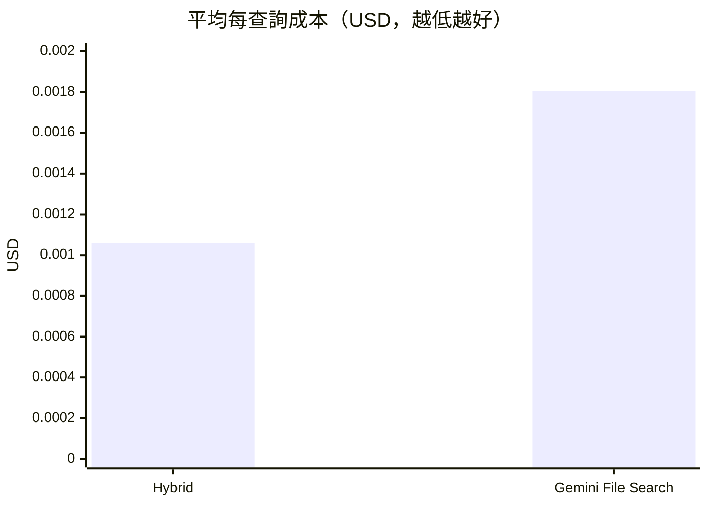

# Teams Agent Backend

這是一個可擴充的 Microsoft Teams AI Agent，使用 Python、[Microsoft Teams
SDK](https://microsoft.github.io/teams-sdk)（`microsoft-teams-apps`）與
LangGraph。Teams Adapter、Agentic RAG、Gemini hybrid retrieval、
來源圖片 Adaptive Card 與 GCP Cloud Run 部署均已完成。

> **2026-08 架構變更：Microsoft 365 Agents SDK → Microsoft Teams SDK。**
> 集團沒有 Azure Subscription，也無法建立 Azure Bot Service resource，因此
> Teams Adapter 已改用 Microsoft Teams SDK，bot 註冊改在 [Teams Developer
> Portal](https://dev.teams.microsoft.com/apps) 完成——只需要一個 Entra ID
> app registration（隨 Microsoft 365 授權提供），不需要 Azure 訂閱。
> 三個 `CONNECTIONS__SERVICE_CONNECTION__SETTINGS__*` 環境變數已由
> `CLIENT_ID` / `CLIENT_SECRET` / `TENANT_ID` 取代。
> 詳見 [`docs/teams-app-setup.md`](docs/teams-app-setup.md)。
> 本文件第 3 節以後仍留有先前 Azure Bot 時期的驗收紀錄，作為歷史脈絡保留；
> 設定步驟一律以第 1、2 節與 `docs/teams-app-setup.md` 為準。

```text
使用者：hello
Bot：收到：hello
```

服務端點：

Teams Adapter（公開）：

- `POST /api/messages`：Teams SDK 註冊的 Messaging endpoint（由 SDK 驗證
  Bot Framework JWT）
- `GET /healthz`：部署平台的健康檢查
- `GET /readyz`：Teams 憑證與 Agent 模式的就緒檢查
- `GET /rag-assets/{path}`：簽章保護的來源圖片（供 Teams 端載入）

Agent Service（私有，僅 Adapter 可呼叫，詳見第 5 節）：

- `POST /agent/chat`：LangGraph Workflow 主入口
- `POST /agent/chat/stream`：同上，但以 SSE 逐步回報進度（見第 4.3 節）
- `POST /feedback`：記錄 👍/👎 回饋（spec §14）
- `POST /retrieval/search`：純檢索除錯用端點
- `GET /healthz` / `GET /readyz`：健康檢查與索引就緒檢查

> **部署後請用 `/readyz` 而非 `/healthz` 驗證服務。** 從公司網路對 Cloud Run 上的
> 服務請求 `/healthz` 會得到 Google 的 404 錯誤頁，且回應不含
> `x-cloud-trace-context` 或 `server: Google Frontend` 標頭——代表該路徑在抵達
> Cloud Run 之前就被攔截，請求從未進入容器。同一支程式在本機測試 `/healthz`
> 回 200 正常，線上既有的 `teams-rag-agent` 也是同樣症狀，可見這是環境層行為而非
> 程式缺陷（2026-08-06 實測）。`/readyz` 不受影響，且會額外回報已載入的 chunk 數。
> Cloud Run 預設的容器健康檢查走 TCP，不受此影響。

## 專案狀態

截至 2026-07-29：

- Milestone 1「Azure Bot 與本機後端打通」已完成。
- Milestone 2 的 Teams app package 已成功上傳公司 Teams。
- Teams 頻道的 LangGraph RAG 端到端測試已成功。
- 下一個驗收點是將 Teams Developer Portal 的 bot endpoint 從 Dev Tunnel 切換至
  Cloud Run Adapter。

截至 2026-07-30，GCP Cloud Run 部署已完成：

- Teams Adapter：`https://teams-agent-adapter-jt7pjdeeoa-de.a.run.app`
- Private RAG Agent：`https://teams-rag-agent-jt7pjdeeoa-de.a.run.app`
- Region：`asia-east1`
- Project：`itr-aimasteryhub-lab`
- Adapter → Agent 使用 Cloud Run IAM identity token
- API Key、Bot client secret 與圖片 signing key 使用 Secret Manager

本機開發路徑已驗證：

```text
Teams 用戶端（或 Teams SDK devtools）
→ 公開 HTTPS Dev Tunnel
→ POST /api/messages
→ Microsoft Teams SDK
→ Echo handler
→ Teams 顯示「收到：hello」
```

雲端正式路徑已驗證至 Cloud Run Adapter／Agent：

```text
Teams／Bot Framework 服務
→ Public Cloud Run Teams Adapter
→ Cloud Run IAM identity token
→ Private Cloud Run LangGraph Agent
→ Gemini 3.5 Flash-Lite
→ Gemini Embedding 2 hybrid retrieval
→ Answer + citation + signed source image
```

已完成項目：

- [x] 建立 Python 3.11 專案與 `uv` 開發環境
- [x] 使用 Microsoft Teams SDK 建立 `App`（2026-08 前為 M365 Agents SDK 的 `AgentApplication`）
- [x] 以 Entra app registration 憑證連接 Teams（2026-08 前為 MSAL connection manager + Azure Bot）
- [x] 建立受 Bot Framework JWT 保護的 `POST /api/messages`
- [x] 建立公開的 `GET /healthz`
- [x] 支援歡迎訊息、`/help` 與 Echo 回覆
- [x] 清除 Teams 訊息中的 Bot `@mention`
- [x] 擷取 tenant、team、channel、conversation 與 Entra user metadata
- [x] 建立 Echo／Agent API 雙模式
- [x] 建立 Agent Gateway request／response contract
- [x] 支援 Agent timeout、錯誤降級、trace ID 與來源引用
- [x] 建立 `/readyz` readiness endpoint
- [x] 使用 Dev Tunnels 暴露本機 HTTPS endpoint
- [x] 端到端測試成功（當時走 Azure Bot `Test in Web Chat`）
- [x] 加入 Dockerfile、環境變數範例、單元測試與 Ruff
- [x] 確認錯誤 App ID 會被 JWT audience validation 阻擋

Teams 與後續里程碑狀態：

- [x] 啟用 Microsoft Teams channel
- [x] 建立通過 v1.25 schema 驗證的 Teams app package
- [x] 加入 manifest v1.25 必要的 `supportsChannelFeatures`
- [x] 使用 Microsoft 365 公司／學校帳號將 app package 上傳到 Teams
- [ ] 在 Teams 頻道以 `@Bot` 完成 Echo 測試
- [x] 建立獨立 LangGraph Agentic RAG Gateway
- [x] 將 `data/sources` 內部文件建立為中文檢索索引
- [x] 完成 route、retrieve、relevance、rewrite、grounded answer graph
- [x] 完成來源引用、文件 ACL、service token 與 tenant allowlist
- [x] RAG 回答可攜帶來源圖片並以 Teams Adaptive Card 顯示
- [x] 圖片使用短效 HMAC 簽名 URL、路徑防護與 Teams 尺寸最佳化
- [x] 選定 Gemini 3.5 Flash-Lite 與 Gemini Embedding 2
- [x] 由 Teams 頻道完成 Agent API 模式端到端驗收
- [ ] 串接唯讀內部 API 工具
- [x] 部署 Teams Adapter 與 LangGraph Agent 至 GCP Cloud Run
- [x] 設定 private service-to-service IAM 與 Secret Manager
- [ ] 將 Teams Developer Portal 的 bot endpoint 切換至 Cloud Run Adapter

## 架構

目前實作為雙服務分離：公開的 Teams Adapter 負責 Bot 通訊與圖片簽章，
私有的 LangGraph Agent 負責檢索與 grounded 回答。


本機開發時，Adapter 跑在 `:3978`、Agent 跑在 `:8000`，Teams Developer Portal
的 bot endpoint 指向 Dev Tunnel；雲端則以 Cloud Run Adapter URL 取代 tunnel。
回答可帶 citation 與來源圖片 metadata；Adapter 再把相對路徑簽成短效 URL，
並把圖片縮放到 Teams 可用尺寸後放入 Adaptive Card。

### 架構決策與限制（spec §2.1、§3.2、§3.3）

以下限制是既有的、經審視過的架構決策，不是尚待補完的缺口，後續開發不應在
沒有新證據的情況下推翻：

- **不因假設重寫語言／框架**：本專案維持 Python 與 LangGraph。是否改用其他
  語言或框架，必須根據壓力測試結果、確認的功能缺口、維運能力或 SDK 支援狀況
  決定，不得只因「其他語言可能適合高併發」而重寫。
  2026-08 從 Microsoft 365 Agents SDK 換成 Microsoft Teams SDK 正是符合這條
  原則的例子：不是假設，而是確認的封鎖性限制——集團沒有 Azure Subscription，
  無法建立 Agents SDK 所依賴的 Azure Bot Service resource。語言（Python）、
  Agent Service、LangGraph 與 Cloud Run 架構皆未更動，改動範圍限於
  `src/teams_agent/` 這層薄通訊層。
- **Hybrid RAG 維持預設**：`KNOWLEDGE_SERVICE_MODE=HYBRID`
  (`HybridKnowledgeService`) 是預設且唯一的正式知識後端。
  `GeminiFileSearchKnowledgeService`（`KNOWLEDGE_SERVICE_MODE=GEMINI_FILE_SEARCH`）
  目前僅供技術 Spike 使用（見
  [`docs/gemini-file-search-spike.md`](docs/gemini-file-search-spike.md)），
  只有在 Retrieval A/B Test（spec §18.7）證明其品質、成本或維運具有明顯優
  勢後，才可能改為預設。
- **外部能力一律走介面**：Knowledge Service、Conversation Repository、
  Ticket Service、User Directory Service 皆以 Protocol/Interface 封裝
  （分別見 `agent_service/src/agent_service/{knowledge,conversation,ticket}.py`
  與 `src/teams_agent/directory.py`）。LangGraph Workflow 不得直接依賴特
  定資料庫、檢索產品或工單系統。
- **POC 階段不預先建立未來平台能力**：不建立完整 Issue Repository、完整
  案件生命週期、工單催辦平台、FAQ／知識庫管理後台、Multi-Agent Framework、
  Approval Framework 或正式高可用／災難復原機制。這些留待 POC 驗證業務價
  值後，依實際需求評估。

## 1. 必要條件

- Python 3.11–3.13（Microsoft Teams SDK 要求 `>= 3.11`）
- 一個 Entra ID app registration（Microsoft 365 內含，**不需要 Azure 訂閱**）
- 在 [Teams Developer Portal](https://dev.teams.microsoft.com/apps) 完成的
  bot 設定，messaging endpoint 指向本服務的 `/api/messages`
- 上述 app registration 的：
  - Application (client) ID → `CLIENT_ID`
  - Directory (tenant) ID → `TENANT_ID`
  - Client secret **Value** → `CLIENT_SECRET`

**不需要**：Azure Subscription、Azure Bot Service resource、Azure Portal。
完整步驟見 [`docs/teams-app-setup.md`](docs/teams-app-setup.md)。

Client secret 只放在本機 `.env` 或雲端 Secret Manager，不可提交到 Git。

## 2. 本機設定

使用 `uv`：

```bash
uv sync --extra dev
cp .env.example .env
```

編輯 `.env`：

```dotenv
CLIENT_ID=<Application (client) ID>
CLIENT_SECRET=<Client secret Value>
TENANT_ID=<Directory (tenant) ID>
PORT=3978
AGENT_MODE=echo
```

啟動：

```bash
uv run teams-agent
```

也可以從專案根目錄一次啟動 Agent Service、Teams Adapter 與 Dev Tunnel：

```bash
./start.sh
```

若 Dev Tunnel 已由其他 Terminal 執行：

```bash
START_TUNNEL=false ./start.sh
```

`Ctrl+C` 會停止由腳本啟動的所有子程序。若 `3978` 或 `8000` 已被舊程序占用，
腳本會先停止並提示需要手動關閉哪個服務。

確認 health 與 readiness endpoints：

```bash
curl http://localhost:3978/healthz
curl http://localhost:3978/readyz
```

預期結果：

```json
{"status": "ok"}
{"status": "ready", "agentMode": "echo", "teamsAuth": "ready", "ragImages": "disabled"}
```

`teamsAuth` 為 `not_configured`（`/readyz` 回 503）代表 `.env` 缺少
`CLIENT_ID` / `CLIENT_SECRET`，Teams SDK 無法驗證進來的 Bot Framework JWT。

`POST /api/messages` 由 Teams SDK 驗證 Bot Framework JWT，因此不能用普通 `curl`
模擬完整 Bot Activity。本機若要在沒有憑證的情況下測試，可暫時設定
`DANGEROUSLY_ALLOW_UNAUTHENTICATED_REQUESTS=true`——**僅限本機**，
絕不可用於 Cloud Run。

### 本機 Log

只要 `uv run teams-agent` 保持執行，Teams／Web Chat 的請求會顯示在 Terminal：

```text
INFO teams_agent.agent Message received:
request_id=<uuid> channel=msteams conversation=<conversation-id>

POST /api/messages HTTP/1.1 200
```

目前 log 刻意不記錄使用者完整問題、Bot 回答、Client Secret 或 API Token。
每次請求會保留 request ID、channel 與 conversation ID 供問題追蹤。

Log level 可在 `.env` 設定：

```dotenv
LOG_LEVEL=INFO
```

需要更詳細的本機除錯資訊時可暫時改為 `DEBUG`，修改後必須重新啟動 Bot。
Dev Tunnel 的 inspect URL 可用來查看 HTTP 流量，但不得分享其中的
Authorization header。

## 3. 讓 Teams 連到本機

開發時可使用 Microsoft Dev Tunnels 或其他提供公開 HTTPS 的 tunnel：

```bash
devtunnel user login -e
devtunnel host -p 3978 --allow-anonymous
```

使用 CLI 顯示的 `Connect via browser` URL；不要使用 inspect URL 或 tunnel ID。
取得 tunnel HTTPS URL 後，在 Teams Developer Portal 設定：

```text
https://dev.teams.microsoft.com/apps
→ 選擇你的 app
→ App features → Bot
→ Endpoint address
→ https://<tunnel-domain>/api/messages
```

儲存後把 app package 側載到 Teams（見
[`docs/teams-app-setup.md`](docs/teams-app-setup.md)），在頻道 @mention Bot
或開 1:1 聊天傳送 `hello`。成功時 Bot 應回覆：

```text
收到：hello
```

本機測試期間必須同時保持兩個程序執行：

```text
Terminal 1：uv run teams-agent
Terminal 2：devtunnel host -p 3978 --allow-anonymous
```

### 常見錯誤

`Invalid audience` 表示 `.env` 的 `CLIENT_ID` 與 Teams Developer Portal 中
bot 的 App ID 不完全相同。請特別檢查多餘字元、前導字元及複製錯誤，修正後
重新啟動後端。

瀏覽器直接開啟 `/` 或 `/api/messages` 時看到 401／`Method Not Allowed`
是正常行為。瀏覽器只能直接檢查 `/healthz` 與 `/readyz`；`/api/messages`
必須以 `POST` 並攜帶 Bot Framework JWT 呼叫。

## 4. Agent 模式

### Echo 模式

開發與 Teams 通訊驗證階段使用：

```dotenv
AGENT_MODE=echo
```

這個模式不會呼叫外部 AI：

```text
hello → 收到：hello
```

### API 模式

本專案已在 `agent_service/` 建立 LangGraph Agent Gateway。啟動後設定：

```dotenv
AGENT_MODE=api
AGENT_API_URL=https://<agent-gateway-domain>/agent/chat
AGENT_API_TOKEN=<internal-service-token>
AGENT_API_TIMEOUT_SECONDS=10
```

非 localhost 的 `AGENT_API_URL` 強制使用 HTTPS。Token 只能放在 `.env`、
Secret Manager 或 Key Vault，不可寫入程式碼與 Git。

Teams Adapter 送出的 request：

```json
{
  "requestId": "uuid",
  "channel": "msteams",
  "conversation": {
    "tenantId": "tenant-id",
    "teamId": "team-id",
    "channelId": "channel-id",
    "conversationId": "conversation-id"
  },
  "user": {
    "teamsUserId": "teams-user-id",
    "entraObjectId": "entra-object-id",
    "displayName": "Justin"
  },
  "message": {
    "text": "如何申請 API Key？",
    "locale": "zh-TW"
  }
}
```

Agent Gateway 最小 response：

```json
{
  "answer": "請至內部平台提出申請。",
  "traceId": "trace-uuid",
  "citations": [
    {
      "title": "API Key 申請流程",
      "url": "https://internal.example/docs/api-key",
      "chunkId": "chunk-8"
    }
  ],
  "images": [
    {
      "path": "大州系統_功能無法點選/p01.png",
      "title": "大州無法點選 — IE 安全性調整",
      "altText": "IE 安全性設定畫面",
      "sourceChunkId": "chunk-8"
    }
  ]
}
```

若 Agent API timeout、連線失敗或回傳格式錯誤，Teams 會收到友善降級訊息與
request trace ID。

### RAG 圖片 Adaptive Card

來源 Markdown 使用相對圖片語法：

```markdown

```

Agent Gateway 只回傳經驗證的相對圖片路徑；Teams Adapter 會產生一小時有效的
HMAC signed URL、將圖片縮到最長邊 1024 pixels、限制在 1 MB，再放入
Adaptive Card。根目錄 `.env` 需要：

```dotenv
BOT_PUBLIC_BASE_URL=https://<目前的-3978-dev-tunnel-domain>
RAG_ASSET_DIR=./data/assets
RAG_ASSET_SIGNING_KEY=<至少 16 字元的隨機值>
RAG_ASSET_URL_TTL_SECONDS=3600
RAG_ASSET_MAX_DIMENSION=1024
RAG_ASSET_MAX_BYTES=1000000
```

產生開發用 signing key：

```bash
openssl rand -hex 32
```

`BOT_PUBLIC_BASE_URL` 只填 domain，不加 `/api/messages`。Dev Tunnel URL
改變時必須同步更新並重新啟動 Teams Adapter。`GET /readyz` 的
`ragImages` 應為 `ready`。圖片 signed URL 到期後不可再次讀取；正式環境請將
signing key 放入 Secret Manager 或 Key Vault。

### 4.3 進度串流（Streaming）

`AGENT_MODE=api` 時，Adapter 會呼叫 Agent Service 的
`POST /agent/chat/stream`（SSE），把 LangGraph 的節點進度即時顯示給使用者，
不必等整個 workflow 跑完才看到第一個字：

```text
已收到你的問題…
正在理解你的問題…      ← Load Conversation 完成
正在確認問題類型…      ← Extract Issues 完成
正在檢索知識庫…        ← Filter IT Issues 完成（最耗時的一段）
正在整理答案…          ← Process Issues 完成
[Adaptive Card 最終答案 + 來源 + 👍/👎]
```

**只在 1:1 私訊生效。** Teams 平台不支援在頻道與群組聊天串流訊息，Adapter
會先看 `conversation.conversationType`，非 `personal` 時直接走原本的單次回覆
路徑（不會多花一次失敗的往返）。本專案 `defaultInstallScope` 是 `team`，
所以**多數頻道流量本來就不會串流**——這是 Teams 的限制，不是設定問題。

其他行為：

- 最終的 Adaptive Card 是串流的收尾訊息。Teams 只允許在串流的**最後一則**
  訊息帶附件，因此進度文字會先被清掉，由卡片取代而不是疊加在下面。
- 串流過程若失敗，使用者一定會拿到東西：Teams 拒絕串流 → 退回一般回覆；
  Agent Service 回報錯誤 → 顯示標準錯誤訊息與追蹤編號；使用者按下 Stop 或
  超過 Teams 的兩分鐘串流上限 → 保留已顯示的內容，不重複回答。
- 答案內容與 `POST /agent/chat` **完全一致**，串流只改變使用者*何時*看到，
  不改變*看到什麼*。
- `AGENT_STREAMING_ENABLED=false` 可整個關掉，行為回到單次回覆。

> **為什麼是「階段」而不是逐字（token）串流。** spec §5.3 要求 Response
> Builder 必須是純字串樣板、不得呼叫 LLM，答案在進到它之前就已由 FAQ／
> Knowledge Service 產生完畢——也就是說 `final_response` 成形時已經沒有
> token 流可以轉發了。而使用者實際在等的是 Issue 抽取與知識庫檢索，正好
> 就是這些階段涵蓋的範圍。要做到真正的逐字串流，必須改寫 Knowledge
> Service 的 grounded answer 產生流程（且多 issue 併發時的輸出順序需要
> 重新設計），屬於另一個獨立議題。

## 5. Agent Service Workflow（LangGraph, spec §5）

`agent_service` 的 `/agent/chat` 由一個 LangGraph Workflow
（`agent_service/src/agent_service/workflow.py` 的 `AgentWorkflow`）處理，
取代單純的單次 RAG 呼叫：

```text
Teams Message
      │
      ▼
Load Conversation      -- ConversationService：載入/建立 conversation，
      │                    套用 CONVERSATION_TIMEOUT_HOURS 逾時判斷
      ▼
Extract Issues          -- IssueExtractor：一次訊息最多拆解
      │                    MAX_ISSUES_PER_MESSAGE（預設 3）個獨立 Issue
      ▼
Filter IT Issues        -- 非 IT 問題不送入知識庫；混合訊息中的 IT
      │                    Issue 仍會個別處理
      ▼
Process Issues          -- 每個 IT Issue 依 route 並行處理（asyncio.gather，
  ├─ FAQ                   一個 Issue 失敗不阻塞其他 Issue，見 §4.2）：
  ├─ Ask More Info           FAQ         → FaqService（純查表，不呼叫 LLM）
  ├─ Knowledge Search         Ask More Info → 最多追問
  └─ Ticket Operation           MAX_MISSING_INFO_PER_ISSUE（預設 2）項
      │                       Knowledge Search → KnowledgeService（Hybrid RAG
      │                         或 Gemini File Search spike）
      │                       Ticket Operation → TicketService（需明確確認）
      ▼
Deterministic Response Builder
      │                    -- response_builder.py：純 Python template 組
      │                       裝多 Issue 回覆，不再呼叫 LLM（不重寫段落、
      │                       不改寫來源、不潤飾工單結果，見 spec §5.3）
      ▼
Save Conversation       -- 寫回本輪訊息與 Issue 結果
      │
      ▼
Teams Response
```

### 可替換的服務介面（spec §3.2）

LangGraph Workflow 不直接依賴任何具體資料庫、檢索產品或工單系統，而是透
過下列介面注入實作，方便日後替換：

| 能力 | 介面/模組 | 目前實作 | 切換方式 |
|---|---|---|---|
| FAQ | `agent_service/src/agent_service/faq.py` | `FaqService`（純查表，讀 `FAQ_PATH` JSON） | 編輯 `data/faq.json` |
| Knowledge Service | `agent_service/src/agent_service/knowledge.py` | `HybridKnowledgeService`（BM25 + embedding，預設） / `GeminiFileSearchKnowledgeService`（spike，見下） | `KNOWLEDGE_SERVICE_MODE=HYBRID` \| `GEMINI_FILE_SEARCH` |
| Conversation Repository | `agent_service/src/agent_service/conversation.py` | `MEMORY`（in-process，本機預設）/ `FILE`（JSON 檔案）/ `FIRESTORE`（受管，Cloud Run 使用） | `CONVERSATION_REPOSITORY_MODE=MEMORY` \| `FILE` \| `FIRESTORE` |
| Ticket Service | `agent_service/src/agent_service/ticket.py` | `DISABLED` / `HTTP`（呼叫內部工單 API） | `TICKET_SERVICE_MODE=DISABLED` \| `HTTP` |
| User Directory Service | `src/teams_agent/directory.py`（Teams Adapter 端） | `disabled`（不查 Graph）/ `graph`（`GET /users/{id}`） | `USER_DIRECTORY_MODE=disabled` \| `graph` |

### Conversation 持久化：為什麼 Cloud Run 上必須用 Firestore（spec §10.3）

程式預設是 `MEMORY`，本機開發與測試用它剛好，但部署到 Cloud Run 上它會直接
破壞 spec §10.1 要求的「連續問答／使用者補充資訊／工單確認」：

- Cloud Run **scale-to-zero**：instance 被回收後，記憶體裡的對話全部消失，
  使用者補完資訊回來時系統已經不記得前一輪問了什麼。
- Cloud Run 最多 **3 個 instance**：同一段對話的前後兩輪可能落在不同
  instance。它們既不共用記憶體、也不共用本機磁碟，所以 `FILE` 模式一樣救
  不了——這不是「重啟才會壞」，是每一輪都可能壞。

因此 `deploy/deploy-gcp.sh` 在雲端固定使用 `FIRESTORE`。選 Firestore 而不是
Redis 或 PostgreSQL 的理由（對應 spec §10.3 的選型考量）：

| 考量 | Firestore | Memorystore/Redis | Cloud SQL |
|---|---|---|---|
| Cloud Run 網路可達性 | 直連，不需 VPC connector | 需要 VPC connector | 需要 connector 或 VPC |
| scale-to-zero 成本 | 用多少算多少 | instance 常駐計費 | instance 常駐計費 |
| 資料保存期限 | 原生 TTL policy | 原生 TTL | 需自建清理 |
| 維運複雜度 | 無 schema migration | 無 | 需管 schema |

Workflow 完全沒有因此改動：三種模式都躲在同一個 `ConversationRepository`
Protocol 後面（spec §3.2），而且**同一套行為測試會 parametrize 跑過三種實
作**，確保它們行為一致。Firestore 的測試由 in-process Fake client 驅動，不
連線、不需憑證。

要點：

- **Timeout 與 TTL 是兩件事**。`CONVERSATION_TIMEOUT_HOURS` 由程式在每次讀
  取時檢查 `lastActivityAt` 強制執行，不依賴 TTL 是否已經跑過；TTL 只負責
  資料保存期限，避免 store 無限成長。
- **附加訊息不做 read-modify-write**。每則訊息是一份獨立 document，兩個
  instance 同時寫入不會互相覆蓋。
- 文件結構、排序保證與並行性論證寫在
  `agent_service/src/agent_service/conversation.py` 的
  `FirestoreConversationRepository` docstring；GCP 端的 database、TTL 與 IAM
  設定見 [`deploy/README.md`](deploy/README.md)。

本機要用 Firestore 模式時需要安裝 optional extra：

```bash
cd agent_service
uv pip install '.[firestore]'
```

### Retrieval A/B Test：Hybrid vs. Gemini File Search（spec §18.7）

`KNOWLEDGE_SERVICE_MODE` 該用 `HYBRID` 還是 `GEMINI_FILE_SEARCH`，不是憑印象決定，而是跑同一組
30 案例評估集（`data/eval/retrieval_eval_set.json`）過兩個後端、比對 spec §18.7 列出的每一項指
標。以下是 2026-08-07 對一個全新建立、跑完即刪除的 Gemini File Search store（19 份語料全數上
傳）所量到的**實測**結果，完整方法、原始輸出與誠實限制見
[`docs/retrieval-ab-test-report.md`](docs/retrieval-ab-test-report.md)，這裡只列結論。

| 指標 | Hybrid（預設） | Gemini File Search |
|---|---|---|
| Answer / Recall@K / Groundedness / Citation / No-answer / Error-code Accuracy | 100% | 100% |
| Image Match Accuracy | 100% (3/3) | 100% (3/3) |
| ACL Accuracy（30 案例欄位） | 100% (2/2) | 100% (2/2)——**此欄位對兩者皆無鑑別力**，見下方說明 |
| P50 / P95 Latency | **3.00s / 4.07s** | 5.71s / 7.15s |
| 平均成本／查詢 | **US$0.001059** | US$0.001804 |
| 平均 LLM 呼叫／查詢 | 2.17 | 1.00 |

八項品質指標兩邊都是 100%，這種情況畫圖表反而是雜訊——表格已經把「打平」講清楚了。真正有落差、
且值得用眼睛比大小的只有延遲與成本，所以只畫這兩項：

```mermaid
xychart-beta
    title "延遲比較（秒，越低越好）"
    x-axis ["P50", "P95"]
    y-axis "秒" 0 --> 8
    bar "Hybrid" [3.00, 4.07]
    bar "Gemini File Search" [5.71, 7.15]
```





**ACL 欄位為什麼不能直接看 100%**：評估集裡的兩個 ACL 案例現在都預期「找得到」，因為語料庫目前
每份文件都是 `audience: all-employees`（見
[`docs/knowledge-document-governance.md`](docs/knowledge-document-governance.md) 的治理決策）。
一個完全不檢查權限的後端一樣會在這兩題拿到 100%，所以這個數字不能拿來比較兩個後端誰的 ACL 做得
好。真正驗證 ACL 的是一個獨立跑的探測（`scripts/acl_verification.py`：上傳一份合成的受限文件與
一份公開文件到一個用完即刪的 store，分別用有權限／無權限的使用者查詢）——結果是 Gemini adapter
的權限過濾機制**確實有效**（有權限者看得到、無權限者看不到且答案不洩漏內容），但這只證明「機制
本身能用」，不代表「現有 19 份公開語料的存取控制現況有被測試到」，因為現況就是全部公開。詳細結
果見報告 2.3 節。

**決策：`KNOWLEDGE_SERVICE_MODE` 維持 `HYBRID`（預設）。** 對業務關係人來說，理由可以濃縮成一句
話：**兩者回答品質打平，但 Hybrid 快將近 2 倍、每次查詢便宜約 4 成，而且沒有額外的維運負擔**（中
文檔名需要額外轉換層、圖片對應只能做到文件層級、上傳流程中斷重試需要人工檢查是否留下重複文件）。
沒有任何一項指標讓 Gemini File Search 贏過 Hybrid 到值得承擔這些代價，所以維持現狀，不需要額外
決策或審批。

### 設定 FAQ（spec §7）

FAQ 僅用於答案固定、不需文件檢索、不需依使用者條件變化的高頻問題（例如密
碼重設入口、VPN 安裝入口、固定聯絡窗口）。FAQ 條目存放在
[`data/faq.json`](data/faq.json)（此檔案**有**被 Git 追蹤，見下方
`.gitignore` 說明），格式：

```json
{
  "faqs": [
    {
      "id": "FAQ_001",
      "faqKey": "PASSWORD_RESET",
      "enabled": true,
      "answer": "請至公司密碼管理入口進行密碼重設。"
    }
  ]
}
```

`faqKey` 必須唯一；Issue Extractor 只能從已啟用（`enabled: true`）的
`faqKey` 中選擇，無法明確對應時會走 `route=KNOWLEDGE` 而不是硬猜一個
`faqKey`。FAQ Service 本身不呼叫 LLM、不做語意相似度、不改寫答案（spec
§7.3）——新增/修改 FAQ 只需要編輯這個 JSON 檔案，不需要改程式碼。啟動或
重新啟動 `agent_service` 後生效；檔案路徑可用 `FAQ_PATH` 覆寫。

### Feedback（`POST /feedback`，spec §14）

`/agent/chat` 的回應在 `feedbackEnabled` 為 `true` 時（由
`FEEDBACK_ENABLED` 控制，預設開啟），Teams 端會在 FAQ／Knowledge 回覆後顯
示：

```text
這個回答有解決你的問題嗎？
👍 已解決   👎 未解決
```

按鈕會呼叫 `POST /feedback`（與 `/agent/chat` 一樣需要
`Authorization: Bearer <AGENT_SERVICE_TOKEN>`，若有設定的話），內容為
correlation ID、conversation ID、issue ID、user ID 與 `rating`
（`up`/`down`）。POC 階段沒有獨立的 feedback 資料表（spec §3.3）：這支
API 只是把結構化紀錄寫進服務 log（`Feedback recorded: ...`），未來要接
BigQuery 或資料表時，讀這行 log 或改寫這個 handler 即可，不影響系統其他
部分。

### 相關文件

- [`docs/knowledge-document-governance.md`](docs/knowledge-document-governance.md) ——
  `data/sources/*.md` 的 YAML front matter（owner／version／effectiveDate／
  audience）規範，對應 spec §9。
- [`docs/gemini-file-search-spike.md`](docs/gemini-file-search-spike.md) ——
  Gemini File Search 技術 Spike 的執行方式與限制，對應 spec §8.3。
- [`docs/retrieval-ab-test-report.md`](docs/retrieval-ab-test-report.md) ——
  Hybrid vs. Gemini File Search 的完整 A/B 測試方法、原始數據與誠實限制，對應 spec §18.7（摘要見上方）。
- [`agent_service/README.md`](agent_service/README.md) —— Agent Service
  本身的啟動、索引建立與 API 範例。

## 6. 環境變數參考（spec §16）

兩個服務各自讀自己的 `.env`，**不會**共用同一份設定；本機分別複製
`.env.example` → `.env`（Teams Adapter，專案根目錄）與
`agent_service/.env.example` → `agent_service/.env`（Agent Service）。

### Teams Adapter（`.env`，公開的 `teams-agent-adapter` 服務）

| 變數 | 預設值 | 說明 |
|---|---|---|
| `CLIENT_ID` | — | Entra App registration 的 Application (client) ID；Teams SDK 直接讀取 |
| `CLIENT_SECRET` | — | Client secret **Value**；只能放 `.env` 或 Secret Manager |
| `TENANT_ID` | — | Entra Directory (tenant) ID（單一租戶 app 必填） |
| `DANGEROUSLY_ALLOW_UNAUTHENTICATED_REQUESTS` | `false` | 略過 `/api/messages` 的 JWT 驗證；**僅限本機**，Cloud Run 絕不可設 |
| `PORT` | `3978` | HTTP 監聽埠；Cloud Run 會自動注入。無 `HOST` 設定——Teams SDK 的 `FastAPIAdapter` 固定綁 `0.0.0.0` |
| `LOG_LEVEL` | `INFO` | 可暫時改 `DEBUG` 做本機除錯 |
| `AGENT_MODE` | `echo` | `echo`（不呼叫外部 AI）或 `api`（呼叫 Agent Service） |
| `AGENT_API_URL` | — | `AGENT_MODE=api` 時必填，指向 Agent Service 的 `/agent/chat` |
| `AGENT_API_TOKEN` | — | `AGENT_API_AUTH_MODE=service_token` 時必填 |
| `AGENT_API_AUTH_MODE` | `none`（有設 `AGENT_API_TOKEN` 時預設 `service_token`） | `none` \| `service_token` \| `google_id_token`（Cloud Run 服務間 IAM） |
| `AGENT_API_AUDIENCE` | — | `google_id_token` 模式下的 identity token audience（Agent Service URL） |
| `AGENT_STREAMING_ENABLED` | `true` | 是否在 1:1 私訊串流進度（見第 4.3 節）；頻道／群組聊天不受影響（Teams 不支援） |
| `AGENT_API_TIMEOUT_SECONDS` | `10` | 非 localhost 的 `AGENT_API_URL` 會強制要求 HTTPS |
| `BOT_PUBLIC_BASE_URL` | — | 用於簽出來源圖片 URL 的公開網域（只填 domain，不加 `/api/messages`） |
| `RAG_ASSET_DIR` | `<repo>/data/assets` | 來源圖片根目錄 |
| `RAG_ASSET_SIGNING_KEY` | — | 至少 16 字元；HMAC 簽章金鑰，正式環境放 Secret Manager |
| `RAG_ASSET_URL_TTL_SECONDS` | `3600` | 簽名 URL 有效秒數 |
| `RAG_ASSET_MAX_DIMENSION` | `1024` | 圖片最長邊（pixels） |
| `RAG_ASSET_MAX_BYTES` | `1000000` | 圖片檔案大小上限 |
| `USER_DIRECTORY_MODE` | `disabled` | `disabled`（不呼叫 Graph）或 `graph`（`GET /users/{id}`，需 `User.Read.All`） |
| `USER_DIRECTORY_CACHE_TTL_SECONDS` | `300` | Graph 查詢結果快取秒數（`graph` 模式才有作用） |

### Agent Service（`agent_service/.env`，私有的 `teams-rag-agent` 服務）

| 變數 | 預設值 | 說明 |
|---|---|---|
| `HOST` | `0.0.0.0` | 監聽位址 |
| `PORT` | `8000`（Cloud Run image 內為 `8080`） | HTTP 監聽埠 |
| `LOG_LEVEL` | `INFO` | log 等級 |
| `RAG_DATA_DIR` | `<repo>/data` | 知識文件、索引、FAQ、conversation 檔案的根目錄 |
| `RAG_INDEX_PATH` | `<RAG_DATA_DIR>/index/chunks.json` | 建立好的檢索索引 |
| `RAG_AUTO_BUILD_INDEX` | `true` | 索引不存在時是否自動建立 |
| `RAG_MODEL` | 空（本機 extractive 模式） | 例：`google_genai:gemini-3.5-flash-lite` |
| `RAG_EMBEDDING_MODEL` | 空（純 BM25） | 例：`google_genai:gemini-embedding-2` |
| `RAG_TOP_K` | `4` | 檢索筆數，範圍 1–20 |
| `RAG_MIN_SCORE` | `0.08` | 相關性門檻，範圍 0–1 |
| `RAG_MAX_REWRITES` | `1` | Query rewrite 次數上限，範圍 0–3 |
| `RAG_MAX_IMAGES` | `2` | 單次回覆附圖上限，範圍 0–4 |
| `RAG_CHUNK_SIZE` / `RAG_CHUNK_OVERLAP` | `900` / `120` | 切塊大小；overlap 必須小於 size |
| `RAG_ALLOWED_TENANTS` | 空（不限制） | 逗號分隔的 tenant allowlist |
| `RAG_SOURCE_BASE_URL` | 空 | citation 的可點擊連結前綴 |
| `AGENT_SERVICE_TOKEN` | 空（不驗證） | 有設定時 `/agent/chat`、`/feedback`、`/retrieval/search` 都要求 `Authorization: Bearer <token>` |
| `MAX_ISSUES_PER_MESSAGE` | `3` | 單則訊息最多拆解幾個 Issue，範圍 1–5（spec §4.2） |
| `MAX_MISSING_INFO_PER_ISSUE` | `2` | 每個 Issue 最多追問幾項，範圍 1–3（spec §6.3） |
| `MAX_HISTORY_MESSAGES` | `10` | 載入 workflow context 的歷史訊息上限，範圍 0–50 |
| `CONVERSATION_HISTORY_ROUNDS` | `5` | 視為「最近對話」的輪數，範圍 1–20 |
| `CONVERSATION_TIMEOUT_HOURS` | `24` | 對話逾時後起新 conversation，範圍 1–168 |
| `MAX_LLM_CALLS_PER_REQUEST` | `5` | 單次請求 LLM 呼叫次數上限，範圍 1–20 |
| `MAX_RETRIEVAL_REWRITES` | 同 `RAG_MAX_REWRITES`（預設 1） | 範圍 0–3；獨立於 `RAG_MAX_REWRITES` 但預設沿用它 |
| `KNOWLEDGE_SERVICE_MODE` | `HYBRID` | `HYBRID` \| `GEMINI_FILE_SEARCH`（spike-only，見上） |
| `GEMINI_FILE_SEARCH_STORE` | 空 | `KNOWLEDGE_SERVICE_MODE=GEMINI_FILE_SEARCH` 時使用的 store 名稱 |
| `TICKET_SERVICE_MODE` | `DISABLED` | `DISABLED` \| `HTTP` |
| `TICKET_SERVICE_BASE_URL` | 空 | `TICKET_SERVICE_MODE=HTTP` 時必填，須為 `http(s)://` |
| `TICKET_SERVICE_TOKEN` | 空 | 工單 API 的 Bearer token，正式環境放 Secret Manager |
| `TICKET_SERVICE_TIMEOUT_SECONDS` | `10.0` | 範圍 1–60 |
| `CONVERSATION_REPOSITORY_MODE` | `MEMORY` | `MEMORY`（in-process）\| `FILE`（JSON 檔案）\| `FIRESTORE`（受管，Cloud Run 部署使用） |
| `CONVERSATION_STORE_PATH` | `<RAG_DATA_DIR>/conversations` | `CONVERSATION_REPOSITORY_MODE=FILE` 時的儲存路徑；不可提交到 Git |
| `CONVERSATION_FIRESTORE_PROJECT` | 空（由 ADC 解析） | 僅 `FIRESTORE` 模式；指向其他專案時才需設定 |
| `CONVERSATION_FIRESTORE_DATABASE` | 空（`(default)`） | 僅 `FIRESTORE` 模式；使用具名 database 時才需設定 |
| `CONVERSATION_FIRESTORE_COLLECTION` | `conversations` | 僅 `FIRESTORE` 模式；root collection 名稱，不可含 `/` |
| `FAQ_PATH` | `<RAG_DATA_DIR>/faq.json` | FAQ 設定檔路徑 |
| `FEEDBACK_ENABLED` | `true` | 是否開放 `POST /feedback` 與 Teams 端 👍/👎 按鈕 |

完整範例見 [`.env.example`](.env.example) 與
[`agent_service/.env.example`](agent_service/.env.example)。

## 7. Docker

兩個服務各自有獨立的 Dockerfile 與 image，對應雙服務架構。

Teams Adapter（專案根目錄 `Dockerfile`，build context 為專案根目錄）：

```bash
docker build -t teams-agent-backend .
docker run --rm -p 8080:8080 --env-file .env teams-agent-backend
```

Agent Service（`agent_service/Dockerfile`，build context 仍是專案根目錄，
因為 image 需要同時複製 `agent_service/` 與根目錄的 `data/`）：

```bash
docker build -f agent_service/Dockerfile -t teams-agent-rag-service .
docker run --rm -p 8080:8080 --env-file agent_service/.env teams-agent-rag-service
```

`data/faq.json` 會隨 `agent_service/Dockerfile` 的 `COPY data ./data` 一併
打包進 image；這也是 `data/faq.json` 必須被 Git 追蹤的原因——否則從乾淨的
clone `docker build` 出來的 image 裡不會有 FAQ 設定。

> **build context 必須含有語料。** `COPY data ./data` 複製的是**建置當下本機
> 的 `data/`**。`data/sources`、`data/index`、`data/assets` 都是 gitignored，
> 因此從乾淨的 clone 建置出來的 image **沒有語料也沒有索引**。此時
> `RAG_AUTO_BUILD_INDEX` 幫不上忙——自動建索引需要 `data/sources/` 裡的
> Markdown 文件，沒有來源文件時 `build_index()` 會直接拋出
> `No Markdown source documents were found.`，服務無法通過 readiness 檢查。
> 語料交付方式與其限制詳見
> [`deploy/README.md`](deploy/README.md) 的「Knowledge corpus and index
> delivery」。

> **尚未驗證。** 本節的兩個 `docker build` 指令在本階段**未實際執行過**
> （開發環境未安裝 Docker）。Cloud Run 部署走的是 `gcloud builds submit`
> 的遠端建置路徑，首次部署時請確認建置成功，並用 `/readyz` 回報的 chunk
> 數確認索引確實進到 image 內。

Messaging endpoint：

```text
https://<public-service-domain>/api/messages
```

部署到 GCP Cloud Run 時，`CLIENT_ID` 與 `TENANT_ID` 走一般環境變數，
`CLIENT_SECRET` 一律走 Secret Manager。服務必須允許 Microsoft 的 Bot
Framework 服務經由公網 HTTPS 呼叫；應用程式本身仍會由 Teams SDK 驗證
Bot Framework JWT。

## 8. Cloud Run 部署

正式部署腳本、Secret Manager 對應與雲端環境變數請見
[`deploy/README.md`](deploy/README.md)（含 §16 建議調校的 concurrency／
CPU／memory／timeout 設定）。目前部署狀態摘要見本文件「專案狀態」一節。

## 9. Teams App 設定與測試

Teams app 註冊、Teams Developer Portal bot 設定、Dev Tunnel 本機測試、`USER_DIRECTORY_MODE=graph`
所需的 Graph 權限，以及只能在真實 Teams 上手動驗證的項目（對話、部署可達
性、圖片顯示、Feedback 按鈕）完整說明見
[`docs/teams-app-setup.md`](docs/teams-app-setup.md)。

## 10. 測試與程式碼檢查

```bash
uv run pytest
uv run ruff check .
```

Agent Service 有自己的測試套件與 lint：

```bash
cd agent_service
uv run pytest
uv run ruff check .
```

## 11. POC 驗收狀態

spec §19 二十二項驗收標準與 §20 二十項交付項目的逐項對照、佐證測試名稱與
待辦清單，見 [`docs/poc-acceptance-checklist.md`](docs/poc-acceptance-checklist.md)。

## 未來方向

### Milestone 2：接入 Microsoft Teams 頻道

目標是讓 Team 頻道中的使用者可以透過 `@Bot hello` 觸發現有 Echo handler。

目前已完成：

- [x] bot 的 Microsoft Teams channel 已啟用
- [x] 建立 Teams app manifest
- [x] Bot scopes 設為 `team` 與 `personal`
- [x] 預設安裝範圍設為 `team`
- [x] 建立符合規格的 192×192 彩色 icon
- [x] 建立具有透明背景的 32×32 白色 outline icon
- [x] 建立 app package 打包腳本
- [x] 加入 manifest v1.25 `supportsChannelFeatures: tier1`
- [x] App package 成功上傳公司 Teams

Teams App 已完成安裝並通過頻道測試。目前需在 Teams Developer Portal
（App features → Bot → Endpoint address）將 endpoint 切換為：

```text
https://teams-agent-adapter-jt7pjdeeoa-de.a.run.app/api/messages
```

切換成功後，本機 Bot、Agent Service 與 Dev Tunnel 不需要保持執行。開發除錯
時仍可使用 `./start.sh` 啟動完整本機環境。

如果沒有 `Upload a custom app` 選項，需要 Teams 管理員在 app setup policy
開啟 custom app upload，或由管理員在 Teams admin center 上傳 package。
Microsoft Teams 免費／個人版不提供此企業自訂 app 上傳流程；請使用具有 Teams
授權的 Microsoft 365 公司或學校帳號。

`manifest.json` 中的 developer URLs 目前是 PoC placeholder。內部正式發布前，
必須替換成公司的網站、隱私權政策與使用條款 URL。

完成標準：

- App 可安裝到指定 Team。
- 頻道輸入 `@Bot hello` 可收到 `收到：hello`。
- 未提及 Bot 的訊息不觸發後端。

### Milestone 3：串接獨立 AI Agent API

保留 Teams Adapter 為薄通訊層，把 AI 邏輯放在獨立 Agent Gateway：

```text
Teams
→ Bot Framework 服務
→ Teams Adapter /api/messages
→ Agent Gateway /agent/chat
→ 回傳答案
→ Teams
```

Adapter contract、client 與實際 LangGraph Agent Gateway 均已完成：

- request ID 與 trace ID
- Teams tenant、team、channel、conversation 與使用者識別
- 問題文字與 locale
- 結構化答案、來源引用及錯誤狀態
- timeout、重試與友善降級訊息

正式部署決策：

- Agent Gateway：private Cloud Run service
- 服務間驗證：Cloud Run IAM identity token
- Contract：沿用 `/agent/chat` 結構化 request／response
- Secrets：Google API Key、Bot client secret、image signing key 存於 Secret Manager
- Timeout、無答案與錯誤：由 Adapter 與 Agent Gateway 分層處理

### Milestone 4：RAG 知識問答

- [x] 建立 Markdown ingestion、清理、切塊與穩定 chunk ID
- [x] 建立中文 BM25，並預留 embedding hybrid retrieval
- [x] 建立相關性門檻與無答案回覆
- [x] 在 retrieval 階段套用文件群組 ACL
- [x] 回覆附上文件標題與 chunk trace
- [x] 建立 LangGraph route、retrieve、grade、rewrite、generate 流程
- [x] 選定 Gemini 3.5 Flash-Lite 與 Gemini Embedding 2
- [ ] 將正式文件 URL 映射至 citation
- [ ] 建立 FAQ 評估集，量測正確率、引用率與無答案率

完整啟動、設定與 API 範例請見
[`agent_service/README.md`](agent_service/README.md)。

### Milestone 5：內部 API 與工具

先接唯讀工具，再評估寫入操作：

- Tool allowlist 與 JSON Schema 參數驗證
- 使用可信任的 Entra／IAM 身分，不接受模型自行提供 user ID 或 role
- API timeout、重試、rate limit 與 circuit breaker
- 敏感操作要求使用者明確確認
- 完整 audit log，不記錄 secret 或不必要的個資

### Milestone 6：正式部署與治理

- [x] 部署至 GCP Cloud Run `asia-east1`
- [x] Secret 改由 Secret Manager 管理
- [x] Adapter／Agent 使用獨立 Service Account
- [x] Agent 設為 private，僅允許 Adapter `roles/run.invoker`
- [x] 設定 Cloud Run scale-to-zero 與最大 3 instances
- [ ] 將 Teams Developer Portal 的 bot endpoint 切換至 Cloud Run
- [x] 對話狀態由 in-memory 遷移到受管儲存（Firestore，`CONVERSATION_REPOSITORY_MODE=FIRESTORE`）
- 加入 OpenTelemetry、集中式 log、錯誤率與 P95 latency 監控
- 加入 prompt injection 防護、PII 遮蔽、內容安全與工具權限政策
- 建立 dev、test、prod 環境與獨立 App Registration
- 正式通路切換後移除對 Dev Tunnel 的依賴

部署腳本與重新部署方式請見
[`deploy/README.md`](deploy/README.md)。

## 建議執行順序

```text
Web Chat Echo ✅
→ Teams App 上傳 ✅
→ LangGraph Agent Gateway ✅
→ data/ 文件索引與 RAG API ✅
→ Teams Channel Agent API 模式 ✅
→ Gemini LLM／embedding ✅
→ GCP Cloud Run + IAM + Secret Manager ✅
→ Teams Developer Portal bot endpoint 切換（目前）
→ 建立 FAQ 評估集
→ 唯讀內部工具
→ Entra 群組與文件 ACL
→ 正式監控與告警
→ 寫入型工具與審批
```

## 下一步驗收清單

- [x] 測試 Team 成功安裝 App
- [x] 頻道 `@Bot hello` 回覆成功
- [x] 本機收到 `msteams` activity 並留下 request ID
- [ ] 未 `@mention` Bot 時不觸發
- [ ] Personal scope Echo 成功
- [x] 啟動 `agent_service` 並將 Adapter 切為 `AGENT_MODE=api`
- [x] 頻道提問可收到知識庫回答與來源
- [x] 來源圖片可透過 Adaptive Card 顯示
- [x] 無關問題回覆「沒有足夠資訊」
- [x] 記錄第一次 Teams + LangGraph RAG 端到端測試結果
- [x] Cloud Run Agent 未授權請求回覆 403
- [x] Cloud Run RAG、citation 與 signed image smoke test
- [ ] bot endpoint 切換後完成 Teams 雲端驗收
