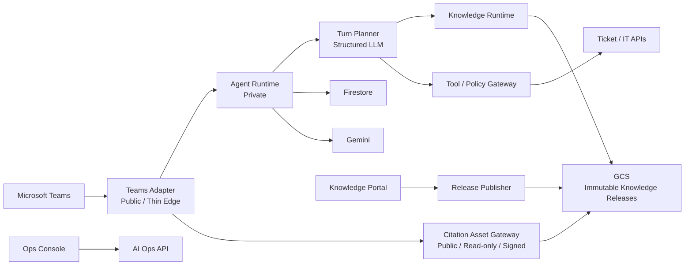

我剛剛直接看了你現在 GitHub `main`，基準是 **`0907b785`**，也對照了 `project-architecture-post-refactor-review-20260918.md`、三個 Dockerfile、`pyproject.toml`、CI、Terraform 與 deploy 文件。

先講結論：**大方向沒有走錯，而且「Teams Adapter 公開、Agent Runtime 私有」這個切法我會保留。** 但你現在最大的架構風險已經不是「耦合太高」，反而是 **系統開始平台化過頭，複雜度成長速度大於產品需求**。現在已經有約 887 個 production source files、11 萬 LOC、Backoffice OpenAPI 約 194 endpoints。下一階段不要再追求「拆更多」，而要開始「收斂責任」。

### 我會優先改這 7 件事

| 優先度 | 我看到的問題 | 建議 |
|---|---|---|
| 🔴 P0 | `main` **目前沒有 branch protection**，但你花大量力氣做 architecture ratchet / Ruff / OpenAPI / bundle gates | Protect `main`，Required Checks + PR-only merge，否則所有架構防線都只是一張很漂亮的安全網，旁邊有扇門開著 |
| 🔴 P0 | **Knowledge delivery 文件跟程式已經 drift**。現在 `agent_service/Dockerfile` 明確不再 COPY corpus/index，註解寫 release 從 GCS 取得；但 `deploy/README.md` 還說 `COPY data ./data`、必須從有 corpus 的開發機部署 | 正式定義 **Knowledge Release Artifact** 為唯一 Source of Truth，刪掉舊部署敘述 |
| 🟠 P1 | `agent_service`、Backoffice、Portal 邏輯已切開，但仍是一個 `teams-agent-rag-service` wheel | 做你文件裡尚未完成的 **uv workspace**。拆 package，不要拆 Git repo |
| 🟠 P1 | Agent Docker image 還安裝 `portal` extra，甚至 BigQuery；Backoffice 也裝 Portal dependencies | 每個 runtime 只安裝自己的 dependency，縮小 image、CVE surface 與 cold start |
| 🟠 P1 | Supervisor-first 讓 Knowledge query 約 **4 次 LLM call**，你的效能文件自己量到成本比舊架構約 +50% | 合併成一個 **Turn Planner structured call**，一次產出 route + issues + readiness，FAQ/response 繼續 deterministic |
| 🟠 P1 | Prompt injection 現在靠 `sanitize_description()` signature-based 過濾，security report 自己也承認可被意譯繞過 | 不要讓「模型產生的 free text」同時成為 retrieval query 與 user-facing text，建立明確的 **trust / provenance boundary** |
| 🟡 P2 | 已有 correlation ID / structured logging，但服務變多後還沒有真正 distributed tracing | 上 OpenTelemetry，追 `Teams → Adapter → Agent → Graph Node → Retrieval → Gemini → Firestore/Tool` |

其中我最意外的是 **第二點**。這已經不是「文件晚一點再補」等級，而是架構 Source of Truth 發生分叉。

你現在的 `agent_service/Dockerfile` 是：

```text
Runtime configuration remains image-owned;
knowledge releases are fetched from GCS
```

而 `deploy/README.md` 還在寫：

```text
agent_service/Dockerfile does COPY data ./data
deployment requires a developer machine that holds the corpus
```

這兩種 architecture philosophy 完全不同。

我會正式選 **GCS Immutable Knowledge Release** 這條路，而且不要再回頭把 corpus bake 進 application image。

---

## 我建議最後收斂成這個樣子



這裡有一個我會特別動刀的地方：**讓 Teams Adapter 變薄。**

你現在 `src/teams_agent/` 裡面已經開始長出：

```text
source_api.py
source_delegation.py
source_link_access.py
source_link_signing.py
source_routes.py
source_storage.py
source_viewer.py
source_viewer_markdown.py
source_viewer_template.py
viewer_sessions_*.py
```

這表示原本應該只是「Teams Protocol Adapter」的東西，正在偷偷長成 **Knowledge Asset Server**。

這是我會阻止的。

Adapter 最理想的責任只有：

```text
Bot Framework authentication
        ↓
Teams activity normalization
        ↓
Agent API invocation
        ↓
Adaptive Card / Teams formatting
```

Citation 文件、圖片、viewer session、source access policy，最好收進獨立的 Asset Gateway，或者 Knowledge service 提供 signed URL。

否則未來 Teams 換成 Web、LINE、Slack，你會發現「Teams Adapter」裡藏了一坨其實跟 Teams 無關的 knowledge infrastructure。

---

## LLM workflow 我也會再砍一刀

你目前這個：

```text
User
 ↓
Conversation Supervisor   ← LLM #1
 ↓
Issue Extractor           ← LLM #2
 ↓
Knowledge Search
 ↓
Relevance / Rewrite       ← LLM #3
 ↓
Answer                    ← LLM #4
```

架構上漂亮，但 production request 走起來有點「四位經理一起審一張請假單」。

我會改成：

```text
User
 ↓
Turn Planner              ← LLM #1
 │
 ├─ route
 ├─ issues[]
 ├─ readiness
 ├─ missingInfo[]
 └─ retrievalIntent
 ↓
RAG                       ← embedding / retrieval
 ↓
Answer Generator          ← LLM #2
 ↓
Deterministic Renderer
```

複雜 query 才啟動 rewrite / grading。

這樣不需要退回 keyword routing，也保留你現在 Structured Output 的好處，正常 IT Knowledge query 有機會從 **4 calls → 2 calls**。

而且這會比繼續優化 Python function size、async helper 或 Cloud Run CPU 有感非常多。你自己的 performance report 其實已經證明 bottleneck 在 **LLM + cold start**，不是 Python。

---

## Prompt Injection 我會改的是「資料流」，不是繼續加 regex

目前 security report 裡的修補是合理的 defense-in-depth，但：

```text
LLM
 ↓
Issue.description
 ↓
sanitize_description()
 ├── render to user
 └── retrieval query
```

本質上還是讓 **不可信模型輸出跨越兩個 trust boundary**。

我會拆成：

```text
original_user_text
        │
        ├──────────────→ display / audit
        │
        ↓
Turn Planner
        │
        ├─ intent enum
        ├─ entities
        ├─ qualifiers
        └─ retrieval_query   ← 永遠不直接 render
```

也就是：

**模型產生的 query 可以拿去搜尋，但不要再拿來顯示。**

**顯示給人的文字不要再反過來拿去執行 tool / retrieval。**

這比偵測「ignore previous instructions」或 System Prompt signature 更符合 Agent security architecture。

---

## 至於你文件裡的 Milestone 2，我現在會真的做

目前：

```text
agent_service/
  pyproject.toml

  src/
    agent_service/
    ai_ops_backoffice/
    knowledge_portal/
    knowledge_core/
    operations_core/
    platform_kernel/
    composition/
```

我會變：

```text
packages/
  platform-kernel/
  operations-core/
  knowledge-core/

apps/
  agent-runtime/
  ai-ops-api/
  knowledge-portal/
  teams-adapter/
  console/
```

然後：

```text
agent-runtime
 ├─ knowledge-core
 ├─ operations-core
 └─ platform-kernel

knowledge-portal
 ├─ knowledge-core
 └─ platform-kernel

ai-ops-api
 ├─ knowledge-core
 ├─ operations-core
 └─ platform-kernel
```

**但仍然維持同一個 monorepo。**

我不建議你現在搞 multi-repo。那會從 code coupling 問題，進化成版本管理地獄 👹。

---

### 如果是我接下來一個月，我會這樣排

**第一刀**不是 refactor Python，而是修 `main` branch protection + deploy 文件與實際 Knowledge Release architecture 的 drift。

**第二刀**完成 uv workspace，讓 Agent / Portal / Backoffice 真正擁有自己的 runtime dependency。

**第三刀**做 Turn Planner PoC，拿現有 Golden Eval 跑 `4-call workflow vs 2-call workflow`，比較 Accuracy / P95 / Cost，不先憑感覺換。

**第四刀**把 citation/source viewer 從 Teams Adapter 抽出去，讓 Adapter 回歸真正的 channel adapter。

**第五刀**才是 OpenTelemetry + production SLO。

所以如果問我現在這個專案「還有沒有架構問題」：

> **有，但已經不是 Clean Architecture 不夠乾淨。**
>
> 現在真正的課題是 **Runtime Boundary、Knowledge Plane、Trust Boundary 與 Complexity Budget**。

而且我反而會開始阻止繼續拆小檔案。你現在最需要的不是更多 Architecture Pattern，而是把這艘船從「每個艙門都設計得很漂亮」拉回「到底哪些艙真的需要存在」。