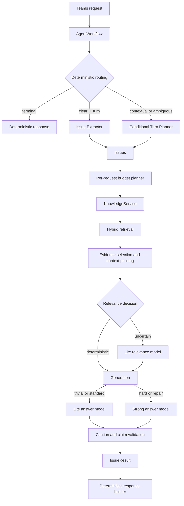

# Agentic RAG Production Optimization Implementation Specification

## Implementation status (code complete; external gates pending)

Code delivery for Phases 0–5 and Workstreams A–H is implemented and verified locally:

- Phase 0 evaluation contract (schema fields, hard negatives, multi-turn ConversationService path, groups/ACL metrics, Layer-3 token-budget overrides, AgentWorkflow evaluator, provenance with role-specific model ids).
- Phase 1 `RagModelBundle`, role settings/governance catalog baselines, startup construction with optional governance peeks (no request-path `build_chat_model` for RAG roles).
- Phase 2 deterministic `plan_request_llm_budget` with provisional query-tier reservations, per-issue answer-slot denial, request-local LLM semaphore (incl. cancel release + nested calls), and planned/consumed/denied/unused budget events.
- Phase 3 hard-answer escalation decisions (default `OFF`) with deadline/budget guards, and contextual Turn Planner policy (default `OFF` / `TURN_PLANNER_MODE`).
- Phase 4 evaluation-channel evidence progression (candidate + generator context chunk ids), source-role filtering, PRIMARY required for found answers.
- Phase 5 G1 `RagAgent.invocation_total` + metric/warning; architecture check forbids chat-route `RagAgent` imports.
- Workstream H observability counters/histograms; LLM component names aligned to the reservation contract (`knowledge_answer`, `knowledge_answer_escalation`, `knowledge_claim_repair`).
- AgentWorkflow eval script reuses `run_production_turn` from `AgentWorkflowTurnExecutor` harness.

Verification evidence (local, non-live):

- `uv run ruff check agent_service/src agent_service/tests` — pass
- `uv run pytest -q agent_service/tests` — 1955 passed, 2 skipped
- `uv run python scripts/check_architecture.py` — pass
- `uv run python scripts/validate_retrieval_eval_v3_blind.py --require-frozen` — pass
- `uv run pytest -q scripts/tests` — 18 passed

Invariants preserved: `AgentWorkflow` + `KnowledgeService` / `HYBRID`; frozen eval labels untouched; `TURN_PLANNER_MODE=OFF`; `RAG_ANSWER_ESCALATION_POLICY=OFF`; global neural reranker off (`rag_reranker_enabled=False`); embedding remains `gemini-embedding-2` when configured via `RAG_EMBEDDING_MODEL`.

Follow-up gates in progress (this goal):

1. Align L3/L2 eval index loading with production active release (same corpus as AgentWorkflow).
2. Expand `agent_workflow_eval_v1` beyond 3 smoke cases (knowledge / multi-turn / greeting) as a formal gate set.
3. Bring Layer-3 live Total/wall P95 to <= 4.5s (exclude harness extractor overhead from RAG latency; profile generate/relevance tails).

Still external / operational:

1. 14-day production observation before `RagAgent` removal (G2/G3).
2. Cloud Run concurrency load test.
3. Final promotion-gate attestation after the aligned live re-runs above.

> Date: 2026-09-21  
> Baseline: `main@b7f3b61`  
> Status: Implementation-ready  
> Owners: Agent Runtime / RAG / AI Ops  
> Scope: Production `AgentWorkflow`, model routing, RAG quality, evaluation, budgets, observability, and legacy `RagAgent` retirement

---

## 1. Purpose

This document defines the next implementation phase for the production agentic RAG path:

```text
Microsoft Teams
  -> teams_agent
  -> AgentGateway
  -> POST /agent/chat or /agent/chat/stream
  -> AgentWorkflow
  -> process_issues
  -> KnowledgeBackendRouter
  -> HybridKnowledgeService
```

The goal is to improve answer quality, multi-turn correctness, model cost allocation, and production observability without introducing another large architectural restructure.

The implementation must preserve these decisions:

1. `AgentWorkflow` remains the production orchestration graph.
2. RAG remains behind the `KnowledgeService` boundary.
3. Retrieval, relevance, rewrite, generation, and citation handling do not become top-level `AgentWorkflow` nodes.
4. `HYBRID` remains the validated production knowledge backend.
5. The repository remains a monorepo while preserving separable service boundaries.
6. `gemini-embedding-2` remains the embedding model unless a later benchmark proves a material regression.
7. A dedicated neural reranker is not enabled globally in this phase.

---

## 2. Current production baseline

### 2.1 Agent workflow

```text
START
 -> load_conversation
 -> route_handoff
    -> handled ---------------------------> save_conversation -> END
    -> respond ---------------------------> build_response -> save -> END
    -> ai
         -> extract_issues
         -> filter_it_issues
         -> process_issues
         -> evaluate_handoff
              -> handled ----------------> save -> END
              -> build ------------------> build_response -> save -> END
```

The graph contains business workflow boundaries. Knowledge implementation details remain inside `HybridKnowledgeService`.

### 2.2 Effective model allocation

| Role | Current model |
|---|---|
| Supervisor / Extractor / Handoff / TurnPlanner | `google_genai:gemini-3.8-flash` |
| RAG answer / relevance / rewrite | `google_genai:gemini-3.1-flash-lite` |
| Embedding | `google_genai:gemini-embedding-2` |
| File Search adapter | `gemini-3.5-flash-lite` |
| Default reranker | `lexical` |

The current governance store agrees with the environment defaults for the active issue-extractor, RAG-answer, embedding, and File Search model configurations.

### 2.3 Actual typical call paths

A clear first-turn IT request normally does not use an LLM for supervision:

```text
deterministic Supervisor
 -> Extractor model
 -> embedding
 -> deterministic or model relevance
 -> RAG answer model
```

A short contextual follow-up may use:

```text
Supervisor model
 -> Extractor model
 -> embedding
 -> relevance/rewrite as needed
 -> RAG answer model
```

The Turn Planner is disabled by default. It should only be promoted after a production-path A/B evaluation.

### 2.4 Latest trustworthy RAG baseline

The frozen blind Layer-3 report contains 156 cases and records:

| Metric | Baseline |
|---|---:|
| Candidate Evidence Recall@24 | 98.28% |
| Document Hit@4 | 98.28% |
| Retrieval Evidence Recall | 89.66% |
| Answer Accuracy | 82.05% |
| Citation Precision | 87.50% |
| Citation Recall | 98.72% |
| No-answer F1 | 98.77% |
| Groundedness | 100% |
| Retrieval P95 | 602 ms |
| Relevance P95 | 1,543 ms |
| Generation P95 | 3,504 ms |
| Total P95 | 4,047 ms |
| LLM calls/query | 1.282 |
| Cost/query | USD 0.001350 |

This report directly evaluates `HybridKnowledgeService`, not the complete `AgentWorkflow`. It must not be presented as a full Teams-to-answer production score.

---

## 3. Target architecture



The target introduces role-specific model routing and request-level budgeting while preserving the existing graph and service boundaries.

---

## 4. Non-goals

The following work is explicitly excluded:

- Splitting the repository.
- Replacing LangGraph.
- Replacing the vector store or embedding model.
- Introducing GraphRAG.
- Turning every RAG stage into a LangGraph node.
- Enabling a neural reranker for all traffic.
- Editing frozen blind labels after viewing candidate output.
- Rewriting the Teams adapter, Knowledge Portal, or AI Ops Backoffice.
- Changing ticket intent precedence or existing handoff safety rules.

---

## 5. Workstream A: correct the evaluation contract

This workstream is a prerequisite for all model and routing decisions.

### 5.1 Extend the evaluation case schema

Update:

- `agent_service/src/agent_service/retrieval_eval_schema.py`
- `agent_service/tests/test_retrieval_eval_v2.py`
- `agent_service/tests/test_validate_retrieval_eval_v3_blind.py`

Add these immutable fields to `EvidenceLevelCase`:

```python
@dataclass(frozen=True)
class EvidenceLevelCase:
    # Existing fields remain unchanged.
    prior_turn: str | None = None
    hard_negative_ids: tuple[str, ...] = ()
    groups: tuple[str, ...] = ()
    categories: tuple[str, ...] = ()
```

Parsing contract:

| JSON field | Python field |
|---|---|
| `priorTurn` | `prior_turn` |
| `hardNegatives` | `hard_negative_ids` |
| `groups` | `groups` |
| `categories` | `categories` |

Do not change existing frozen queries, expected documents, evidence markers, or forbidden titles as part of this schema change.

### 5.2 Make hard-negative metrics real

Update `scripts/run_rag_pipeline_eval.py` so `score_retrieval_case()` receives:

```python
hard_negative_ids=case.hard_negative_ids
```

Remove the current constant empty list.

Required tests:

1. A relevant document at rank 1 returns hard-negative accuracy `1.0`.
2. A hard-negative document at rank 1 returns `0.0`.
3. A case without hard negatives contributes `None`, not a synthetic zero.
4. Aggregate `hardNegativeAccuracy` averages only labeled cases.

### 5.3 Execute multi-turn cases as multi-turn

The evaluation runner must not concatenate `priorTurn` and `query` into one synthetic string. It must exercise production conversation resolution.

For Layer 3:

1. Create an isolated conversation identity per case.
2. If `prior_turn` is present, seed or execute the prior turn through the same `ConversationService` used by `AgentWorkflow`.
3. Execute the current query as a second turn.
4. Preserve tenant, conversation, user, and request identities across both turns.
5. Score only the second turn.

For retrieval-only Layer 1 and Layer 2 reports:

- Either resolve the query through the production issue-resolution helper; or
- Exclude `multi_turn` cases and report `excludedMultiTurnCaseCount`.

Do not silently score an ambiguous follow-up without its context.

### 5.4 Honor group context

Layer 1, Layer 2, and Layer 3 must pass `case.groups` into the user/retrieval context.

If the corpus has no group-gated documents, the report must state:

```json
"aclCoverageMode": "CORPUS_HAS_NO_GROUP_GATED_DOCUMENTS"
```

The field named `aclLeakageCount` must only represent actual forbidden ACL exposure. Scenario confusion or forbidden semantic documents require a separate metric such as `forbiddenDocumentHitCount`.

### 5.5 Fix the Layer-3 token budget contract

`run_layer3_case()` must not accept and discard `token_budget`.

Choose exactly one contract:

#### Preferred contract

Pass a request-scoped evaluation override through `AgentRequest` or `ExecutionContext`:

```python
evaluation_overrides={"evidence_token_budget": token_budget}
```

Production requests must not accept this external override.

#### Acceptable fallback

Remove the Layer-3 token-budget CLI option and report the actual tier-derived budget used by each case.

Required report fields:

```json
{
  "configuredTokenBudget": 800,
  "effectiveTokenBudget": 800,
  "queryTier": "standard"
}
```

### 5.6 Add production-path evaluation

Create:

- `scripts/run_agent_workflow_eval.py`
- `agent_service/tests/test_agent_workflow_eval.py`
- `data/eval/agent_workflow_eval_v1.json`

Reuse `AgentWorkflowTurnExecutor` instead of building a second workflow harness.

Each case must enter through an `AgentRequest` and exit as an `AgentResponse`.

Minimum case schema:

```json
{
  "id": "workflow-v1-001",
  "priorTurns": [],
  "message": "FortiClient 出現 -455 怎麼辦？",
  "groups": [],
  "expectedRoute": "KNOWLEDGE",
  "expectedIssueCount": 1,
  "expectedFound": true,
  "expectedDocuments": ["登入 FortiClient 出現錯訊"],
  "expectedEvidence": [{"mustContain": ["-455"]}],
  "forbiddenActions": ["CREATE_TICKET", "HANDOFF"]
}
```

Required production-path metrics:

- Supervisor route accuracy.
- Issue count accuracy.
- Issue route accuracy.
- IT/non-IT classification accuracy.
- Retrieval intent preservation.
- Answer accuracy.
- Citation precision and recall.
- No-answer F1.
- Ticket false-trigger rate.
- Handoff false-trigger rate.
- LLM calls per request by component.
- Input/output tokens by component.
- Cost per request.
- P50/P95 total latency.
- P50/P95 time to first streamed stage.

### 5.7 Provenance requirements

Every Layer-2, Layer-3, and AgentWorkflow report must contain:

```json
{
  "provenance": {
    "commitSha": "...",
    "datasetPath": "...",
    "datasetHash": "...",
    "freezeVersion": 2,
    "releaseId": "...",
    "agentModel": "...",
    "answerModel": "...",
    "relevanceModel": "...",
    "rewriteModel": "...",
    "embeddingModel": "...",
    "region": "...",
    "startedAt": "...",
    "completedAt": "..."
  }
}
```

A report with a mismatched dataset hash, missing commit SHA, or missing production model identity must not be used as a release gate.

---

## 6. Workstream B: split RAG model roles

### 6.1 Configuration contract

Retain `RAG_MODEL` as the backward-compatible default. Add:

```text
RAG_ANSWER_MODEL
RAG_RELEVANCE_MODEL
RAG_REWRITE_MODEL
RAG_HARD_ANSWER_MODEL
RAG_ANSWER_ESCALATION_POLICY
```

Resolution order:

| Role | Resolution |
|---|---|
| Answer | governance `rag-answer-model` -> `RAG_ANSWER_MODEL` -> `RAG_MODEL` |
| Relevance | governance `rag-relevance-model` -> `RAG_RELEVANCE_MODEL` -> resolved answer model |
| Rewrite | governance `rag-rewrite-model` -> `RAG_REWRITE_MODEL` -> resolved relevance model |
| Hard answer | governance `rag-hard-answer-model` -> `RAG_HARD_ANSWER_MODEL` -> no escalation |

Default behavior must remain identical when new environment variables and governance configurations are absent.

Suggested initial values:

```text
RAG_ANSWER_MODEL=google_genai:gemini-3.1-flash-lite
RAG_RELEVANCE_MODEL=google_genai:gemini-3.1-flash-lite
RAG_REWRITE_MODEL=google_genai:gemini-3.1-flash-lite
RAG_HARD_ANSWER_MODEL=google_genai:gemini-3.8-flash
RAG_ANSWER_ESCALATION_POLICY=OFF
```

### 6.2 Settings changes

Update:

- `agent_service/src/agent_service/settings.py`
- `agent_service/src/agent_service/settings_env.py`
- `agent_service/src/agent_service/settings_validate.py`
- `agent_service/.env.example`

Add fields:

```python
rag_answer_model: str | None = None
rag_relevance_model: str | None = None
rag_rewrite_model: str | None = None
rag_hard_answer_model: str | None = None
rag_answer_escalation_policy: str = "OFF"
```

Allowed escalation policies:

```text
OFF
HARD_DIRECT
ON_GROUNDING_FAILURE
HARD_OR_GROUNDING_FAILURE
```

Invalid values must fail at startup.

### 6.3 Runtime model bundle

Create `agent_service/src/agent_service/rag_models.py`:

```python
@dataclass(frozen=True)
class RagModelBundle:
    answer: BaseChatModel | None
    relevance: BaseChatModel | None
    rewrite: BaseChatModel | None
    hard_answer: BaseChatModel | None
```

The bundle must be created at startup and passed into `HybridKnowledgeService`. Do not call `build_chat_model()` on the request path.

Update:

- `agent_service/src/agent_service/lifespan_wiring.py`
- `agent_service/src/agent_service/knowledge_hybrid.py`
- `agent_service/src/agent_service/knowledge_pipeline/relevance_stage.py`
- `agent_service/src/agent_service/knowledge_pipeline/search_stage.py`
- `agent_service/src/agent_service/knowledge_pipeline/generation_stage.py`
- `agent_service/src/agent_service/knowledge_pipeline/generation_host.py`

Role usage:

- `documents_are_relevant()` uses `bundle.relevance`.
- `rewrite_search_query()` uses `bundle.rewrite`.
- initial answer generation uses `bundle.answer` unless hard-direct escalation applies.
- repair/escalation uses `bundle.hard_answer` only when policy allows.

### 6.4 Governance model IDs

Add optional governance configurations:

```text
rag-relevance-model
rag-rewrite-model
rag-hard-answer-model
```

Existing `rag-answer-model` remains authoritative for ordinary answer generation.

Model governance audit events must record:

- role
- selected model
- source: governance/environment/fallback
- escalation policy
- escalation reason

### 6.5 Backward compatibility

Required tests:

1. Only `RAG_MODEL` set: all RAG roles use the same model.
2. Only `RAG_ANSWER_MODEL` set: relevance/rewrite inherit answer model.
3. Every role configured: each stage uses its configured model.
4. Missing hard model with escalation enabled: safely stays on answer model and records `HARD_MODEL_UNAVAILABLE`.
5. Governance override changes only the intended role.

---

## 7. Workstream C: hard-tier answer escalation

### 7.1 Escalation inputs

Escalation may use only trusted runtime signals:

- `query_tier == "hard"`
- structured output validation failure
- answer grounding failure
- claim/citation alignment failure
- answer safety repair exhaustion

Do not escalate based on user-provided claims such as “this is hard.”

### 7.2 Policy behavior

| Policy | Initial model | Retry model |
|---|---|---|
| `OFF` | answer | none |
| `HARD_DIRECT` | hard for hard tier, answer otherwise | none |
| `ON_GROUNDING_FAILURE` | answer | hard after eligible failure |
| `HARD_OR_GROUNDING_FAILURE` | hard for hard tier, answer otherwise | hard after eligible failure |

Only one answer escalation is allowed per issue.

Do not escalate when:

- request deadline cannot reserve the configured model timeout;
- request LLM budget has no escalation slot;
- the result is a valid no-answer;
- retrieval evidence is empty;
- the failure is an ACL or authorization failure;
- the hard model is unavailable.

### 7.3 Trace contract

Add to retrieval/answer trace:

```json
{
  "answerModel": "gemini-3.1-flash-lite",
  "answerEscalated": true,
  "answerEscalationModel": "gemini-3.8-flash",
  "answerEscalationReason": "GROUNDING_FAILURE",
  "answerAttemptCount": 2
}
```

Allowed reasons:

```text
HARD_TIER
STRUCTURED_OUTPUT_FAILURE
GROUNDING_FAILURE
CLAIM_ALIGNMENT_FAILURE
SAFETY_REPAIR_FAILURE
```

### 7.4 Initial rollout recommendation

Roll out in this order:

1. `OFF` baseline.
2. `ON_GROUNDING_FAILURE` at 5% canary.
3. `ON_GROUNDING_FAILURE` at 25% if gates pass.
4. Compare `HARD_DIRECT` only after the failure-only policy has a stable baseline.

Do not begin with `HARD_OR_GROUNDING_FAILURE` globally.

---

## 8. Workstream D: conditional Turn Planner

### 8.1 Configuration

Replace the boolean-only behavior with an enum while preserving the old flag:

```text
TURN_PLANNER_MODE=OFF|CONTEXTUAL|ALL
```

Compatibility mapping:

```text
TURN_PLANNER_ENABLED=false -> OFF
TURN_PLANNER_ENABLED=true  -> ALL
```

When both are set, `TURN_PLANNER_MODE` wins.

### 8.2 Contextual activation policy

Create a pure helper:

```python
def should_use_turn_planner(
    *,
    message: str,
    pending_clarification: bool,
    recent_turns: Sequence[str],
    has_pending_ticket_offer: bool,
) -> bool:
    ...
```

`CONTEXTUAL` mode returns true when at least one condition holds:

- pending clarification exists;
- a pending ticket offer requires contextual interpretation;
- recent turns exist and the message matches the contextual-reply pattern;
- recent turns exist and normalized message length is at most 12 characters;
- the message begins with a referential expression such as `那`, `這個`, `剛才`, or `上面`.

Deterministic greeting, explicit ticket, explicit escalation, and assistant-scope paths remain zero-LLM.

### 8.3 Failure behavior

If Turn Planner invocation fails:

1. Do not silently return an empty IT plan.
2. Fall back to the current Supervisor + Extractor path if budget permits.
3. Record `turn_planner_fallback_total` and the exception type.
4. Preserve the same request deadline.

### 8.4 Promotion gates

Turn Planner may move from `OFF` to `CONTEXTUAL` only when the production-path eval shows:

- no regression in route accuracy;
- no regression in ticket/handoff false-trigger rate;
- multi-turn answer accuracy improves by at least 5 percentage points or reaches 90%;
- mean LLM calls for contextual turns decreases by at least 15%;
- contextual-turn P95 does not regress by more than 10%;
- total cost per contextual turn does not regress by more than 10%.

`ALL` mode is not a target for this phase.

---

## 9. Workstream E: deterministic request-level LLM budgeting

### 9.1 Problem

`process_issues` processes up to three issues concurrently. A shared counter limits calls, but concurrent issues can compete for remaining slots. Results may depend on coroutine scheduling instead of issue priority.

### 9.2 Budget plan

Create `agent_service/src/agent_service/llm_budget_plan.py`:

```python
@dataclass(frozen=True)
class IssueLlmBudget:
    issue_id: int
    answer_slots: int
    relevance_slots: int
    rewrite_slots: int
    escalation_slots: int

@dataclass(frozen=True)
class RequestLlmBudgetPlan:
    total_limit: int
    already_used: int
    issue_budgets: tuple[IssueLlmBudget, ...]
```

Planning rules:

1. Reserve one answer slot for every READY knowledge issue when capacity permits.
2. Allocate relevance slots to standard/hard issues before rewrite slots.
3. Allocate rewrite only to hard issues with rewrite headroom.
4. Allocate escalation slots last.
5. Preserve input issue order as the deterministic tie-breaker.
6. Never allocate more than `MAX_LLM_CALLS_PER_REQUEST - already_used`.

If there are more answerable issues than remaining answer slots, return a deterministic budget-exceeded `IssueResult` for the unallocated issues. Do not race them against allocated issues.

### 9.3 Per-request concurrency limit

Add:

```text
MAX_CONCURRENT_LLM_CALLS_PER_REQUEST=2
```

`ExecutionContext.run_llm()` must acquire a request-local semaphore before invoking the provider.

Requirements:

- Semaphore waiting time counts against the request deadline.
- Cancellation releases the semaphore.
- Nested `run_llm()` calls must not deadlock.
- Embedding calls are not counted by this semaphore unless separately configured.

### 9.4 Component reservations

Every LLM call must identify a component:

```text
turn_planner
conversation_supervisor
issue_extractor
knowledge_relevance
knowledge_rewrite
knowledge_answer
knowledge_answer_escalation
knowledge_claim_repair
handoff_router
ticket_item_selector
```

Budget events must record planned, consumed, denied, and unused slots by component and issue ID.

### 9.5 Required concurrency tests

1. Three issues with six slots produce deterministic allocation across 100 runs.
2. A hard first issue cannot consume answer slots reserved for later issues.
3. Provider failure releases the semaphore.
4. Deadline expiry while waiting returns `DEADLINE_EXCEEDED`.
5. Cancellation does not leak a permit.
6. At most two fake model calls are concurrently active.

---

## 10. Workstream F: evidence selection and citation precision

This work begins only after Workstream A produces a corrected baseline.

### 10.1 Stage-level evidence trace

For evaluation channels only, record expected evidence progression:

```json
{
  "candidateChunkIds": [],
  "postSelectionChunkIds": [],
  "bundleChunkIds": [],
  "generatorContextChunkIds": [],
  "citedChunkIds": [],
  "droppedEvidence": [
    {
      "chunkId": "...",
      "stage": "CONTEXT_PACKING",
      "reason": "TOKEN_BUDGET"
    }
  ]
}
```

Allowed drop stages:

```text
CANDIDATE_FILTER
DOCUMENT_SELECTION
VERSION_FILTER
DIVERSITY_LIMIT
EVIDENCE_EXPANSION
CONTEXT_PACKING
GENERATION
CITATION_PRUNING
```

Allowed reasons must be an enum, not arbitrary strings.

Never attach full document content or user text to production spans.

### 10.2 Source role contract

Use these source roles consistently:

```text
PRIMARY
SUPPORTING
CONTRASTIVE
POLICY_OVERLAY
INCIDENTAL
```

Rules:

- At least one `PRIMARY` source is required for a found answer.
- `SUPPORTING` sources appear only when a material claim depends on them.
- `CONTRASTIVE` sources appear only for explicit comparison or negative-constraint answers.
- `POLICY_OVERLAY` sources remain separate from enterprise knowledge citations.
- `INCIDENTAL` sources do not appear in the user-visible citation list.

### 10.3 Selection optimization order

Implement experiments in this order:

1. Query-aligned source-role filtering.
2. Context packing that preserves primary evidence before supporting evidence.
3. Hard-query-only lexical/listwise reranking.
4. Dedicated reranker canary only if the first three steps do not meet gates.

Do not enable a dedicated reranker merely because candidate recall is high and final evidence recall is lower. First determine the exact stage where evidence is dropped.

---

## 11. Workstream G: legacy `RagAgent` retirement

### 11.1 Current state

Production chat routes use `AgentWorkflow`, but startup, index reload, dependency synchronization, and model control still construct and assign `RagAgent` to `app.state.agent`.

### 11.2 Retirement phases

#### Phase G1: usage proof

- Add a counter for every runtime entry into `RagAgent.run/search`.
- Add a warning identifying the caller category.
- Do not count unit tests.
- Observe production for at least 14 days.

#### Phase G2: stop constructing legacy agent

When runtime traffic is zero:

- Remove `RagAgent` construction from startup.
- Remove recreation from index reload and model control.
- Update only `KnowledgeBackendRouter` on index adoption.
- Remove `app.state.agent`.

#### Phase G3: remove implementation

- Remove `agent_service/graph.py`.
- Remove legacy-only tests.
- Preserve reusable `KnowledgeService` tests.
- Add an architecture check preventing reintroduction of production imports from `agent_service.graph`.

### 11.3 Removal gate

Removal requires:

- zero production invocations for 14 days;
- no route registration referencing `app.state.agent`;
- index reload tests passing through `KnowledgeBackendRouter`;
- model governance tests passing without `RagAgent`;
- rollback documented as redeploying the previous release, not dual-running both paths.

---

## 12. Workstream H: observability and release gates

### 12.1 Required metrics

Counters:

```text
agent_turn_planner_selected_total
agent_turn_planner_fallback_total
agent_llm_budget_denied_total
rag_answer_escalation_total
rag_answer_escalation_success_total
rag_evidence_drop_total
rag_citation_pruned_total
legacy_rag_agent_invocation_total
```

Histograms:

```text
agent_request_latency_ms
agent_first_stage_latency_ms
agent_llm_semaphore_wait_ms
rag_retrieval_latency_ms
rag_relevance_latency_ms
rag_rewrite_latency_ms
rag_generation_latency_ms
rag_claim_repair_latency_ms
rag_total_latency_ms
```

Low-cardinality attributes:

```text
component
query_tier
model_role
model_id
knowledge_backend
release_id
result_type
escalation_reason
```

Do not use query, answer, document title, case ID, user ID, or conversation ID as metric attributes.

### 12.2 Proposed production promotion gates

Revalidate the baseline after Workstream A. Then require both non-regression and absolute floors.

#### RAG service gate

| Metric | Promotion floor |
|---|---:|
| Answer Accuracy | >= 90% initially; target >= 92% |
| Citation Precision | >= 92% initially; target >= 95% |
| Citation Recall | >= 95% |
| No-answer F1 | >= 98% |
| Groundedness | >= 99% |
| Candidate Evidence Recall@24 | >= 97% |
| Total P95 | <= 4.5 s |
| Retrieval P95 | <= 1.0 s |
| Cost/query | <= baseline +25% |

#### AgentWorkflow gate

| Metric | Promotion floor |
|---|---:|
| Route accuracy | >= 97% |
| Ticket false-trigger rate | <= 0.5% |
| Handoff false-trigger rate | <= 0.5% |
| Issue count exact match | >= 95% |
| Multi-turn answer accuracy | >= 90% |
| Request P95 | no more than baseline +10% |
| Request cost | no more than baseline +15% |

These are proposed gates. If product owners choose different values, record the decision in governance data; do not silently change the evaluator.

### 12.3 Load test gate

After functional gates pass, run the documented concurrency matrix:

- concurrency: 1, 4, 8, 16, 32;
- at least 200 requests per level or 5–10 minutes sustained load;
- separate cold and warm runs;
- separate repeated-query and unique-query populations;
- record instance count, cold starts, provider throttling, TTFT, P95/P99, errors, and timeouts.

Do not select Cloud Run concurrency from an eight-request sample.

---

## 13. Delivery phases

### Phase 0: evaluation correctness

Deliverables:

- Extended `EvidenceLevelCase`.
- Real hard-negative scoring.
- Multi-turn execution with prior context.
- Group-aware evaluation.
- Effective Layer-3 token budget reporting.
- Production-path AgentWorkflow evaluator.

Exit criteria:

- All tests pass.
- Frozen dataset hash unchanged unless a new freeze version is formally approved.
- Corrected full Layer-2 and Layer-3 reports generated at current HEAD.
- AgentWorkflow baseline report generated.

### Phase 1: model role separation

Deliverables:

- `RagModelBundle`.
- Role-specific settings and governance.
- No behavior change with default configuration.
- Component-level usage attribution.

Exit criteria:

- Baseline metrics are statistically equivalent to pre-change corrected baseline.
- No model construction occurs in request paths.

### Phase 2: deterministic budgeting

Deliverables:

- Request budget plan.
- Per-issue reservations.
- Request-local model semaphore.
- Budget observability.

Exit criteria:

- Concurrency tests are deterministic.
- No reserved answer slot can be consumed by another issue.
- Existing graceful degradation remains intact.

### Phase 3: model-routing experiments

Experiments:

1. Answer escalation on grounding failure.
2. Hard-direct answer model.
3. Conditional Turn Planner.
4. Hard-tier reranker only if evidence-selection work is insufficient.

Exit criteria:

- Candidate meets the promotion gates.
- A/B report includes accuracy, latency, calls, tokens, and cost.
- Rollback is a configuration change.

### Phase 4: evidence and citation optimization

Deliverables:

- Stage-level evidence trace.
- Source-role enforcement.
- Primary-first context packing.
- Residual failure adjudication.

Exit criteria:

- Answer and citation gates pass.
- No ACL or policy-overlay regression.

### Phase 5: legacy retirement and production load validation

Deliverables:

- `RagAgent` usage proof and removal.
- Full production load test.
- Dashboard and alerts.
- Updated architecture documentation.

---

## 14. Verification commands

Run the narrowest relevant tests during development, followed by the complete gates before merge.

```bash
uv run ruff check src tests
uv run pytest -q tests

uv run ruff check agent_service/src agent_service/tests
uv run pytest -q agent_service/tests

uv run python scripts/check_architecture.py
uv run python scripts/validate_retrieval_eval_v3_blind.py --require-frozen
uv run pytest -q scripts/tests
```

After Phase 0, add documented commands for:

```bash
uv run python scripts/run_rag_pipeline_eval.py \
  --eval-set data/eval/retrieval_eval_v3_blind.json \
  --split test \
  --layer 3 \
  --live-model \
  --output data/eval/reports/<report>.json

uv run python scripts/run_agent_workflow_eval.py \
  --eval-set data/eval/agent_workflow_eval_v1.json \
  --live-model \
  --workflow-factory <module:attr> \
  --output data/eval/reports/<report>.json
```

`run_agent_workflow_eval.py` requires `--workflow-factory module:attr` that returns an AgentWorkflow-compatible object; it reuses `AgentWorkflowTurnExecutor` patterns and does not invent a second harness. Exact CLI arguments are also available via each script's `--help` output.

---

## 15. Pull request structure

Keep changes reviewable. Do not implement the entire specification in one pull request.

Recommended sequence:

1. `fix/eval-production-contract`
2. `feat/rag-model-roles`
3. `feat/request-llm-budget-plan`
4. `feat/rag-answer-escalation`
5. `feat/contextual-turn-planner`
6. `feat/rag-evidence-trace`
7. `refactor/remove-legacy-rag-agent`
8. `perf/cloudrun-agent-load-gate`

Each pull request must include:

- scope and non-goals;
- affected contracts;
- test evidence;
- benchmark evidence when behavior changes;
- rollback procedure;
- remaining risks;
- confirmation that frozen eval labels were not modified after observing output.

---

## 16. Definition of done

This phase is complete when:

1. RAG service evaluation correctly handles prior turns, groups, hard negatives, and effective token budgets.
2. A full production-path `AgentWorkflow` evaluation exists and is used as a release gate.
3. RAG answer, relevance, rewrite, and hard-answer model roles can be configured independently.
4. Hard-model use is bounded, observable, and reversible by configuration.
5. Multi-issue LLM allocation is deterministic and protected by a request-local concurrency limit.
6. Correct evidence can be traced from candidate retrieval to final citation without logging sensitive content.
7. Turn Planner remains off or contextual-only unless its A/B gates pass.
8. `RagAgent` is removed after verified zero production use.
9. Corrected blind RAG metrics meet the agreed promotion gates.
10. Production AgentWorkflow metrics meet the agreed routing, safety, latency, and cost gates.
11. Cloud Run load testing demonstrates stable P95/P99 and error rates at the selected concurrency.
12. Architecture and runbook documents reflect the final production path and effective model routing.

---

## 17. Final implementation stance

The current architecture is structurally sound. The next phase must optimize contracts and runtime decisions rather than introduce new architectural layers.

The preferred path is:

```text
correct evaluation
 -> separate model roles
 -> deterministic request budgeting
 -> hard-answer escalation experiment
 -> contextual Turn Planner experiment
 -> evidence/citation optimization
 -> legacy RagAgent removal
 -> production load gate
```

Do not enable a stronger model, Turn Planner, or dedicated reranker globally until the corrected RAG and AgentWorkflow evaluations demonstrate a measurable win.
