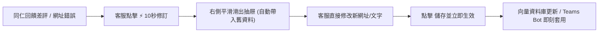
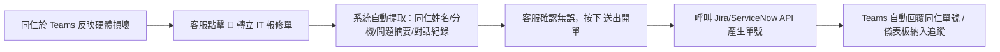
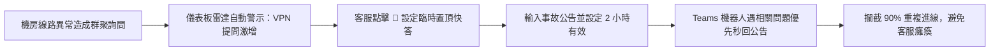

# 資訊客服營運工作台 UI/UX 規格書 (IT Helpdesk Operations Workbench Specification)

| 項目 | 內容 |
|---|---|
| 文件版本 | v1.0 |
| 定稿日期 | 2026-09-16 |
| 狀態 | Approved by User / Ready for Implementation |
| 適用系統 | teams-agent / ai_ops_backoffice / console_frontend |
| 目標使用者 | 主要：一線/二線 IT 客服人員 (Role A)、知識庫與 BU 文件維護者 (Role B)；次要：IT 維運主管 (Role C) |
| 設計哲學 | **以營運工作流為核心，拒絕工程資料庫 CRUD；實現零公文式操作（3 秒掌握現況、10 秒完成修復）** |

---

## 1. 背景與重構核心宗旨

### 1.1 現況痛點分析
目前系統存在兩套介面（舊版靜態 HTML/JS 與 Console-V2 初版），在日常維運上具有顯著缺陷：
1. **資訊架構破碎，功能散落各處**：舊版高達 30 多個平鋪選單（prompts, models, flags, costs, budgets, issues, retention...），客服找不到常用入口。
2. **操作過度「公文行政化」**：修改一筆 FAQ 或更正文件段落，需經歷多層跳轉、開立工單、選取稽核碼、關聯多重標籤等繁瑣步驟，嚴重拖慢客服即時排查效率。
3. **缺乏即時態勢感知（Situation Awareness）**：儀表板充斥純工程指標（Token、Raw Costs），客服上班第一眼無法得知今日有無突發故障（如機房當機、VPN 異常）。
4. **對話上下文割裂**：排查差評或錯誤回答時，看不到真實 Teams 對話視圖與 AI 推論引用的文件片段。

### 1.2 重構目標與指導原則
* **使用者本位**：專為 IT Helpdesk 人員與知識管理者量身打造，將底層 AI 治理與工程設定收納至背景或進階選單。
* **零公文、直修權限**：一線客服具備輕量修復權限，修改常見問答或覆蓋手冊時，支援「**即改即生效**」，後台自動留存稽核日誌。
* **實體工單整合**：遇到硬體故障或需現場支援之問題，一鍵轉派至 Jira / ServiceNow / 內部工單，並在工作台即時追蹤進度。
* **手冊為主力、FAQ 為輔助**：針對知識庫以「上傳 PDF/Word 操作手冊」為主的特性，提供流暢的拖曳上傳、版本自動汰換與段落檢驗。
* **即改即測（Live Playground）**：知識修訂旁常駐模擬測試框，在工作台內即可驗證 AI 是否學會，無需切換至 Teams 實體測試。

---

## 2. 全站導覽架構（IA 大收斂）

將原先 30 多個破碎入口全面收斂為 **4 大日常營運主入口** 與 **1 處進階設定**：

```
┌────────────────────────────────────────────────────────┐
│  🏢 資訊客服營運工作台                                 │
├────────────────────────────────────────────────────────┤
│  📊 營運即時儀表板    (今日早晨態勢、突發雷達、快捷待辦)│
│  💬 對話重播與分診    (Teams對話還原、負評/查無排查、直修)│
│  📄 知識手冊與問答    (PDF/Word上傳、FAQ快速新增、測試場)│
│  🎫 IT 工單追蹤       (轉派 Jira/ServiceNow 實體單進度)│
├────────────────────────────────────────────────────────┤
│  ────────────────── (分隔線) ─────────────────        │
│  ⚙️ 系統進階設定      (僅 IT 管理者可見：模型/成本/授權) │
└────────────────────────────────────────────────────────┘
```

---

## 3. 四大核心模組詳細規格

### 模組 1：營運即時儀表板 (Operations Real-time Dashboard)

#### 3.1 視覺與區塊規劃
儀表板依據 **「感知現況 ➔ 突發警報 ➔ 立即處理 ➔ 趨勢盲區」** 的工作節奏展開：

```
┌──────────────────────────────────────────────────────────────────────────────────────────────────┐
│ 頂欄：資訊客服營運中心  [Teams 機器人：正常運行 🟢]  [Jira/工單同步：已連線 🟢]   [⚡ 快速新增 FAQ] [🔍]│
├──────────────────────────────────────────────────────────────────────────────────────────────────┤
│ 【板塊 1：早晨態勢 KPI 卡片（含轉派工單）】                                                     │
│ ┌──────────────┐ ┌──────────────┐ ┌──────────────┐ ┌──────────────┐ ┌──────────────┐          │
│ │ 今日諮詢總量 │ │ AI 自動解決率│ │ 轉派實體工單 │ │ 同仁滿意度   │ │ 待處理紅字項 │          │
│ │   1,248 件   │ │    81.5%     │ │    32 件     │ │  92% 好評 👍 │ │    8 筆需介入│          │
│ │ (較昨日 +12%)│ │ (1,017 件自決│ │ (硬體/權限單)│ │ (16 件差評 👎│ │ (4負評/4缺漏)│          │
│ └──────────────┘ └──────────────┘ └──────────────┘ └──────────────┘ └──────────────┘          │
├──────────────────────────────────────────────────────────────────────────────────────────────────┤
│ 【板塊 2：🚨 即時突發事件雷達（Spike Alert）】                                                   │
│ ⚠️ 突發警報：過去 30 分鐘內有 42 人詢問「VPN 連線逾時 / 伺服器無回應」                          │
│ [查看 42 筆對話]   [📢 設定 Teams 機器人臨時置頂快答/廣播]   [一鍵通報網路組]   [關閉警報]        │
├──────────────────────────────────────────────────────────────────────────────────────────────────┤
│ 【板塊 3：今日待辦工作箱（Action Inbox）—— 拒絕公文，10 秒完成處置】                             │
│  分籤：[🔴 待處理負評 (4)]   [🟡 知識缺口 (4)]   [🎫 追蹤已轉派工單 (12)]   [⚡ 歷史快修紀錄]     │
│ ┌──────────────────────────────────────────────────────────────────────────────────────────────┐ │
│ │ • 10:14 財務部-王小明 👎 差評：「回答的差勤系統網址連不上，出現 404」                        │ │
│ │   當時引用：《差勤系統操作指引 v1.0》                                                        │ │
│ │   操作按鈕：👉 【⚡ 10秒修訂這筆 FAQ】   【🎫 轉立 IT 報修單】   【標記為已確認】            │ │
│ │ ──────────────────────────────────────────────────────────────────────────────────────────── │ │
│ │ • 09:45 業務部-林專員 🎫 已轉工單：[IT-2026-881] 筆記型電腦鍵盤潑水無法開機 (處理中)        │ │
│ │   派工對象：現場硬體組 (阿祥) | 更新時間：10分鐘前                                           │ │
│ │   操作按鈕：👉 【檢視 Jira/工單詳情】   【通知進度給同仁】                                   │ │
│ └──────────────────────────────────────────────────────────────────────────────────────────────┘ │
├──────────────────────────────────────────────────────────────────────────────────────────────────┤
│ 【板塊 4：常見 IT 諮詢排行 與 知識健康度盲區】                                                   │
│ ┌──────────────────────────────────────────────┐ ┌──────────────────────────────────────────────┐ │
│ │ 🏆 Top 5 本週最常問 IT 主題                  │ │ 🧭 知識庫健康度盲區（最需要補強的類別）      │ │
│ │ 1. 忘記密碼 / 帳號解鎖   (420 次，解決率 98%)│ │ • 差勤與人資系統：差評率偏高 22% ⚠️ (需更新) │ │
│ │ 2. 訪客 Wi-Fi 帳密申請   (280 次，解決率 95%)│ │ • 印表機與硬體周邊：轉人工率高 35% ⚠️ (需補圖)│ │
│ │ 3. VPN 遠端辦公連線      (195 次，解決率 72%)│ │ • 視訊設備使用：知識覆蓋良好 (解決率 96%)    │ │
│ │ 4. Outlook 郵件設定      (150 次，解決率 88%)│ │                                              │ │
│ └──────────────────────────────────────────────┘ └──────────────────────────────────────────────┘ │
└──────────────────────────────────────────────────────────────────────────────────────────────────┘
```

#### 3.2 關鍵功能定義
1. **KPI Pulse**：計算今日諮詢量、AI 自動解決率（Deflection Rate）、轉派實體工單數、同仁滿意度（好評/差評數）、待處理紅字項。點擊紅字項卡片直接平滑滾動至待辦工作箱。
2. **突發事件雷達（Spike Alert）**：後端即時聚合同一語意之提問，當 30 分鐘內超過門檻（例如 > 20 人）時置頂警示。支援點擊「**📢 設定臨時置頂快答/廣播**」，設定 1~4 小時有效之優先回覆，攔截重複進線。
3. **待辦工作箱（Action Inbox）**：分為「負評」、「知識缺口」、「已轉工單」三頁籤。點擊「10秒修訂」直接展開側邊欄，不離開當前畫面。
4. **熱門排行與盲區**：顯示最常問 IT 主題 Top 5，並標記解決率低於 75% 的知識盲區分類。
5. **常駐【⚡ 快速新增 FAQ】**：頂欄常駐快捷鍵，彈出簡易視窗（問題問法、解答內容、分類），10 秒內存檔生效。

---

### 模組 2：對話重播與負評分診台 (Conversation & Feedback Triage Console)

#### 4.1 三欄式工作台佈局
專為客服人員排查具體個案而設計，兼具完整上下文與即時處置能力：

```
┌─────────────────┬───────────────────────────────────────────────┬─────────────────────────────────┐
│ 1. 待處理分診佇列 │ 2. Teams 真實對話重播 (Conversation Stream)   │ 3. 根因診斷與處置工具箱 (Action) │
├─────────────────┼───────────────────────────────────────────────┼─────────────────────────────────┤
│ 篩選：          │ 【同仁資訊】財務部 - 王小明 (分機 3312)        │ 【快速診斷 (點一下選取)】       │
│ [全部] [👎負評 4]│ 【對話時間】今日 10:14 (耗時 2 輪)            │ ( ) 知識庫缺漏 (無對應資料)     │
│ [❓查無 4][🎫工單]│ ───────────────────────────────────────────── │ (●) 知識庫過期/有誤 (網址404)   │
│ ────────────────│ 👤 王小明 (10:14)                             │ ( ) 意圖理解錯誤 (答非所問)     │
│ 🔴 差評 - 差勤系統│    請問差勤系統新版的登入網址是什麼？         │ ( ) 屬現場硬體/權限 (需開單)    │
│    財務部-王小明│                                               │ ─────────────────────────────── │
│    10:14 (404報錯)│ 🤖 Teams 機器人 (10:14)                      │ 【一鍵處置方案】                │
│                 │    您可以至以下網址登入：                     │                                 │
│ 🟡 查無 - 借用螢幕│    🔗 hr-system.corp.internal/login           │ ⚡ 【10秒修復此知識 / FAQ】     │
│    行銷部-陳專員│    若無法連線請聯繫分機 1111。                │    • 自動關聯：《差勤手冊》     │
│    09:50        │                                               │    • 點擊直接在下方編輯新網址   │
│                 │ 👤 王小明 (10:15)  👎 點了負評                │                                 │
│ 🎫 已開單 - 鍵盤水│    「這個網址根本連不上，直接顯示 404！」     │ 🎫 【轉開 IT 報修單 (Jira)】    │
│    業務部-林專員│ ───────────────────────────────────────────── │                                 │
│    09:30 [處理中│ 🔍 【當時 AI 檢索與引用依據 (Citations)】     │ 🧪 【加入 Golden Eval 測試集】  │
│                 │ 📄 《差勤系統操作指引 v1.0》(相似度 91%)      │    (避免日後又被改壞)           │
│ 🔴 差評 - VPN斷線│    命中段落："...新進同仁可登入 hr-system..." │                                 │
│    研發部-張工程│    最後更新：2024-05-12 (⚠️ 已超過 1 年未更新)│ ✅ 【標記結案 / 已排除】       │
└─────────────────┴───────────────────────────────┴─────────────────────────────────┘
```

#### 4.2 各欄位功能與約束
1. **左欄（佇列篩選）**：
   * 標籤快篩：全部、差評申訴（👎）、查無解答（❓）、已轉工單（🎫）。
   * 顯示同仁部門、姓名、諮詢時間、核心主旨。
2. **中欄（對話重播與推論透視）**：
   * 擬真 Teams 氣泡聊天視圖，包含同仁的文字、按鈕點擊、好評/差評符號及留言。
   * **透明化檢索依據（Citations）**：直接展開 AI 當時命中哪篇手冊、段落文字及匹配相似度 %。若文件更新時間超過 180 天，自動顯示「⚠️ 文件過期警示」。
   * *(依使用者確認：目前不實施補償回覆與 PII 遮罩，保持介面簡潔直覺)*。
3. **右欄（處置工具箱）**：
   * **四項快速診斷標籤**（單選）：
     1. 知識庫過期/有誤
     2. 知識庫缺漏
     3. 意圖理解錯誤
     4. 屬現場硬體/權限
   * **一鍵處置動作**：
     * **⚡ 10 秒修復知識**：展開右欄內嵌編輯區，直接修正錯誤文字或網址並發布。
     * **🎫 轉開 IT 報修單**：自動抓取中欄同仁資料與對話重點，開立 Jira/ServiceNow 單據。
     * **🧪 加入 Golden Eval**：將同仁問法與修正後答案收入題庫，防範回歸。
     * **✅ 標記結案**：無需寫報告，一鍵將案件移出待辦。

---

### 模組 3：知識庫與手冊中心 (Knowledge & Manuals Hub)

#### 5.1 雙軸架構（以手冊為主、FAQ 為輔）
配合 IT 維運以大量官方 PDF/Word 操作手冊為主的實際工作型態，整合為單一頁面：

```
┌──────────────────────────────────────────────────────────────────────────────────────────────────┐
│ 頂欄：知識營運中心  ➔ 【 📄 操作手冊與文件 】   [+ 快速新增問答]   [+ 上傳新手冊]                 │
├──────────────────────────────────────────────────────────────────────────────────────────────────┤
│ 頁籤切換：【 📄 操作手冊與文件 (34) 】    【 💡 FAQ 標準問答 (182) 】    【 ⚠️ 待補知識缺口 (6) 】│
├──────────────────────────────────────────────────────┬───────────────────────────────────────────┤
│ 【左欄：手冊清單與拖曳上傳】                         │ 【右欄：即時 AI 問答模擬測試 (Playground)】│
│                                                      │                                           │
│ 拖曳上傳區 (Drop Zone)：                             │ 💬 測試這筆手冊/FAQ 是否真的生效？        │
│ ┌──────────────────────────────────────────────────┐ │ ┌───────────────────────────────────────┐ │
│ │ 📁 拖曳新版 PDF / Word / MD 手冊至此或點擊選擇   │ │ │ [測試者輸入]                          │ │
│ └──────────────────────────────────────────────────┘ │ │ 請問新版差勤打卡網址在哪裡？          │ │
│                                                      │ │                                       │ │
│ 既有文件清單：                                       │ │ 🤖 [AI 即時模擬回答]                  │ │
│ ┌──────────────────────────────────────────────────┐ │ │ 新版差勤系統請至以下連結登入：      │ │
│ │ 📄 《2026 全公司差勤與請假系統手冊》 [已生效 🟢] │ │ │ 🔗 https://hr.corp.com              │ │
│ │    • 檔案：HR-Guide-v2.1.pdf (3.4 MB)            │ │ │                                       │ │
│ │    • 向量狀態：解析 42 個段落，100% 索引就緒     │ │ │ 命中依據：📄 差勤請假系統手冊 (98%)   │ │
│ │    • 歷史版本：v2.0 (已自動封存停用)             │ │ └───────────────────────────────────────┘ │
│ │    👉 【上傳新版覆蓋】 【預覽段落】 【在右側測試】 │ │                                           │
│ └──────────────────────────────────────────────────┘ │ 💡 說明：改完或上傳後直接在右側輸入口語測試│
└──────────────────────────────────────────────────────┴───────────────────────────────────────────┘
```

#### 5.2 核心機制
1. **拖曳上傳與自動版本淘汰（Version Deprecation）**：
   * 上傳新手冊（例如 v2.1）時，可選擇「覆蓋舊版（v2.0）」。
   * 系統自動將舊版本索引設為封存，確保 Teams Bot **絕對不會引用舊規章**，徹底避免 AI 拿舊資料回答。
2. **切分段落預覽（Chunk Inspector）**：
   * 點擊即可檢視後端將 PDF 切割成哪些區塊，確認表格、圖片標籤無遺漏或文字解析錯誤。
3. **即時模擬測試框（Playground）**：
   * 右側常駐互動對話框，手冊上傳完畢後，維護者可隨手輸入幾種口語問法，立刻觀察 AI 抓取的依據與生成內容，確認無誤才收工。
4. **待補知識缺口庫（Knowledge Gaps）**：
   * 後端自動聚合同仁「在 Teams 問過但查無解答」的高頻題目。
   * 清單列出問答次數，提供「**➕ 為此缺口建立 FAQ**」按鈕，點擊自動帶入同仁問法，只需填寫答案即補齊知識庫。

---

### 模組 4：IT 工單追蹤中心 (IT Tickets Tracking)

滿足硬體報修、實體故障、權限申請等需轉交二線或現場工程師之情境，與 Jira / ServiceNow / 內部工單雙向整合：

#### 6.1 工單清單與狀態追蹤
* **工單欄位**：工單編號（點擊外開 Jira 原始頁面）、報修同仁資訊（姓名/部門/分機）、問題主旨（AI 自動從對話提煉）、指派組別（現場支援/系統/網路）、目前狀態（待分派/處理中/已結案/已取消）、更新時間。
* **雙向穿梭（Context Bridging）**：
  * 在工單清單中，點擊 **【檢視原始對話】**，立即打開分診台還原當初同仁在 Teams 求助的完整對話歷史，現場工程師接單無須二次向同仁詢問相同問題。

---

## 4. 三大「零公文」核心作業流程

### 流程 A：10 秒修訂 FAQ / 知識（客服直修）


### 流程 B：一鍵轉開實體 IT 報修單


### 流程 C：突發事件一鍵廣播快答


---

## 5. 權限與安全原則

1. **一線客服（Role A）**：
   * 允許檢視儀表板、對話重播、工單轉派、FAQ 新增與修訂、手冊上傳。
   * 免審核直接發布日常問答，操作行為全數進入稽核日誌（Audit Log）。
2. **知識管理者（Role B）**：
   * 具備 Role A 全部權限，額外擁有手冊永久封存/刪除權限、知識分類體系調整權限。
3. **系統工程管理員（IT Admin）**：
   * 獨家存取「系統進階設定」（包含 LLM 模型切換、Token 預算告警、向量庫索引參數重構）。

---

## 6. 驗收標準 (Acceptance Criteria)

- [ ] **導覽清晰度**：首頁僅呈現 4 大主入口，一線人員不需經過 2 次以上點擊即可進入分診台或知識中心。
- [ ] **直修反應速度**：從負評進入「⚡ 10秒修訂」，修改完成發布後，Playground 模擬測試須於 5 秒內命中最新答案。
- [ ] **工單連動契約**：轉立 IT 報修單時，必須正確帶入同仁部門、分機、問題摘要與 Teams 對話附錄，並取回有效 Jira/ServiceNow 單號。
- [ ] **手冊版本純淨度**：上傳覆蓋新版手冊後，確認舊版已封存，AI 生成時引用的 Citation 僅限最新手冊段落。
- [ ] **零公文體驗**：任何修復或上傳動作，均不得強制要求填寫與業務無關之系統內部代碼。
