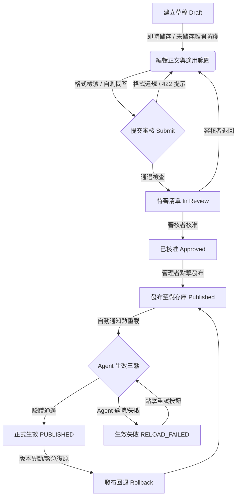

# 知識營運服務 BU 維護與交接指南 (BU Handoff & Operations Guide)

本文件供業務單位（BU）知識庫負責人、審核人員、維運工程師及 IT 團隊作為正式交接與日常維護之標準作業程序（SOP）。

---

## 1. 系統架構與定位

知識營運服務（Knowledge Portal）已完全整合至 **AI 資訊客服營運後台（AI Ops Backoffice）**：

- **單一登入（SSO）**：全面整合 Microsoft Entra ID (Azure AD)，採用 RS256 簽章公鑰動態輪替驗簽機制。
- **無縫原生嵌入**：以 Web Components 原生技術嵌入後台，無需 iframe，提供一致之設計語言（Fluent UI）與流暢操作體驗。
- **BFF 代理層（Knowledge Bridge）**：後台與知識服務間透過委派密鑰（Delegation Secret）與 HMAC 安全封裝，內部流量隔離，防止前端偽造身分。
- **Agent 即時生效閉環**：文件發布與回退操作即時聯動 Agent 向量索引重載，實現無需重啟服務之熱更新。

```
[ BU 使用者 / 審查人員 ]
         │ (Entra ID Token / SSO)
         ▼
[ AI Ops Backoffice 後台 ] 
         │ (HMAC 委派簽章 / BFF Proxy)
         ▼
[ Knowledge Portal 知識庫服務 ] ──(原子發布 / Manifest)──► [ GCS / 本地發布儲存庫 ]
         │
         │ (HTTP POST /admin/reload-knowledge)
         ▼
[ Teams AI Agent 服務 ] (熱更新 HybridIndex 與向量檢索)
```

---

## 2. 角色與權限矩陣 (RBAC Matrix)

系統實作嚴格的**多租戶與跨單位權限隔離**，並設有最高平台管理者之特權機制：

| 操作項目 | 知識貢獻者<br>`CONTRIBUTOR` | 知識審核者<br>`REVIEWER` | 單位知識管理者<br>`MANAGER` | 稽核人員<br>`AUDITOR` | 最高平台管理者<br>`PLATFORM` / `SYSTEM_ADMIN` |
| :--- | :---: | :---: | :---: | :---: | :---: |
| 瀏覽所屬單位文件 | ✅ | ✅ | ✅ | ✅ | ✅ |
| 瀏覽跨單位文件 | ❌ | ❌ | ❌ | ❌ | ✅ (全域瀏覽) |
| 建立／編輯草稿 | ✅ | ✅ | ✅ | ❌ | ✅ (跨單位均可) |
| 提交審核 (送審) | ✅ | ✅ | ✅ | ❌ | ✅ |
| 審核他人文件 (核准/退回) | ❌ | ✅ | ✅ | ❌ | ✅ |
| 審核自己建立之文件 (自審) | ❌ | ❌ (嚴格阻擋) | ❌ (嚴格阻擋) | ❌ | ✅ (急件特權) |
| 發布正式版本 / 回退版本 | ❌ | ❌ | ✅ (限所屬單位) | ❌ | ✅ (跨單位發布) |
| 觸發 Agent 重新同步 | ❌ | ❌ | ✅ | ❌ | ✅ |
| 查閱完整稽核軌跡 | ❌ | ❌ | ✅ | ✅ | ✅ |

> [!IMPORTANT]
> **跨單位隔離防護原則**：
> 一般單位管理者（如「資訊服務處」管理者）無法檢視、修改或發布其他單位（如「人力資源部」）之草稿與未公開文件；亦不可將非所屬單位文件關聯至客服品質審查個案。跨單位維護工作僅限 `SYSTEM_ADMIN` / `PLATFORM` 執行。

---

## 3. 知識文件生命週期與作業 SOP

### 3.1 流程圖



### 3.2 步驟說明

#### 步驟 1：建立草稿與編輯
1. 進入後台「知識營運」分頁，點擊右上角 **「＋ 新增文件」**。
2. 填寫標題、分類、擁有單位及適用對象（全員可見或特定群組）。
3. 撰寫 Markdown 正文，可上傳附件圖片並自動插入 Markdown 引用代碼。
4. **未儲存防護（Navigation Guard）**：
   - 編輯過程若未點擊「儲存草稿」，點擊任何導覽選單、切換分頁或關閉瀏覽器標籤時，系統均會彈出確認提示視窗，防止輸入內容遺失。

#### 步驟 2：提交審核 (Submit Review)
1. 進入文件的「送審」分頁，輸入本次變更原因。
2. 系統將自動執行內容合規性檢驗（標題字數、生效日期、適用對象格式等）。
3. **智慧錯誤提示**：若檢驗未通過，系統會彈出對話框清楚條列不符規範之具體欄位與說明（如 `[effective_at] 請填寫生效日`），依提示修正後即可再次送審。
4. **自審迴避**：文件建立者不可自行核准自己的送審文件。

#### 步驟 3：審核決策 (Review Decision)
1. 審核者（`REVIEWER` 或 `MANAGER`）至「待審清單」挑選文件。
2. 檢視修訂差異與測試驗證紀錄。
3. 選擇 **「核准（Approved）」** 或 **「退回修改（Changes Requested）」**，並填寫審核意見。退回後草稿回到原作者編輯狀態。

#### 步驟 4：發布與版本維護 (Publish & Rollback)
1. 單位管理者於已核准文件點擊 **「發布正式版本」**。
2. 系統會自動帶入冪等防護金鑰（`Idempotency-Key`），防止網路抖動造成重複發布。
3. **改版中保護**：若正式文件正在進行新版改版，新發布版本會如實納入，既有已生效版本不會意外遺失。
4. **版本回退**：若需緊急回復至歷史版本，至「發布紀錄」選擇指定 Release 點擊「回退至此版本」，系統會原子同步儲存庫狀態，徹底避免已下架文件殭屍復活。

---

## 4. Agent 發布三態狀態機與維護排障

發布或回退執行後，知識庫會自動呼叫 Teams AI Agent 之重載端點。發布紀錄提供三種狀態視覺反饋：

### 4.1 狀態圖示與意義

| 狀態名稱 | UI 呈現標籤 | 意義說明 | BU 處置動作 |
| :--- | :--- | :--- | :--- |
| **正式生效** | 🟢 `正式生效 (驗證通過)` | Release Manifest 已建立，且 Teams AI Agent 已完成熱重載並通過健康檢查 | 無需動作，Teams 客服機器人已即時讀取最新知識 |
| **等待生效** | 🟡 `發布完成 (等待生效)` | 文件已完成發布並寫入儲存庫，正在通知 Agent 更新中（通常在數秒內完成） | 重新整理頁面檢查狀態是否轉為綠色 |
| **生效失敗** | 🔴 `生效失敗 (待重試)` | 知識發布成功，但 Agent 服務未回應、Token 錯誤或網路逾時 | 點擊卡片旁的 **「重試同步」** 按鈕 |

### 4.2 故障排查 SOP (Troubleshooting)

```
[ 發布狀態呈現 🔴 生效失敗 (待重試) ]
                 │
                 ▼
         點擊「重試同步」按鈕
                 │
        ┌────────┴────────┐
        ▼                 ▼
   [ 轉為綠色 ]      [ 仍顯示失敗 ]
    排障完成              │
                          ▼
            檢查 Agent 服務狀態與密鑰：
            1. 確認 Agent 服務是否在線 (GET /readyz)
            2. 確認知識庫與 Agent 之 SERVICE_TOKEN 是否一致
            3. 查看 Agent 服務日誌 (搜尋 POST /admin/reload-knowledge)
```

#### 常見 API 錯誤代碼與處理方式

| HTTP 狀態碼 | 錯誤代碼 (`error.code`) | 常見原因 | 建議排查措施 |
| :--- | :--- | :--- | :--- |
| **401** | `KNOWLEDGE_UPSTREAM_UNAUTHORIZED` | Entra Token 過期或缺少 Token | 重新登入後台重新整理憑證 |
| **403** | `KNOWLEDGE_UPSTREAM_FORBIDDEN` | 嘗試修改或發布非所屬單位之文件 | 確認使用者角色與帳號指派之單位 |
| **409** | `KNOWLEDGE_VERSION_CONFLICT` | 同時有其他管理員編輯並儲存了草稿 | 重新載入頁面取得最新 ETag 後再儲存 |
| **422** | `VALIDATION_FAILED` | Markdown 格式不符、必填欄位缺漏 | 查看彈窗中的 issues 列表逐項修正 |
| **502 / 504** | `KNOWLEDGE_UPSTREAM_ERROR` | 後端服務啟動中或網路短暫逾時 | 系統標記為可重試（Retryable），等待 30 秒後重新整理 |

---

## 5. 系統組態與維運監控指引 (For IT / SRE)

### 5.1 關鍵環境變數清單

| 環境變數名稱 | 適用服務 | 說明與預設值 |
| :--- | :--- | :--- |
| `AI_OPS_KNOWLEDGE_BRIDGE_ENABLED` | Backoffice | 必須設為 `true`，啟用 BFF 代理功能 |
| `AI_OPS_KNOWLEDGE_DELEGATION_SECRET` | Backoffice | 與知識庫共用之 HMAC 委派密鑰（存於 Secret Manager） |
| `KNOWLEDGE_PORTAL_DELEGATION_SECRET` | Portal | 知識庫驗簽 HMAC 密鑰，須與 Backoffice 密鑰一致 |
| `AGENT_RELOAD_TOKEN` | Agent / Portal | Agent 熱重載端點授權 Token（用於 `/admin/reload-knowledge`） |
| `ENTRA_CLIENT_ID` / `ENTRA_TENANT_ID` | Backoffice | Microsoft Entra ID 應用程式註冊識別碼 |

### 5.2 核心健康檢查端點

- **AI Ops 後台健康檢查**：`GET /healthz`
- **知識庫健康檢查**：`GET /healthz`
- **Teams Agent 運作狀態**：`GET /healthz`（服務存活）與 `GET /readyz`（知識索引已加載完成）
- **Agent 手動觸發熱重載**：
  ```bash
  curl -X POST "https://<AGENT_INTERNAL_URL>/admin/reload-knowledge" \
    -H "Authorization: Bearer <AGENT_RELOAD_TOKEN>" \
    -H "Content-Type: application/json" \
    -d '{"release_id": "<RELEASE_ID>", "reason": "Manual operator refresh"}'
  ```

---

## 6. 交接簽核與聯絡窗口

- **業務單位負責人（BU Lead）**：負責各業務單位知識文件正確性審查與正式版本發布授權。
- **IT 營運窗口（AI Ops Admin）**：負責系統權限指派、Entra 應用程式註冊、GCP Secret Manager 金鑰維護與 Cloud Run 部署維運。
- **維護支援**：請透過公司內部 IT Service Desk 提報工單或聯繫 Teams 資訊客服專案小組。
