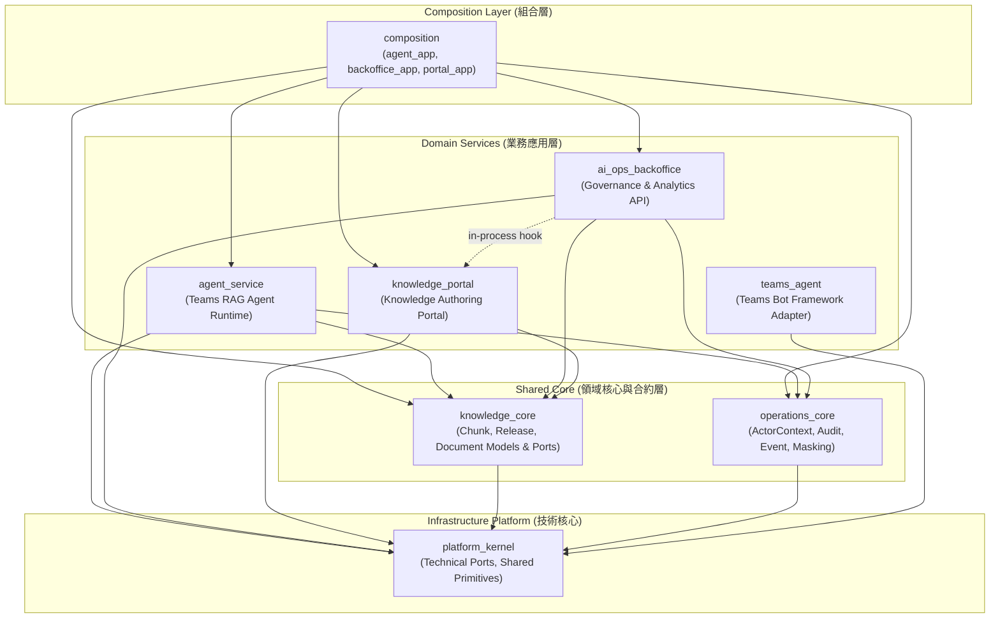
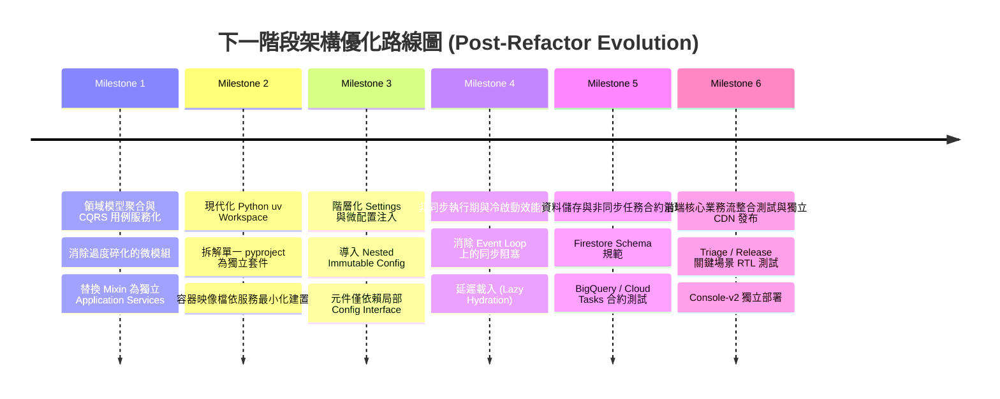
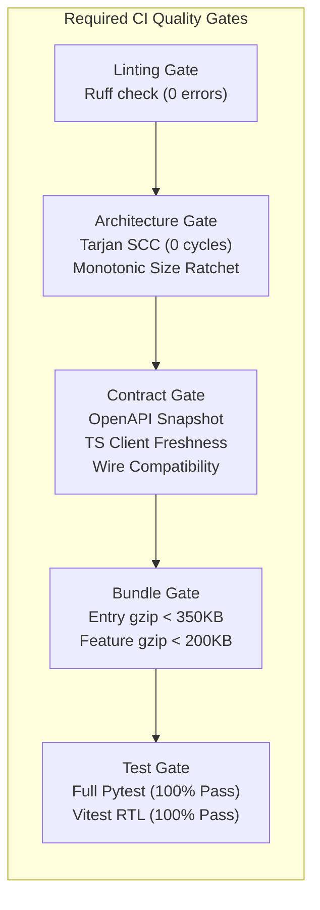

# 專案架構重構完成後全面評估與下一階段優化指南

> 評估日期：2026-09-19  
> Git 基準：`main@8639acc`  
> 前次基準：`main@0b3ce32`（重構啟動基準：`main@641aaa7`）  
> 範圍：Teams Adapter、Agent/RAG Runtime、Knowledge Portal、AI Ops Backoffice、React Console、composition、contracts、CI 與部署拓樸  
> 目標定位：**盤點 Phase A～H 重構落地成果，深入診斷當前架構的新瓶頸與深層隱患，並提供下一階段（Post-Refactor Evolution）的架構演進藍圖。**

---

## 1. 執行摘要與成果回顧

專案在經歷 Phase A 至 Phase H 的密集重構後，已徹底解決了先前最棘手的循環依賴、架構看門機制失效、mega-files 難以維護以及 CI 紅燈等核心問題。專案已正式跨入「架構規則可自動化驗證、邊界有嚴格看門」的新階段。

### 1.1 前次評估問題與現況對照

| 原架構痛點 / 規劃項目 | 前次狀態 (`@0b3ce32`) | 現況 (`@8639acc`) | 判定 |
|---|---|---|---|
| **Required CI 狀態** | 失敗（Ruff 859 errors, test failures） | **100% 通過**（Adapter/Agent Ruff 0 errors, 全套 tests 通過） | **已解決** |
| **Package 循環依賴** | 部分手寫規則，無 Tarjan SCC | **Tarjan SCC 0 cycles**；嚴格拓樸驗證 | **已解決** |
| **Domain $\to$ Composition 反向依賴** | 存在反向 import | **徹底歸零**；Composition 作為唯一向外裝配根 | **已解決** |
| **Backoffice $\to$ Agent 依賴** | 115 個檔案依賴 Agent 實作 | **0 個檔案**；所有共用合約抽至 `operations_core` / `knowledge_core` | **已解決** |
| **Portal $\to$ Agent 依賴** | 18 個檔案依賴 Agent 實作 | **0 個檔案**；共用資料結構統一收斂至 `knowledge_core` | **已解決** |
| **單調 Size Ratchet 門檻** | Baseline 未下修，可逆向增長 | **單調基線**；超過 500 行檔案歸零，超過 80 行函式歸零 | **已解決** |
| **Router 層直接檔案 I/O** | Workbench router 直接讀寫 JSON | **抽離至 `WorkbenchStore` 倉儲適配器**，Router 僅負責 HTTP | **已解決** |
| **跨模組私有成員存取** | 多處存取 `._source_trace`、`._settings` | **AST 靜態分析看門歸零**；新增專用 public API | **已解決** |
| **前端 OpenAPI 型別飄移** | 手寫 412 行重複 DTO | **自動生成 TS schemas & client**，DTO 重複率降為 0 | **已解決** |
| **前端打包體積 (Bundle Size)** | 單一約 2.12 MB 巨型 JS | **動態載入 + 依路由切分**，Entry gzip 僅 18 KB，符合預算門檻 | **已解決** |
| **舊版 Legacy UI 隔離與清理** | 存在 ~18k LOC 的 legacy-js | **已徹底刪除**；正式終止雙軌維護負擔 | **已解決** |

---

## 2. 目前專案量化指標

統計排除 `tests`、`node_modules`、靜態構建產物（`static/console-v2`）、`data`、暫存檔與快取：

| 量化指標 | 前次基準 (`@0b3ce32`) | 現況 (`@8639acc`) | 變化詮釋 |
|---|---:|---:|---|
| **Production Source Files** | 561 | **887** | +326 檔；完成大模組拆分與核心共用模組抽取 |
| **Production LOC** | 108,486 | **112,369** | +3,883 行（主要為 interface、adapters 與 typed ports） |
| **>300 行檔案數** | 116 | **76** | 下降 34.5%，中大型檔案持續受到壓制 |
| **>500 行檔案數** | 46 | **0** | **徹底歸零**，無任何檔案突破 500 行門檻 |
| **>800 行檔案數** | 13 | **0** | **徹底歸零**，極端複雜熱點已全部消除 |
| **>80 行 Python 函式** | 173 | **0** | **徹底歸零**，程序化長函式全數分解完畢 |
| **跨套件違規邊界** | 133 處 | **0 處** | `ai_ops_backoffice` 與 `knowledge_portal` 對 `agent_service` 實作依賴為 0 |
| **Ruff Linter 違規數** | 860 項 | **0 項** | 包含未定義名稱 (`F821`)、Wildcard imports (`F403`) 全數清除 |
| **OpenAPI 端點覆蓋率** | 未完整驗證 | **194 端點** | 53 處前端呼叫點 100% 通過矩陣驗證 |

---

## 3. 現階段架構依賴拓樸圖

重構後之套件依賴關係已轉化為單向無環圖（DAG），清晰確立了「高階依賴低階，核心合約無反向依賴」的原則：



---

## 4. 當前專案面臨的深層架構問題與潛在風險

雖然機械指標（行數、函式大小、反向 import 數）已全部合格，但依據 Clean Architecture 與 Domain-Driven Design (DDD) 標準檢視，程式碼庫出現了重構後期的典型次生結構性問題：

### 4.1 過度碎片化（Over-Fragmentation）與領域貧血風險

* **問題現象**：為符合「單檔 $\le 500$ 行、單函式 $\le 80$ 行」的嚴格基線，原先的高聚合理論被拆分成大量微型模組（例如 `query_conversations_filter.py`、`query_conversations_list.py`、`query_conversations_detail.py`，以及 `extractor_invoke.py`、`extractor_fallback.py`、`extractor_normalize.py`）。
* **架構危害**：
  1. **認知負載（Cognitive Overhead）轉移**：開發者尋找一個商業邏輯時，必須在 5~8 個細碎模組之間來回跳轉。
  2. **領域貧血化（Anemic Domain Model）**：許多抽出的模組僅包含單一的純函式（Pure Function）或流程輔助器，缺乏物件封裝與狀態不變性（Invariant）約束，演變為「細碎的程序導向程式碼（Procedural Code）」。
  3. **內部合約膨脹**：微模組之間需要透過大量的內部參數物件與中繼 tuple 傳遞狀態，增加了 glue code（黏合程式碼）比例。

### 4.2 邏輯解耦完成，但物理包裝仍為單一 Monolithic Wheel

* **問題現象**：
  - `agent_service/src` 底下雖然邏輯上切分了 `agent_service`、`ai_ops_backoffice`、`knowledge_portal`、`knowledge_core`、`operations_core`、`platform_kernel` 與 `composition` 7 個套件，但在 `agent_service/pyproject.toml` 中，它們仍然被打包成同一個單一 Wheel (`teams-agent-rag-service`)。
  - 三個生產環境 Dockerfile (`Dockerfile`, `Dockerfile.backoffice`, `Dockerfile.portal`) 依然採取 `COPY src/ /app/src/`，將整個原始碼目錄完整拷貝，安裝同一套所有依賴（包含 LangChain、FastAPI、PyMuPDF、Firestore、BigQuery 等）。
* **架構危害**：
  1. **鏡像體積虛胖與資安攻擊面未收斂**：`agent_service` 執行期並不需要 PDF 轉檔套件（PyMuPDF）；`knowledge_portal` 執行期並不需要 LangGraph 與向量檢索引擎。
  2. **部署隔離不完整**：若 `operations_core` 有細微更動，三個服務的映像檔必須全部重新建置，無法達成個別元件獨立發布與微服務化。

### 4.3 服務層仍依賴大量 Mixin 繼承而非組合

* **問題現象**：
  - `ai_ops_backoffice/services/` 雖然將大檔案拆開，但主要架構仍是 `BackofficeService(ConversationsQueryMixin, IssuesQueryMixin, HealthQueryMixin, ...)`。
  - Mixin 之間透過隱式的 `self._runtime`、`self._settings` 與 `self._store` 互相呼叫，未形成獨立的 Application Service 或 CQRS 用例處理器。
* **架構危害**：
  1. **隱式狀態依賴**：型別檢查工具難以靜態推斷 Mixin 所需的內部狀態是否在主類別初始化時已完整給定。
  2. **生命週期耦合**：任何一個 Mixin 需要特定的連線資源，整個 `BackofficeService` 的建構子就必須被擴充。

### 4.4 Settings 仍然過於龐大且缺乏局部配置切片

* **問題現象**：
  - 雖然 `from_env` 的剖析邏輯已被移至 `settings_sections.py` 或獨立 helper，但資料物件本身（如 `BackofficeSettings`、`RagSettings`）仍包含 40~50 個欄位的扁平結構。
  - 許多底層元件（如 `PricingService`、`FreshnessStore`）接收了整個 `Settings` 物件，而實際上僅使用了其中的 2~3 個配置參數。
* **架構危害**：
  1. **破壞最小知識原則（Law of Demeter）**：測試時為了初始化一個小型服務，需要 mock 數十個無關的環境變數。
  2. **動態組態難以追蹤**：難以明確識別哪一個設定更動會影響哪些子系統。

### 4.5 非同步 Event Loop 上的同步 I/O 與冷啟動負擔

* **問題現象**：
  - 部份非同步 API 路徑上，仍存在同步的本機檔案存取（如 `Path.read_text()`）或繁重的 JSON 序列化/反序列化（例如大型審計事件日誌與 Release Manifest）。
  - 在服務啟動（Lifespan）階段，一次性載入 Taxonomy、建立 HybridIndex、編譯 LangGraph 流程，使得 Cloud Run 冷啟動時間仍有優化空間。
* **架構危害**：在突發流量下，若同步 I/O 阻塞了 FastAPI 的 asyncio event loop，會直接拉高其他並行連線的延遲（P99 Latency）。

### 4.6 前端與後端雖然具備 OpenAPI TS Client，但元件測試深度仍偏薄

* **問題現象**：
  - 前端 Vitest 測試已提升至 18 個，覆蓋了 Store 與 Markdown 元件，但對於最核心、互動最複雜的頁面（如 `TriagePage` 的即時交談串流、`CaseDetailPage` 的真人轉接審查、`KnowledgePage` 的版本發布驗證），仍然缺乏完整的使用者行為模擬測試。
  - 前端仍有部分業務邏輯與 Ant Design 表格強綁定，元件職責分割仍有提升空間。

---

## 5. 下一階段持續優化路線圖 (Architecture Evolution Roadmap)

針對上述深層問題，下一階段的架構演進不應再聚焦於「降低行數」，而應聚焦於**「提高領域凝聚度、隔離實體打包、強化執行期效能與用例解耦」**。



---

### Milestone 1：領域模型聚合與 CQRS 用例服務化（消除過度拆分）

* **目標**：解決檔案碎片化問題，將過度分散的純函式重新收斂為高內聚的領域聚合（Domain Aggregates）與用例處理器（Use-Case Handlers）。
* **具體工作**：
  1. **重構 `BackofficeService` 為 CQRS 模式**：
     - 將 `ConversationsQueryMixin`、`IssuesQueryMixin` 等收斂為專責的 Query Handlers（如 `ConversationQueryService`, `IssueAnalyticsQueryService`）。
     - 將寫入操作（如標籤修訂、FAQ 審核、工單派發）封裝為獨立的 Command Handlers（如 `FaqPublishCommandHandler`）。
  2. **Extractor 領域封裝**：
     - 將 `extractor_invoke.py`、`extractor_fallback.py` 與 `extractor_normalize.py` 整合為具備良好內部封裝的 `IssueExtractorEngine` 類別，透過策略模式（Strategy Pattern）替換模型呼叫與備援機制，減少外部裸露的中繼函式。
  3. **Release 流程聚合**：
     - 將 Release 狀態機的轉換驗證與步驟執行封裝在 `ReleaseAggregate` 內，確保狀態轉換的不可變原則（Invariants）在領域物件內被保護。

---

### Milestone 2：現代化 Python uv Workspace（多套件獨立打包）

* **目標**：將 Monolithic Wheel 拆解為標準的 Monorepo Workspace，達成各服務最小依賴打包。
* **具體工作**：
  1. **建立正式的 Workspace 結構**：
     ```text
     teams-agent/
     ├── pyproject.toml               # Workspace root (uv workspace)
     ├── packages/
     │   ├── platform-kernel/        # 技術核心 (基礎協定、通用工具)
     │   ├── operations-core/        # 運營合約 (事件、審計、遮罩、分類)
     │   └── knowledge-core/         # 知識合約 (Chunk、Release、文件模型)
     ├── apps/
     │   ├── rag-service/            # agent_service
     │   ├── backoffice-service/     # ai_ops_backoffice
     │   ├── knowledge-portal/       # knowledge_portal
     │   ├── teams-adapter/          # teams_agent
     │   └── console-frontend/       # React Console-v2
     └── deploy/
     ```
  2. **精簡 Dockerfile 與建置相依**：
     - `Dockerfile.backoffice` 僅依賴 `packages/operations-core`、`packages/knowledge-core` 與 `packages/platform-kernel`，排除 RAG 模型推論與向量檢索套件。
     - `Dockerfile.agent` 排除 PDF 轉檔（`pypdf`, `pymupdf`）與前端靜態資源。
     - 大幅縮減各容器映像檔大小（預期縮小 30%~50%）並加速 CI 建置。

---

### Milestone 3：階層化 Settings 與微配置注入

* **目標**：打破 50 欄位的巨型扁平 Settings，改採領域切片配置。
* **具體工作**：
  1. **定義 Nested Immutable Configuration**：
     ```python
     @dataclass(frozen=True)
     class AuthSettings:
         mode: str
         service_token: str | None
         entra_tenant_id: str | None
         entra_client_id: str | None

     @dataclass(frozen=True)
     class BigQuerySinkSettings:
         enabled: bool
         project: str | None
         dataset: str
         table: str
     ```
  2. **服務建構子依賴最小化**：
     - 服務元件僅在其建構子要求所屬的配置切片（如 `AuditService(settings: AuditSettings, ...)`），不再要求傳入全域 `BackofficeSettings`。
     - 測試撰寫時不再需要建立龐大的虛擬 settings 物件。

---

### Milestone 4：非同步執行期與冷啟動效能調優

* **目標**：提升系統吞吐量，消除 Event Loop 潛在阻塞，壓低 Cloud Run 冷啟動延遲。
* **具體工作**：
  1. **非同步 I/O 全面審計**：
     - 將所有本機大型檔案（如 Release Chunks JSON、Taxonomy JSON）的讀取與 JSON 解析，明確排程至專用線程池（`anyio.to_thread.run_sync`），避免阻塞主事件迴圈。
     - 確保 Firestore 與 BigQuery 的非同步用戶端正確使用連接池。
  2. **延遲載入（Lazy Hydration）策略**：
     - 在服務啟動階段，僅初始化連線池與健康檢查探針；繁重的 RAG 模型連線與索引快取延遲至首次請求或背景工作預熱（Warm-up Worker）完成。

---

### Milestone 5：非同步任務與資料庫儲存合約治理

* **目標**：將現有針對 HTTP API 的 OpenAPI 嚴格合約看門機制，延伸至非同步作業與資料庫實體。
* **具體工作**：
  1. **Firestore 集合綱要規範（Schema Versioning）**：
     - 為 `operational_events`、`operational_delivery_outbox`、`quality_state` 等關鍵集合定義 JSON Schema 或 Pydantic 實體合約。
     - 撰寫向後相容測試，驗證舊版資料結構被新版程式碼讀取時不會產生反序列化崩潰。
  2. **Cloud Tasks / Background Jobs 酬載治理**：
     - 針對非同步匯出任務（Export Jobs）與同步任務（Sync Jobs）的 Payload 建立嚴格型別定義，避免版本發布交替期間產生未知的非同步工作失敗。

---

### Milestone 6：前端關鍵業務流整合測試與獨立部署

* **目標**：鞏固 Console-v2 前端生產穩定性，達成真正的前後端獨立交付。
* **具體工作**：
  1. **深度使用者情境測試（RTL Integration Tests）**：
     - `TriagePage`：模擬從訊息進入、串流生成、點擊查看引用來源到展開 Chunk 詳情的完整操作流。
     - `CaseDetailPage`：模擬從案件審查、手動分派、填寫工單到確認發布的端到端行為。
  2. **獨立部署管線落地**：
     - 配合已完成的 `Dockerfile.console`，配置專屬的 Cloud Build 與 CDN / Cloud Storage 靜態託管管線。
     - 前端採用純靜態資源發布，後端 API 網址透過執行期環境配置注入，達成「純前端變更零後端重構、零後端重啟」。

---

## 6. 架構健康度度量衡與防退化規則 (Architectural Governance Guardrails)

為確保未來的開發不會重蹈「循環依賴復燃、檔案無限增長、合約飄移」的覆轍，專案必須永久維持以下自動化看門防線：



1. **單調基線機制（Monotonic Ratchet）**：
   - 目前 `oversized_files.json` 與 `oversized_functions.json` 已全數清空。
   - 任何新增檔案嚴格禁止超過 **500 行**；任何新增函式嚴格禁止超過 **80 行**。
   - PR 審查時，禁止無理由透過新增 waiver 繞過行數限制。
2. **零逆向邊界（Zero Reverse Edge Policy）**：
   - 嚴格禁止任何業務套件反向依賴 `composition`。
   - 嚴格禁止 `ai_ops_backoffice` 與 `knowledge_portal` 重新引入對 `agent_service` 的直接實作依賴；所有跨領域共用合約必須且僅能透過 `operations_core` 或 `knowledge_core`。
3. **OpenAPI 自動化同步與零飄移**：
   - 任何後端路由或 DTO 變更，必須同步更新 `openapi/ai_ops_backoffice.canonical.json` 並執行 `generate_openapi_ts.py --write`。
   - CI 階段強制比對 Git 工作目錄乾淨度，徹底杜絕前後端介面型別脫節。
4. **前端打包預算硬性限制（Bundle Budget Hard Ceiling）**：
   - Entry Chunk Gzip 嚴格限制在 **350 KB** 以下。
   - 任何延遲載入之 Feature Chunk Gzip 嚴格限制在 **200 KB** 以下。
   - 禁止在全域 Store 中加入非必要的大型外部函式庫。

---

## 7. 結論與下一步行動建議

專案在本次重構中展現了極高的工程執行力：**成功拔除了所有架構循環，消滅了 859 個 Linter 錯誤，完全清除了所有大於 500 行的檔案與大於 80 行的函式，將跨領域耦合歸零，並徹底刪除了舊時代的 Legacy UI 負擔**。

當前的系統處於**「骨架清晰、合約受控、自動化看門完備」**的最佳狀態。

**建議下一步的立即行動方針**：
1. **無須急於進一步物理拆分 Git Repository**：目前的 Monorepo 依賴關係已非常清晰，物理拆分只會徒增跨 Repo 發版與套件發布的行政負擔。
2. **暫停單純為滿足「行數極限」的機械式切割**：現階段行數指標已全數合格。後續改動應以「提升業務凝聚度」與「DDD 領域聚合」為依歸，避免進一步製造微模組碎塊。
3. **聚焦於 Milestone 1（CQRS 用例服務化）與 Milestone 2（uv Workspace 多套件打包）**：這是將專案從「程式碼結構整潔」推進到「生產級高併發與獨立雲原生發布」的關鍵路徑。
