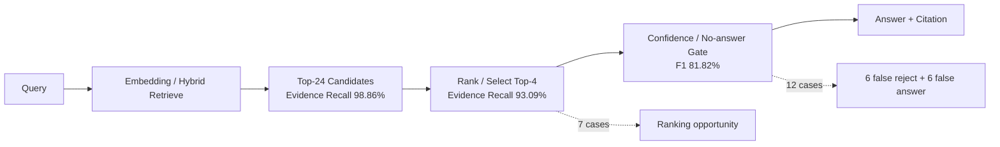

# 專案架構重構後複查與 RAG 準確率／效能下一步

> 複查日期：2026-09-20
> Git 基準：`fix/rag-ranking-contract-closeout@c3bc708`
> 前次文件基準：`main@8639acc`
> 範圍：Teams Adapter、Agent/RAG Runtime、Knowledge Portal、AI Ops Backoffice、React Console、composition、contracts、CI、部署與未來拆庫能力
> 性質：依目前原始碼、測試與本機可重現評測重新判定；不是沿用舊文件的完成聲明

---

## 1. 結論先行

這次重構的主要架構方向是正確的，而且多數基礎工程已穩定：跨套件循環、Backoffice／Portal 反向依賴、Legacy UI、OpenAPI 漂移、前端產物漂移等問題目前都受到自動化閘門保護。RAG 的檢索品質也已經不是「完全找不到資料」的階段。

但目前提交 **尚未達到可合併／可發布狀態**，原因不是抽象的技術債，而是三個可重現的 P0 失敗：

1. `test_mid_band_relevance_is_standard` 失敗：shared confidence 將原本應為 `STANDARD` 的中間信心案例判成 `HARD`。
2. `test_adaptive_tiers_skip_rewrite_on_standard_relevance_reject` 失敗：上述分類改變使一次查詢變成兩次 retrieval，直接增加延遲與 embedding 成本。
3. `check_architecture.py` 失敗：`retrieval_stage.py::run_retrieve` 為 82 行，突破 80 行函式上限。

因此下一步的順序應是：

1. **先修正 confidence／query-tier 語意回歸與架構閘門。**
2. **再改善 No-answer 校準與 7 個排序型失敗。**
3. **先處理 embedding 延遲與變異，再考慮 dedicated reranker。**
4. **用 production model 跑 Layer 3 release benchmark，之後才討論上線。**

目前不建議更換向量資料庫、不建議導入 GraphRAG，也不建議立刻把 RAG 與前端拆成兩個 Git repository。應維持同一 repo，但繼續強化可獨立建置、測試、版本化及部署的邊界。

---

## 2. 本次驗證結果

### 2.1 品質閘門

| 驗證項目 | 結果 | 說明 |
|---|---:|---|
| Teams Adapter Ruff | 通過 | 0 lint error |
| Teams Adapter tests | 通過 | `215 passed` |
| Agent Service Ruff | 通過 | 0 lint error |
| Agent Service tests | **失敗** | `1875 passed, 2 skipped, 3 failed` |
| Architecture ratchet | **失敗** | `run_retrieve` 82 行，門檻 80 行 |
| Legacy shell quarantine | 通過 | Legacy JS 已完全移除 |
| Knowledge image Source of Truth | 通過 | Agent image 不內嵌 sources／index／releases |
| OpenAPI snapshot | 通過 | canonical snapshot 無漂移 |
| Generated TypeScript freshness | 通過 | schemas 與 client 皆為最新 |
| Wire-contract compatibility | 通過 | 9 個 shared models，0 warning |
| Script unit tests | 通過 | `18 passed`；前次 legacy deletion regression 已修正 |
| Playground tests | 通過 | `16 passed` |
| Console Node smoke tests | 通過 | `4 passed` |
| Console Vitest | 通過 | 7 files、23 tests |
| Console production bundle freshness | 通過 | committed artifact 與重建 SHA-256 一致 |
| Console bundle budget | 通過 | 總 raw size 2,196,424 bytes |
| Frontend DTO overlap | 通過 | checker 回報 handwritten-only 0 |
| Console OpenAPI path matrix | 通過 | 53 call sites 對 194 paths |

### 2.2 必須修正的三個失敗

#### P0-1：Confidence Contract 與 Query Tier 的語意衝突

`retrieval_confidence.evaluate_confidence()` 會將弱詞彙重疊直接判成 `LOW`；`query_tier.classify_query_tier()` 又將 `LOW_CONFIDENCE_FAIL` 視為 `HARD`。這使原本「交給 relevance 判斷，但不要支付 rewrite 成本」的中間區間消失。

具體影響：

- 既有中段案例由 `STANDARD` 變成 `HARD`。
- relevance 拒絕後仍執行 query rewrite。
- `index.search_calls` 從 1 增加為 2。
- 線上會增加 embedding、搜尋與可能的 LLM rewrite 成本。
- 準確率校準與執行速度同時受到影響。

建議不要為了讓測試變綠而直接改測試期待值。應先明確定義三個概念：

| 概念 | 用途 | 建議輸出 |
|---|---|---|
| Retrieval confidence | 判斷證據是否可直接採信 | `HIGH / UNCERTAIN / LOW` |
| No-answer prediction | 評測與拒答校準 | `ANSWER / NO_ANSWER` + probability/reason |
| Query cost tier | 決定是否允許 rewrite／retry | `TRIVIAL / STANDARD / HARD` |

三者可以共享 features，但不應以一個 enum 直接推導所有決策。尤其 `LOW lexical overlap` 不等於「值得再查一次」；它也可能代表應直接安全拒答。

#### P0-2：額外 rewrite 的效能回歸

失敗測試證明目前 adaptive tier 會對部分低信心、但無重寫價值的查詢多做一次 retrieval。這與「只有 hard query 才支付 rewrite 成本」的設計目標相反。

修正方向：

- 將 `should_rewrite` 變成獨立決策，而不是等同於 `confidence == LOW`。
- 至少考慮 `empty retrieval`、`identifier typo`、`candidate conflict`、`multi-aspect`、`rewrite headroom` 等訊號。
- 對「有候選但 relevance reject，且沒有可改善訊號」維持 single pass。
- 新增 rewrite benefit 指標：第二次 retrieval 是否改善 Evidence Recall@4、是否改變最終 found／no-answer，以及增加多少毫秒。

#### P0-3：Architecture ratchet 失敗

`run_retrieve` 目前 82 行。這只是輕微超標，但 CI 會因此失敗，且不能用 waiver 掩蓋。

適合的最小修法是抽出一個純函式，例如 `_merge_retrieval_result_sets(...)`，集中處理：

- previous ranking 是否存在；
- query-level RRF 是否啟用；
- rewrite weight `0.6`；
- previous weight `1.0`；
- 空 result set fallback。

這同時會讓 ranking contract 更容易單元測試，而不是單純搬移兩行程式。

---

## 3. 架構現況量化

統計範圍使用 `check_architecture.py` 的 production source roots，排除 tests、static、generated、node_modules 與 build artifacts。

| 指標 | `@8639acc` | `@c3bc708` | 判讀 |
|---|---:|---:|---|
| Production source files | 887 | **910** | RAG v2、observability、reranker、eval contracts 增加模組 |
| Production LOC | 約 126.8k | **127,791** | 成長主要集中於 RAG 能力與合約 |
| >300 行檔案 | 95 | **95** | 未惡化 |
| >350 行檔案 | 68 | **69** | 接近門檻的檔案仍多 |
| >400 行檔案 | 27 | **28** | 應觀察 change coupling，不宜再盲拆 |
| >450 行檔案 | 7 | **11** | 有增加，仍未突破 500 行硬門檻 |
| >500 行檔案 | 0 | **0** | 通過 |
| >800 行檔案 | 0 | **0** | 通過 |
| >60 行 Python 函式 | 228 | **217** | 改善 |
| >70 行 Python 函式 | 96 | **89** | 改善 |
| >75 行 Python 函式 | 48 | **41** | 改善 |
| >80 行 Python 函式 | 0 | **1** | **回歸，CI blocker** |

### 3.1 依賴方向

主要跨套件 importer-file 數如下：

| From | To | Importer files |
|---|---|---:|
| `agent_service` | `knowledge_core` | 15 |
| `agent_service` | `operations_core` | 17 |
| `agent_service` | `platform_kernel` | 4 |
| `ai_ops_backoffice` | `knowledge_core` | 15 |
| `ai_ops_backoffice` | `knowledge_portal` | 1 |
| `ai_ops_backoffice` | `operations_core` | **158** |
| `ai_ops_backoffice` | `platform_kernel` | 9 |
| `knowledge_portal` | `knowledge_core` | 20 |
| `knowledge_portal` | `platform_kernel` | 4 |
| `composition` | application/core packages | 21 total |

Backoffice 與 Portal 對 `agent_service` 的 direct importer 仍為 0，這是重構最重要的成果之一。下一個風險是 `operations_core` 逐漸變成新的 shared god package；158 個 Backoffice importer 已足以要求 public API／internal API 分界與變更影響分析。

---

## 4. RAG 準確率現況

### 4.1 評測資料契約

資料集：`data/eval/retrieval_eval_v2.json`

| Population | 數量 |
|---|---:|
| 全部案例 | 121 |
| Answerable | 88 |
| No-answer / hard-negative | 33 |
| 有 evidence label 的 answerable | 88 / 88 |

這次 evidence label 已完整，Document Hit 與 Evidence Recall 也已分離，因此目前的數字比早期以 title hit 代替 evidence 的結果可信。

### 4.2 本次 Layer 2 全資料集重跑

命令：

```bash
PYTHONPATH=agent_service/src uv run python scripts/run_rag_pipeline_eval.py \
  --split all --layer 2 --taxonomy \
  --output /tmp/rag-l2-review-20260920.json
```

| 指標 | 本次結果 | 判讀 |
|---|---:|---|
| Evidence Recall@4 | **93.09%** | 整體檢索證據覆蓋已高 |
| Evidence Precision@4 | **60.61%** | Top-4 仍有約四成非標註 evidence |
| Candidate Evidence Recall@24 | **98.86%** | 候選池幾乎完整 |
| Document Hit@4 | **96.59%** | 文件級命中良好 |
| Document Candidate Hit@24 | **98.86%** | 只有極少數真正 retrieval miss |
| No-answer precision | **81.82%** | 仍有 6 個 answerable 被誤拒 |
| No-answer recall | **81.82%** | 仍有 6 個 no-answer 被誤答 |
| No-answer F1 | **81.82%** | 目前最值得優先改善的品質面 |
| ACL leakage | **0** | 權限面結果正常 |
| P50 | **641 ms** | 本機全資料集重跑 |
| P95 | **1705 ms** | 明顯高於文件先前記載的 788 ms |
| 平均 batch embedding | **769 ms** | 主要效能風險訊號 |

失敗分類共 20 件：

| 分類 | 數量 | 優先方向 |
|---|---:|---|
| Ranking / reranker opportunity | 7 | 先做規則／輕量 reranking 實驗 |
| No-answer false positive | 6 | 降低誤拒，校準 confidence |
| No-answer false negative | 6 | 提高拒答可靠度 |
| True retrieval recall miss | 1 | 針對單一語料／索引案例修正 |

### 4.3 Frozen test split 重跑

| 指標 | 結果 |
|---|---:|
| Cases | 37（29 evidence-labeled answerable） |
| Evidence Recall@4 | **98.28%** |
| Candidate Evidence Recall@24 | **100%** |
| Document Hit@4 | **100%** |
| No-answer F1 | **80.00%** |
| Reranker headroom | **1.72 pp** |
| P50 / P95 | **458 / 642 ms** |

Test split 上只有 1 個 ranking opportunity，dedicated reranker 的可得收益很低；主要錯誤是 4 個 answerable 被錯誤判成 no-answer。因此 release gate 應優先修 confidence calibration，而不是先加入昂貴 reranker。

### 4.4 Layer 3 deterministic 診斷

本次另跑了 test split 的 deterministic Layer 3（`liveModel=false`）：

| 指標 | 結果 | 限制 |
|---|---:|---|
| Answer Accuracy | 81.08% | 無 production LLM，不是最終上線數字 |
| Citation Precision / Recall | 79.73% / 80.18% | deterministic path |
| Groundedness | 100% | 依目前 claims contract 計算 |
| Retrieval P50 / P95 | 469 / 671 ms | 幾乎占全部延遲 |
| Relevance P95 | 0.62 ms | 未使用 live model |
| Generation P95 | 0.10 ms | 未使用 live model |
| Query tier | 12 trivial / 10 standard / 15 hard | 受目前 tier regression 影響 |

這組數字只適合定位 pipeline：在無 LLM 時，延遲幾乎全部來自 retrieval／embedding。它不能取代 production-model Layer 3 release benchmark。

### 4.5 準確率的真正瓶頸

目前候選證據召回率為 98.86%，表示 88 個 answerable 中，多數正確證據已在 Top-24。主要問題已從「retrieve」移到兩個後段決策：



因此準確率工作應分成：

- **校準問題**：同時存在 false positive 與 false negative，不能只把 threshold 單向調高或調低。
- **排序問題**：只有 7 件，且 frozen test 只有 1 件；應做 targeted reranking，不應全流量增加一次模型呼叫。
- **真正 retrieval miss**：只有 1 件，應個案修語料、metadata 或 tokenization，不值得全面更換 retrieval architecture。

---

## 5. RAG 執行速度現況

### 5.1 已完成且應保留的優化

- 預先計算 index maps。
- Sparse fast path。
- 多 query batch embedding。
- Query-level RRF。
- reranker instance reuse。
- adaptive evidence expansion 與 token budget。
- retrieval cache key 已包含 release、ACL groups、fusion mode 與 candidate parameters。
- OpenTelemetry／stage timing 基礎已存在。

### 5.2 尚未解決的問題

#### Embedding latency 變異

同一版程式在兩種 population 的結果差異明顯：

| Run | P50 | P95 | Avg batch embedding |
|---|---:|---:|---:|
| Frozen test（37） | 458 ms | 642 ms | 524 ms |
| All（121） | 641 ms | 1705 ms | 769 ms |

這表示單次 benchmark 的 788 ms P95 不能作為穩定 SLO 證據。可能因素包含：

- embedding provider 網路／配額變異；
- facet query 數不同；
- batch path 只在 multi-query 且 cache miss 時觸發；
- retry/backoff 對 tail latency 的放大；
- 本機 sequential benchmark 與實際 Cloud Run concurrency 行為不同。

#### Layer 2 缺少完整 stage percentile

目前 Layer 2 summary 只輸出 `avgBatchEmbeddingMs`，沒有輸出：

- embed P50/P95；
- sparse P50/P95；
- dense P50/P95；
- fusion P50/P95；
- selection／evidence expansion P50/P95；
- cache-hit 與 cache-miss 分群；
- facet count 分群；
- provider retry count。

在缺少這些資料前，不應以平均值判定優化已完成。

#### Ablation 顯示 batch／query-RRF 路徑可能反而增加延遲

本次在 frozen test split 執行現有的 real-component ablation matrix：

| Configuration | Evidence Recall@4 | No-answer F1 | P95 |
|---|---:|---:|---:|
| Vanilla Weighted | 94.83% | 57.14% | 853 ms |
| RRF Fusion | 98.28% | 94.12% | 982 ms |
| RRF + Sparse Fast Path | 98.28% | 94.12% | 919 ms |
| Pipeline L2 Single-pass | 98.28% | 80.00% | **499 ms** |
| + Batch Embed & Query RRF | 98.28% | 80.00% | **904 ms** |
| + Adaptive EvidenceBundle | 98.28% | 80.00% | 847 ms |

Config A～C 與 Config D～F 使用不同 evaluation layer，因此兩組之間的 No-answer F1 不應直接比較；可比較的是同為 Layer 2 的 D／E／F。這組結果也不能直接證明 batch embedding 本身就是原因，因為 Config E 同時打開 batch embedding 與 query-level RRF，且各 configuration 是依序執行，仍受 provider latency 變異影響。但它已經證明：目前「進階路徑」在此 test population 沒有帶來 Evidence Recall 收益，卻增加約 405 ms P95。

下一個 benchmark 應將兩個開關拆開為四格：

| Batch embedding | Query RRF | 目的 |
|---:|---:|---|
| off | off | single-pass baseline |
| on | off | 隔離 batch provider 成本 |
| off | on | 隔離 multi-query fusion 收益 |
| on | on | 完整 candidate |

並依 facet fan-out 分群。當只有一個 query 時不應進入 batch path；兩個 query 時也必須證明 provider batch 比並行 single-query 更快。若沒有穩定收益，應把 batch 啟用條件改成 adaptive，而不是全域預設。

#### Cache 為 process-local

目前 retrieval cache 是 in-memory mutable mapping。它對單一 warm instance 有效，但 Cloud Run scale-out、冷啟動或 release rollover 後命中率會重置。現在不一定需要 Redis；應先量測 production cache hit rate、instance churn 與 miss penalty，再決定是否引入共享 cache。

---

## 6. 建議執行順序

### Phase 0：恢復可合併狀態（立即）

1. 拆分 `run_retrieve` 的 ranking merge helper，使 architecture gate 回到 0 finding。
2. 釐清 `LOW confidence`、`NO_ANSWER`、`HARD query` 的決策邊界。
3. 修正兩個 query-tier regression tests，不接受單純改 expectation。
4. 重跑完整 Agent suite 與所有 CI gates。

完成條件：

- Agent tests 0 failed。
- Architecture checker 0 finding。
- standard reject 維持 1 次 search；empty／明確 hard case 才允許 rewrite。

### Phase 1：No-answer calibration sprint（最高品質優先級）

1. 將 12 個 No-answer 錯誤輸出成固定 calibration slice。
2. 記錄每案 features：top score、score gap、lexical overlap、sparse/dense agreement、identifier exact hit、facet count、query length。
3. 以 dev split 校準，frozen test 只做一次最終驗證，避免 test leakage。
4. 比較規則式 baseline 與簡單 logistic／isotonic calibration；資料量不足時保留規則式。
5. 將 refusal threshold 與 rewrite eligibility 分離。

建議 gate：

- Test No-answer F1：**80% → 至少 88%**。
- No-answer recall 不可下降超過 2 pp。
- Answerable false reject：4 件降至 2 件以下。
- 不新增 LLM call。

### Phase 2：Targeted ranking 改善

先處理 Top-24 已存在但 Top-4 遺失的 7 件：短而模糊的密碼／登入／網路 query、多文件比較、版本／平台差異、視覺證據 query。

實驗順序：

1. query intent／entity features 與 exact identifier boost；
2. 多文件比較與 visual evidence 的 deterministic diversity rule；
3. 僅對 `UNCERTAIN + candidate headroom` 啟用 lexical／small cross-encoder rerank；
4. 最後才 A/B Vertex Ranking 或 Qwen reranker。

建議 gate：

- All-set Evidence Recall@4：**93.09% → 至少 95%**。
- Frozen test 不得低於目前 **98.28%**。
- No-answer F1 不得退化。
- 新增 P95 不超過 100 ms；若超過，收益需明顯高於目前 5.78 pp all-set headroom。

### Phase 3：Latency observability 與 embedding 優化

1. 讓 Layer 2 報告完整 stage P50/P95，而非只報 batch average。
2. 將 batch embedding 與 query RRF 拆成獨立 ablation 維度。
3. 分開 cold／warm、cache hit／miss、single／multi-query、facet count 0/1/2+。
4. 記錄 embedding provider request count、batch size、retry count、429/503 與 backoff time。
5. 建立同一 commit 至少 3 次重跑的 variance 報告。
6. 在真正 Cloud Run revision 做 concurrency 1/4/8/16 壓測。
7. 若 embedding 仍為瓶頸，再依序評估：
   - query embedding cache；
   - facet query dedupe／正規化；
   - provider deadline 與一次 bounded retry；
   - regional endpoint／connection reuse；
   - 才考慮替換 embedding provider。

建議 gate：

- Frozen test Layer 2 P95 ≤ 700 ms。
- 三次 all-set 重跑 P95 的最大／最小差距 ≤ 25%。
- production retrieval P95 ≤ 1 s；若現有正式 SLO 不同，以正式 SLO 為準。
- retry rate、cache hit rate、facet fan-out 必須可觀測。

### Phase 4：Production-model Layer 3 release gate

在使用正式模型、正式 region、正式 embedding provider 與相同 deployment settings 的環境執行：

```bash
cd agent_service
../.venv/bin/python ../scripts/run_rag_pipeline_eval.py \
  --split test --layer 3 --live-model \
  --output /tmp/rag-l3-live.json
```

必須保存：

- Answer Accuracy；
- No-answer F1；
- Citation precision／recall；
- Groundedness；
- retrieval／relevance／generation／total P50-P95；
- LLM calls、input/output tokens、cost per query；
- query tier distribution；
- model、region、release id、index version、commit SHA。

本次複查沒有執行 `--live-model`，因為它會使用正式模型憑證並產生成本；deterministic Layer 3 不能代替這個 release gate。

---

## 7. 前端與 RAG 是否要拆成兩個 repository

### 7.1 決策

**現在維持同一個 repository，但設計成可隨時拆分。**

這個決策仍然成立。前端與 RAG 的版本、API 與 release gate 尚在快速共同演進，立即拆 repo 會增加跨 repo contract PR、版本協調與部署追蹤成本，並不會自動改善準確率或速度。

### 7.2 已具備的拆分能力

- `console_frontend/` 有自己的 `package.json`、lockfile、測試、Vite build 與 Dockerfile。
- 前端可以建成獨立 nginx image。
- Cloud Build 有獨立 console image config。
- OpenAPI canonical snapshot 與 generated TS client 已存在。
- Frontend build freshness、bundle budget、DTO overlap、path matrix 已進 CI。
- RAG／Backoffice／Portal 的 Python package 邊界已明顯改善。

### 7.3 尚未真正完成的拆分條件

- production console 仍預設由 Backoffice 同源提供。
- 獨立 nginx image 只提供 `/console-v2`，不代理 `/api`。
- `apiClient` 使用相對 `/api` 與 `credentials: same-origin`，獨立網域需要 gateway／BFF、CORS 與認證決策。
- TypeScript generated client 尚未完全取代所有直接 `apiClient` call sites。
- OpenAPI matrix 主要驗證 path 存在，尚未完整驗證 method、query、request body 與 response schema 相容性。
- Python 仍主要是兩個 workspace members；Agent Runtime、Backoffice、Portal 仍同一 wheel。

### 7.4 Repo-ready exit criteria

未來若要真正拆 repo，先達成：

1. Frontend build 不讀取 `agent_service/` 原始碼，只依賴發布版 OpenAPI artifact／npm client package。
2. RAG／Backoffice image 不依賴 frontend source，只選擇是否下載已版本化的 UI artifact。
3. `/api` 的 same-origin gateway、auth、CSRF、CORS 與 base URL 有明確部署合約。
4. Consumer-driven contract test 驗證 method、payload 與 response，而不只驗證 path。
5. UI 與 API 可以各自 deploy／rollback，並保留相容版本矩陣。
6. 有實際證據顯示兩邊 release cadence、ownership、security boundary 或 failure isolation 需要不同 repo。

在這些條件之前，「同 repo、獨立 artifact」是成本最低且風險較小的方案。

---

## 8. 其他持續優化方向

### 8.1 不再以 LOC 作為主要重構 KPI

硬門檻仍應保留，但 69 個 350 行以上檔案與 41 個 75 行以上函式說明大量程式貼近門檻。接下來應量測：

- change coupling；
- public API surface；
- cyclomatic／cognitive complexity；
- 重複邏輯；
- 單一功能修改需要跨越的檔案數；
- owner 與 failure domain。

### 8.2 收斂 shared core

`ai_ops_backoffice -> operations_core` 有 158 個 importer files。建議：

- 明確定義 `operations_core.public` 或 package-level exports；
- 禁止應用層引用 core 的 internal adapters；
- 對 public symbols 建立 API snapshot；
- 以領域切片組織 contract，而不是繼續堆入通用 helpers。

### 8.3 前端初始載入預算仍不完整

雖然 entry gzip 只有 18.28 KB，但主要 vendor gzip 約為：

- general vendor：335.48 KB；
- Ant Design：200.51 KB；
- Refine：37.09 KB；
- React：5.00 KB。

Vite 仍警告兩個 minified chunks 超過 500 KB raw。現有 gate 偏向「每個 chunk」與 total raw size，尚未限制首頁實際 preload／download 的 aggregate gzip。下一步應增加 route-level initial transfer budget，而不是只看 entry chunk。

### 8.4 測試輸出噪音

Console tests 全數通過，但預期 503 情境會輸出大量 error log，JSDOM 也會輸出 `getComputedStyle` not implemented warning。這不影響正確性，但會降低 CI 訊號品質；應在測試中針對預期錯誤 mock logger／browser API，而不是全域忽略 stderr。

---

## 9. 建議的工作票拆分

| 優先級 | 工作票 | 估計範圍 | 驗收 |
|---|---|---|---|
| P0 | Restore confidence/query-tier semantics | 1–2 天 | 兩個 regression tests + full suite green |
| P0 | Extract retrieval merge helper | 0.5 天 | architecture 0 finding；ranking tests green |
| P1 | No-answer calibration slice + report | 2–4 天 | Test F1 ≥ 88%；無新增 LLM call |
| P1 | Layer 2 stage percentile telemetry | 1–2 天 | embed/sparse/dense/fusion/cache/facet P50-P95 |
| P1 | Repeatable latency benchmark | 1–2 天 | 3-run variance + cold/warm + cache segmentation |
| P2 | Targeted ambiguous-query ranking | 3–5 天 | All Evidence Recall@4 ≥ 95%；P95 delta ≤ 100 ms |
| P2 | Live Layer 3 release benchmark | 1 天 + review | accuracy/grounding/citation/latency/cost 完整報告 |
| P2 | Frontend initial-route budget | 1–2 天 | aggregate preload gzip gate |
| P3 | Consumer-driven API contract gate | 3–5 天 | method/request/response compatibility |
| P3 | uv workspace physical package split | 獨立里程碑 | 同 repo、各 service 最小依賴 wheel/image |

---

## 10. 最終判定

目前專案的架構已經從「巨型檔案與循環依賴失控」進入「邊界大致穩定，但需要以品質與執行期數據驅動演進」的階段。整體重構不是失敗；相反地，基礎邊界與自動化看門已經足以讓新回歸被準確抓出。

當前最重要的訊號是：

- 正確證據在 Top-24 的比例已達 98.86%，因此不要全面重做 retrieval。
- Evidence Recall@4 已達 93.09%，排序還有有限但明確的改善空間。
- No-answer F1 只有 81.82%，而且 shared confidence 已造成 runtime tier regression，這是第一品質優先級。
- test split P95 642 ms 尚可，但 all-set P95 1705 ms，embedding tail latency 尚未穩定。
- dedicated reranker 的 all-set headroom 5.78 pp、test headroom 1.72 pp，不足以支持全流量啟用。
- Git repo 暫時不拆；維持 monorepo，但要求獨立 artifact、contract、deploy 與 rollback。

因此最合理的下一步不是再進行大型架構翻修，而是完成一個短週期的 **「P0 regression closeout → No-answer calibration → retrieval latency stabilization → live Layer 3 release gate」**。只有當這四步都有可重現證據後，才應重新評估 reranker、embedding provider、共享 cache 或物理拆 repo。
