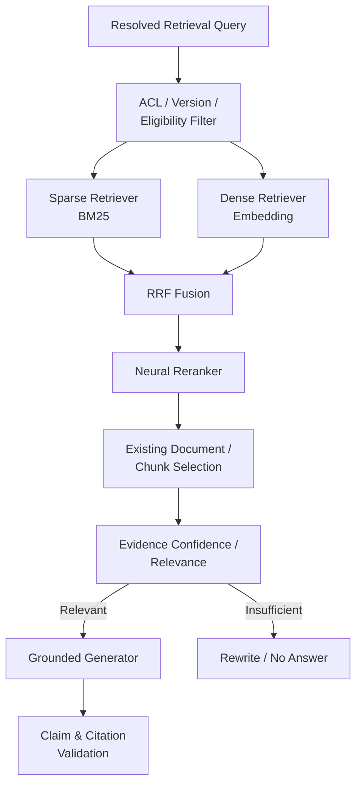

# Teams Agent RAG v2 工程規格書

**Spec Version:** 1.0  
**Target Repository:** `poirotw66/teams-agent`  
**Target Component:** Agent Runtime / Knowledge Retrieval Core  
**Scope:** RRF Fusion → Contextual Chunk Index → Neural Reranker  
**Architecture Style:** Adaptive Multi-Stage Hybrid RAG  
**Status:** Proposed

---

# 1. 背景

目前 Teams Agent 已具備成熟的 Hybrid RAG 基礎，包括：

- BM25 sparse retrieval
- Dense embedding retrieval
- Hybrid score fusion
- Layout-aware chunking
- Section / heading / page metadata
- ACL filtering
- Query rewrite
- Facet query
- Adaptive query tier
- Retrieval cache
- Document selection
- Citation grounding
- Claim-level grounding
- No-answer handling
- Golden evaluation
- Golden User Journeys
- Immutable Knowledge Release

目前 Hybrid Retrieval 核心融合方式仍為：

```python
score = 0.45 * normalized_sparse + 0.55 * dense_score
```

此設計在目前小型 corpus 上可用，但存在三個主要限制：

1. Sparse score 與 dense cosine score 分布不同，線性加權容易因 corpus、embedding model 或 query 類型改變而漂移。
2. Chunk 的 embedding 主要代表 `title + content`，缺乏文件、章節、系統、情境等檢索上下文。
3. Retrieval 後尚無專門的高精度 reranker，最終候選排序仍高度依賴第一階段 retrieval score 與 heuristic。

本專案下一階段不採用全面 GraphRAG、RAPTOR 或多 Agent Retrieval，而先將現有 Hybrid RAG 升級為：

```text
High Recall Retrieval
        ↓
RRF Fusion
        ↓
Context-aware Retrieval
        ↓
Neural Reranking
        ↓
Evidence Selection
        ↓
Grounded Generation
```

---

# 2. 目標

RAG v2 的目標不是單純提高 benchmark accuracy，而是同時改善：

```text
Retrieval Accuracy ↑
Top-1 Precision ↑
Hard Negative Discrimination ↑
No-answer Reliability ↑

P95 Latency ≈
LLM Calls ↓ / ≈
Cost ≈

Maintainability ↑
Observability ↑
```

核心產品目標：

> 對錯誤碼、系統名稱、模糊描述、近似文件、版本文件與自然語言改寫，都能穩定找回真正相關 evidence，同時避免所有 query 都支付高成本 retrieval pipeline。

---

# 3. Non-Goals

本次明確不實作：

```text
GraphRAG
HippoRAG
RAPTOR
HyPE
Full Agentic Retrieval
Multi-Agent Retrieval
Vector DB Migration
Knowledge Graph
LLM-generated contextual summary
Embedding fine-tuning
Reranker fine-tuning
Parent-child retrieval
Visual multimodal retrieval
```

以上皆可作為 RAG v3 / Experimental Track。

本次不得藉機：

```text
重構 Agent Workflow
拆新的 Microservice
搬 repository
改 Knowledge Portal 架構
重寫 Answer Generator
重寫 Citation Pipeline
```

RAG v2 必須以 **最小 Change Radius** 疊加在目前架構上。

---

# 4. 整體架構



Contextual Chunk Index 同時影響：

```text
BM25 sparse representation
+
Dense embedding representation
```

但不改變 Answer Generator 使用的原始 evidence。

---

# 5. 核心原則

## 5.1 Retrieval Text 與 Evidence Text 分離

新增概念：

```text
retrieval_text
```

專門用於：

- BM25
- Embedding
- Reranking

既有：

```text
chunk.content
```

仍然是：

- LLM evidence
- Citation evidence
- User-visible source
- Claim grounding

禁止將 contextual prefix 顯示給使用者。

概念：

```text
Retrieval Representation
≠
Grounding Evidence
≠
Display Content
```

這與目前：

```text
Issue.retrieval_query
≠
Issue.description
```

採用相同 trust boundary 原則。

---

# 6. Milestone 0：Evaluation v2

在修改演算法前，必須先提升評估集難度。

目前 retrieval eval 因 corpus 規模較小而有 ceiling effect。

RAG v2 不得以現有 30 題 100% 作為成功證據。

## 6.1 建立 Hard Retrieval Benchmark

建議：

```text
data/eval/retrieval_eval_v2.json
```

案例數：

```text
最低：100
建議：150
目標：200+
```

至少包含：

| Category | Example |
|---|---|
| Exact Identifier | VPN -455 |
| Similar Identifier | -455 / -8 / -14 / -619 |
| Paraphrase | 驗證碼一直收不到 |
| Typo | Fortclient / FortiClinet |
| Alias | 員工入口網 / CTeam |
| Short Query | VPN 錯誤 |
| Ambiguous Query | 密碼不能用 |
| Similar Documents | AD / VPN / Portal password |
| Hard Negative | topic similar but wrong procedure |
| Near Duplicate | old/new SOP |
| Version Conflict | v1 vs v2 |
| Multi-section | answer across headings |
| Multi-document | information split across docs |
| No Answer | plausible but undocumented |
| ACL Allow | authorized |
| ACL Deny | unauthorized |
| Conversational | 第二輪補充錯誤碼 |
| Negative Constraint | 為什麼不能... |
| Source Scope | 文件有沒有寫... |
| Visual Reference | 畫面 / 按鈕 / 圖 |

---

# 7. Evaluation Metrics

Retrieval layer 至少記錄：

```text
Recall@5
Recall@10
Recall@20
MRR@10
nDCG@10
Hit@1
Hit@3

No-answer Precision
No-answer Recall
No-answer F1

ACL Leakage Count
Version Accuracy
Hard-negative Accuracy
```

End-to-end：

```text
Answer Correctness
Completeness
Groundedness
Citation Accuracy
No-answer Accuracy
```

Efficiency：

```text
retrieval P50
retrieval P95

rerank P50
rerank P95

total Agent P50
total Agent P95

LLM calls/query
embedding calls/query
rerank calls/query
cost/query
```

---

# 8. Milestone 1：RRF Fusion

## 8.1 問題

現況：

```python
score = 0.45 * sparse + 0.55 * dense
```

問題為：

```text
BM25 score distribution
≠
Dense cosine distribution
```

即使 normalize，也會受到 candidate pool 影響。

RAG v2 改為：

# Reciprocal Rank Fusion

公式：

```text
RRF(d) = Σ weight_i / (k + rank_i(d))
```

第一版支援：

```text
Sparse Rank
Dense Rank
```

未來可增加：

```text
Title Rank
Synthetic Query Rank
Visual Rank
Graph Rank
```

---

# 9. RRF Candidate Pipeline

建議：

```text
Query
 │
 ├── BM25 Top 50
 │
 └── Dense Top 50
        ↓
Deduplicate by chunk_id
        ↓
RRF
        ↓
Top 30
```

設定不得 hardcode。

新增：

```python
rag_fusion_mode: str = "WEIGHTED"
rag_rrf_k: int = 60

rag_sparse_candidate_k: int = 50
rag_dense_candidate_k: int = 50

rag_fusion_candidate_k: int = 30
```

環境變數：

```text
RAG_FUSION_MODE=WEIGHTED|RRF

RAG_RRF_K=60
RAG_SPARSE_CANDIDATE_K=50
RAG_DENSE_CANDIDATE_K=50
RAG_FUSION_CANDIDATE_K=30
```

Production rollout 前預設：

```text
RAG_FUSION_MODE=WEIGHTED
```

切換後：

```text
RAG_FUSION_MODE=RRF
```

---

# 10. SearchResult 資料模型

現有：

```python
SearchResult(
    chunk,
    score,
    sparse_score,
    dense_score,
)
```

擴充成：

```python
SearchResult(
    chunk,
    score,
    sparse_score,
    dense_score,

    sparse_rank=None,
    dense_rank=None,

    fusion_score=None,
    fusion_rank=None,

    rerank_score=None,
    rerank_rank=None,

    final_rank=None,
)
```

`score` 保留作 backward compatibility。

RRF 啟用時：

```text
score = fusion_score
```

Reranker 啟用時不得強迫 `score` 等於 rerank score。

因為不同 reranker score calibration 不一定一致。

---

# 11. 新增 Fusion 模組

建議新增：

```text
agent_service/src/agent_service/retrieval_fusion.py
```

API：

```python
def reciprocal_rank_fusion(
    *,
    sparse_results: list[SearchResult],
    dense_results: list[SearchResult],
    k: int,
    sparse_weight: float = 1.0,
    dense_weight: float = 1.0,
) -> list[SearchResult]:
    ...
```

不得與：

```text
HybridIndex
KnowledgeService
Workflow
```

直接耦合。

Fusion 必須是 pure function。

---

# 12. RRF Pseudocode

```python
scores = {}

for rank, result in enumerate(sparse_results, start=1):
    scores[result.chunk.chunk_id] += (
        sparse_weight / (rrf_k + rank)
    )

for rank, result in enumerate(dense_results, start=1):
    scores[result.chunk.chunk_id] += (
        dense_weight / (rrf_k + rank)
    )

return sorted(
    candidates,
    key=lambda x: scores[x.chunk.chunk_id],
    reverse=True,
)
```

---

# 13. ACL 執行順序

ACL 必須在 retrieval candidate 產生前執行。

禁止：

```text
Search all
→ rank
→ ACL filter
```

必須：

```text
ACL / Content Eligibility
→ Sparse
→ Dense
→ Fusion
```

避免：

```text
ranking side-channel
unauthorized candidate leakage
```

---

# 14. Milestone 1 Acceptance Criteria

RRF 必須至少滿足：

```text
Recall@20 >= Weighted Baseline

MRR@10 不得顯著下降

Exact Identifier Accuracy = 100%

ACL leakage = 0

Retrieval P95 增加 < 10%
```

如果：

```text
RRF <= Weighted Fusion
```

則不得 production cutover。

保留：

```text
RAG_FUSION_MODE
```

直到下一 Milestone 完成。

---

# 15. Milestone 2：Contextual Chunk Index

## 15.1 問題

目前一個 chunk 可能只有：

```text
Permission denied (-455)

可能原因為網路訊號不穩或密碼問題。
```

Dense embedding 無法知道：

```text
FortiClient
VPN
哪份 SOP
哪個章節
什麼情境
```

因此建立 Contextual Retrieval Representation。

---

# 16. Contextual Representation

新增：

```python
DocumentChunk.retrieval_context
DocumentChunk.retrieval_text
```

建議：

```python
retrieval_context = """
文件：VPN常見Q&A問答
別名：FortiClient VPN
分類：VPN
章節：常見錯誤 > 登入問題
來源類型：IT Support SOP
"""

retrieval_text = f"""
{retrieval_context}

{content}
"""
```

Embedding 與 BM25 使用：

```text
retrieval_text
```

Generation / Citation 使用：

```text
content
```

---

# 17. Contextual Prefix V1

第一版禁止使用 LLM 生成 Context。

全部 deterministic。

Context source：

```text
Document Title
Source Aliases
Metadata Category
Heading Path
Section Path
Source Type
System / Product metadata
Effective Version
```

禁止加入：

```text
ACL Groups
Internal permission information
Security labels not intended for retrieval
Prompt instructions
System configuration
```

---

# 18. Context Builder

新增：

```text
agent_service/src/knowledge_core/contextual_representation.py
```

API：

```python
@dataclass(frozen=True)
class ContextualRepresentation:
    context: str
    retrieval_text: str
    version: str


def build_contextual_representation(
    chunk: DocumentChunk,
) -> ContextualRepresentation:
    ...
```

Version：

```text
contextual-v1
```

---

# 19. Contextual Schema Version

Knowledge Index schema 升級：

```text
index version 1
→
index version 2
```

Manifest 必須記錄：

```json
{
  "indexSchemaVersion": 2,
  "contextualizationVersion": "contextual-v1",
  "embeddingModel": "...",
  "chunkerVersion": "...",
  "createdAt": "..."
}
```

---

# 20. Backward Compatibility

Runtime 暫時必須支援：

```text
Index v1
Index v2
```

v1：

```text
retrieval_text = title + content
```

v2：

```text
retrieval_text =
contextual prefix + original content
```

Production 完成 migration 後，再刪除 v1 compatibility。

---

# 21. Embedding 建置

現況：

```python
embed_documents(
    [f"{chunk.title}\n{chunk.content}"]
)
```

RAG v2：

```python
embed_documents(
    [chunk.retrieval_text]
)
```

Embedding vector 必須與：

```text
contextualizationVersion
embeddingModel
```

綁定。

若 runtime embedding config 與 index manifest 不符：

```text
Fail Fast
```

不得 silent fallback。

---

# 22. Sparse Index

BM25 同樣改用：

```text
retrieval_text
```

但保留 field-aware boosting 的可能性。

v1 不另外導入複雜 BM25F。

先讓：

```text
title
aliases
heading path
context
content
```

共同 tokenization。

---

# 23. Debug / Trace

Retrieval trace 需加入：

```json
{
  "contextualizationVersion": "contextual-v1",
  "retrievalTextHash": "...",
  "indexSchemaVersion": 2
}
```

Production trace 不回傳完整 contextual text。

避免：

```text
PII leak
metadata leak
log explosion
```

---

# 24. Contextual Index Acceptance Criteria

與 non-contextual RRF baseline 比較：

```text
Paraphrase Recall@20 ↑

MRR@10 ↑

Hard-negative Hit@1 ↑

Exact identifier accuracy 不下降

No-answer F1 不下降

Latency 基本不增加
```

因為 Contextual Retrieval 的成本主要發生在 indexing。

Runtime 不應增加額外 LLM call。

---

# 25. Milestone 3：Neural Reranker

## 25.1 目的

RRF 解決：

```text
Retriever disagreement
```

Contextual Index 解決：

```text
Representation weakness
```

Reranker 解決：

```text
Top candidate precision
Hard negative discrimination
```

Pipeline：

```text
Sparse Top 50
Dense Top 50
      ↓
RRF Top 30
      ↓
Reranker Top N
      ↓
Final Top K
```

---

# 26. Reranker Architecture

新增 protocol：

```text
agent_service/src/agent_service/reranker.py
```

```python
class Reranker(Protocol):
    async def rerank(
        self,
        *,
        query: str,
        candidates: list[SearchResult],
        limit: int,
    ) -> list[SearchResult]:
        ...
```

實作：

```text
NoopReranker
ModelReranker
```

未來可增加：

```text
HttpReranker
VertexReranker
ColBERTReranker
```

---

# 27. Reranker Input

輸入：

```text
Query
+
Candidate retrieval_text
```

而不是：

```text
Answer Prompt
Conversation History
Full document
```

目的只有 relevance ranking。

---

# 28. Candidate Budget

初始參數：

```text
RRF candidate pool = 30

Reranker input = Top 24

Final evidence pool = Top 4
```

Config：

```text
RAG_RERANKER_ENABLED=false

RAG_RERANKER_MODEL=...
RAG_RERANK_CANDIDATE_K=24
RAG_FINAL_TOP_K=4

RAG_RERANK_TIMEOUT_MS=700
```

模型建議先 benchmark：

```text
Qwen3-Reranker-0.6B
```

再比較較大型版本。

不得因排行榜直接選最大模型。

---

# 29. Reranker Fail-Open

Reranker 屬於 optional precision stage。

出現：

```text
timeout
model unavailable
rate limit
invalid response
dependency failure
```

必須：

```text
fallback to RRF ranking
```

禁止因 reranker failure 導致：

```text
Knowledge Service 500
```

Fallback trace：

```text
RERANKER_TIMEOUT
RERANKER_ERROR
RERANKER_DISABLED
```

---

# 30. Reranker Timeout Budget

預設：

```text
700 ms
```

可配置。

Hard requirement：

```text
Reranker 不得無限制等待
```

若 timeout：

```text
RRF candidates
→ Existing Document Selection
```

---

# 31. Final Ranking

Reranker 啟用時：

第一版採：

```text
reranker rank
```

為主要順序。

RRF score 作：

```text
tie breaker
fallback
debug signal
```

第一版不要做：

```text
0.7 reranker + 0.3 RRF
```

因為不同 reranker score 未必具良好 calibration。

---

# 32. Exact Identifier Protection

對企業客服非常重要。

例如：

```text
-455
-14
12029
EMS
OTP
```

如果 candidate A 有 exact identifier match，而 reranker 將完全不包含 identifier 的 candidate B 排到極高位置：

不得直接盲從。

加入：

```text
Exact Identifier Guard
```

但只保護：

```text
error code
ticket code
explicit product id
version
unique technical token
```

不要對一般自然語言 keyword 做強制 boost。

---

# 33. Document Selection 順序

新流程：

```text
Sparse / Dense
↓
RRF
↓
Reranker
↓
Cross-scenario filter
↓
Version resolution
↓
Document diversity
↓
Existing chunk selection
```

但 ACL：

```text
永遠在最前面
```

---

# 34. Query Tier 整合

目前已有：

```text
TRIVIAL
STANDARD
HARD
```

RAG v2 不刪除。

建議：

### TRIVIAL

```text
Strong exact / lexical hit
↓
RRF
↓
Skip Reranker 可選
↓
Generate
```

### STANDARD

```text
Hybrid
↓
RRF
↓
Light Reranker
↓
Generate
```

### HARD

```text
Hybrid
↓
Facet Queries
↓
RRF
↓
Reranker
↓
Optional Rewrite
↓
Generate
```

Reranker 不應使所有 trivial query 都增加延遲。

新增：

```text
RAG_RERANKER_MIN_TIER=STANDARD
```

可設：

```text
TRIVIAL
STANDARD
HARD
```

---

# 35. Retrieval Cache

目前 cache key 必須升級。

新增影響因素：

```text
fusion mode
RRF k
contextualization version
embedding model
release id
candidate k
```

例如：

```python
(
    query,
    groups,
    environment,
    release_id,

    fusion_mode,
    contextualization_version,

    top_k,
)
```

如果 rerank cache 存在，還必須包含：

```text
reranker model id
reranker version
```

---

# 36. Observability

每次 retrieval trace 必須記錄：

```json
{
  "queryTier": "STANDARD",

  "sparseCandidateCount": 50,
  "denseCandidateCount": 50,

  "fusionMode": "RRF",
  "rrfK": 60,

  "fusionCandidateCount": 30,

  "rerankerEnabled": true,
  "rerankerModel": "...",
  "rerankerCandidateCount": 24,

  "finalCandidateCount": 4,

  "contextualizationVersion": "contextual-v1",

  "timings": {
    "embeddingMs": 0,
    "sparseMs": 0,
    "fusionMs": 0,
    "rerankMs": 0,
    "retrievalTotalMs": 0
  }
}
```

---

# 37. OpenTelemetry Spans

至少增加：

```text
rag.retrieve
rag.sparse
rag.dense
rag.fusion
rag.rerank
rag.select
rag.generate
```

Attributes：

```text
query_tier
candidate_count
release_id
fusion_mode
reranker_model
cache_hit
```

不得記錄完整：

```text
user query
document body
sensitive content
```

到一般 span attributes。

---

# 38. Metrics

Production metrics：

```text
rag_retrieval_latency_ms
rag_rerank_latency_ms
rag_total_latency_ms

rag_sparse_candidates
rag_dense_candidates
rag_fused_candidates

rag_reranker_timeout_total
rag_reranker_failure_total

rag_no_answer_total

rag_retrieval_cache_hit_rate

rag_query_tier_total
```

---

# 39. Configuration

新增設定建議：

```python
rag_fusion_mode: str = "WEIGHTED"

rag_rrf_k: int = 60

rag_sparse_candidate_k: int = 50
rag_dense_candidate_k: int = 50
rag_fusion_candidate_k: int = 30

rag_contextual_index_enabled: bool = False
rag_contextualization_version: str = "contextual-v1"

rag_reranker_enabled: bool = False
rag_reranker_model: str | None = None
rag_rerank_candidate_k: int = 24
rag_rerank_timeout_ms: int = 700
rag_reranker_min_tier: str = "STANDARD"

rag_final_top_k: int = 4
```

Environment：

```text
RAG_FUSION_MODE
RAG_RRF_K

RAG_SPARSE_CANDIDATE_K
RAG_DENSE_CANDIDATE_K
RAG_FUSION_CANDIDATE_K

RAG_CONTEXTUAL_INDEX_ENABLED
RAG_CONTEXTUALIZATION_VERSION

RAG_RERANKER_ENABLED
RAG_RERANKER_MODEL
RAG_RERANK_CANDIDATE_K
RAG_RERANK_TIMEOUT_MS
RAG_RERANKER_MIN_TIER

RAG_FINAL_TOP_K
```

---

# 40. CI Requirements

新增 test groups：

```text
test_rrf_fusion.py

test_contextual_representation.py

test_contextual_index_compatibility.py

test_reranker.py

test_reranker_timeout.py

test_reranker_exact_identifier.py

test_retrieval_v2_integration.py
```

Existing Golden User Journeys 必須全部 pass。

---

# 41. RRF Unit Tests

至少：

```text
Sparse #1 + Dense #2 beats sparse-only #1 candidate

Dense-only strong candidate survives

Duplicate chunk deduplicated

Weights honored

Stable deterministic ordering

Empty result handled

ACL excluded candidate never enters fusion
```

---

# 42. Contextual Index Tests

至少：

```text
retrieval_text contains title

retrieval_text contains heading path

retrieval_text contains aliases

original content unchanged

context never enters citation text

v1 index readable

v2 index readable

embedding model mismatch fails

contextualization version mismatch detectable
```

---

# 43. Reranker Tests

至少：

```text
Reranker changes incorrect RRF top1

Exact identifier candidate preserved

Timeout fallback to RRF

Exception fallback to RRF

Disabled mode identical to RRF baseline

ACL candidate cannot reappear

Rerank candidate limit respected
```

---

# 44. Evaluation Experiment Matrix

至少比較：

```text
A = Existing Weighted Hybrid

B = RRF

C = RRF + Contextual

D = RRF + Contextual + Reranker
```

禁止只比較：

```text
Old
vs
Final
```

否則無法知道 improvement 來自哪個 stage。

---

# 45. Success Gate

RAG v2 Final 相對 Existing Baseline：

最低接受：

```text
Recall@20 >= baseline

MRR@10 >= baseline + 8%

Hit@1 >= baseline + 8 percentage points
或
Hard Negative Accuracy >= baseline + 10 points

No-answer F1 >= baseline

Exact Error Code Accuracy = 100%

ACL Leakage = 0
```

End-to-end：

```text
Groundedness >= baseline

Citation Accuracy >= baseline

Answer Accuracy >= baseline
```

Performance：

```text
Retrieval P95 <= baseline + 500 ms

Total Agent P95 <= baseline + 10%

Average cost/query <= baseline + 10%
```

如果 Accuracy improvement 非常顯著，可以接受少量 latency tradeoff，但必須在 A/B report 明確紀錄。

---

# 46. Shadow Mode

Production 不直接切換。

Phase 1：

```text
Serve = Current Retrieval

Shadow =
RRF + Contextual + Reranker
```

同一 query 背景計算：

```text
Current Top K
New Top K
```

紀錄：

```text
Top1 changed?
TopK overlap
RRF score
Reranker score
latency
```

不影響 user response。

---

# 47. Shadow Evaluation

建議至少：

```text
100+
```

真實 query。

分析：

```text
Top1 change rate

Good change
Bad change

No-answer change

Latency distribution

Error code queries

Ambiguous queries
```

不得只看：

```text
overall average
```

---

# 48. Canary Rollout

完成 Shadow 後：

```text
5%
↓
20%
↓
50%
↓
100%
```

每階段檢查：

```text
P95
Error Rate
No-answer Rate
Handoff Rate
Feedback Down Rate
Reranker Timeout
```

---

# 49. Rollback

Feature flags 必須確保任何時間可以：

```text
RAG_RERANKER_ENABLED=false
```

回：

```text
RRF + Contextual
```

或者：

```text
RAG_CONTEXTUAL_INDEX_ENABLED=false
```

使用 v1 representation。

最終：

```text
RAG_FUSION_MODE=WEIGHTED
```

完全回既有 Hybrid。

不得要求 rollback 時重新 deploy corpus。

---

# 50. Knowledge Release

Knowledge Release 應增加：

```json
{
  "retrieval": {
    "schemaVersion": 2,
    "contextualizationVersion": "contextual-v1",
    "embeddingModel": "...",
    "chunkerVersion": "...",
    "vectorCount": 1234
  }
}
```

Release immutable 原則維持。

切換 index：

```text
Publish new release
→ Validate
→ Activate
```

不要 overwrite active release。

---

# 51. Recommended Code Layout

建議：

```text
agent_service/src/

  agent_service/
    retrieval.py
    retrieval_fusion.py
    reranker.py

    knowledge_pipeline/
      retrieval_stage.py
      retriever.py
      query_tier.py
      document_selection.py

  knowledge_core/
    contextual_representation.py
    document_chunks.py
```

不要新增：

```text
rag_v2/
new_rag/
advanced_rag/
```

避免形成新舊兩套 parallel architecture。

---

# 52. Migration Strategy

## M0

Hard Eval v2

```text
No behavior change
```

## M1

RRF implementation

```text
Feature flag OFF
```

A/B：

```text
Weighted vs RRF
```

## M2

Contextual Index v2

```text
Dual read v1/v2
```

A/B：

```text
RRF plain
vs
RRF contextual
```

## M3

Reranker

```text
Feature flag OFF
```

A/B：

```text
RRF contextual
vs
RRF contextual + reranker
```

## M4

Shadow mode

## M5

Canary

## M6

Production default

## M7

Delete obsolete weighted fusion code only after stable production period.

---

# 53. Implementation Order

建議實際 PR：

```text
PR 1
Retrieval Eval v2

PR 2
RRF Fusion
+ trace
+ unit tests

PR 3
Contextual Representation
+ index schema v2

PR 4
Contextual BM25 + Embedding

PR 5
Reranker Interface
+ Noop
+ Model adapter

PR 6
Adaptive Query Tier integration

PR 7
Shadow Evaluation

PR 8
Production cutover
```

每一 PR 都必須：

```text
small
reversible
measurable
```

---

# 54. Performance Strategy

最重要原則：

> Precision enhancement 不代表每個 query 都跑完整 pipeline。

推薦：

```text
Exact/Error-code
↓
Sparse + Dense
↓
RRF
↓
Strong confidence
↓
Skip reranker optional
```

一般 query：

```text
Hybrid
↓
RRF
↓
Reranker
```

Hard query：

```text
Facet retrieval
↓
RRF
↓
Reranker
↓
Rewrite only if necessary
```

這樣避免：

```text
every query
=
multi-query
+
reranker
+
rewrite
+
grader
```

---

# 55. LLM Relevance Grader

Reranker 上線後，不代表立即刪除 LLM relevance grader。

第一階段：

```text
RRF
↓
Reranker
↓
Current Relevance Decision
```

收集數據後：

高 confidence：

```text
Reranker confidence
+
rank margin
+
retriever agreement
↓
Skip LLM relevance
```

未來才進一步移除部分 relevance LLM calls。

不納入 RAG v2 initial cutover。

---

# 56. Confidence Signals

RAG v2 必須開始記錄：

```text
Reranker top1 score

Top1 - Top2 gap

Retriever agreement

Sparse rank

Dense rank

RRF rank

Exact identifier match

Query tier
```

但本次只記錄。

下一階段才建立：

```text
calibrated relevance probability
```

避免 Scope Creep。

---

# 57. Security Requirements

RAG v2 必須維持：

```text
ACL-before-retrieval

No unauthorized candidate logging

Contextual prefix not user-facing

Retrieval text not citation evidence

No prompt instruction from document changes system behavior

No Reranker output rendered to user
```

Reranker 是 ranking tool，不具 authority。

---

# 58. Failure Handling

任何 retrieval enhancement failure：

```text
Contextual field missing
→ fallback original text

Dense unavailable
→ sparse

Sparse failure
→ dense

RRF failure
→ existing fusion

Reranker timeout
→ RRF order
```

但是：

```text
ACL failure
Index integrity failure
Embedding model mismatch
Release corruption
```

不得 fallback。

必須 Fail Closed / Fail Fast。

---

# 59. Definition of Done

RAG v2 完成必須符合：

### Architecture

```text
RRF independent pure component
Contextual representation independent component
Reranker behind interface
No duplicated RAG pipeline
```

### Quality

```text
Hard Eval 改善
Golden User Journeys 全綠
Existing Golden Eval 無 regression
```

### Performance

```text
P95 within agreed budget
Reranker timeout observable
Fallback verified
```

### Operations

```text
Feature flags
Shadow mode
Canary mode
Rollback
Tracing
Metrics
```

### Security

```text
ACL leakage = 0
Original evidence preserved
Retrieval/display trust boundary preserved
```

---

# 60. 最終 Target Pipeline

完成後 production path：

```text
User Question
      ↓
Resolved Retrieval Query
      ↓
ACL / Version / Eligibility
      ↓
┌─────────────┬──────────────┐
│ BM25        │ Dense        │
│ contextual  │ contextual   │
└──────┬──────┴──────┬───────┘
       └───── RRF ───┘
             ↓
        Candidate 30
             ↓
       Neural Reranker
             ↓
          Top 4
             ↓
   Existing Document Selection
             ↓
      Evidence Confidence
             ↓
      Grounded Generator
             ↓
     Claim/Citation Repair
             ↓
           Answer
```

---

# 61. 最重要的設計決策

本計畫不是：

```text
更 Agentic
更多 LLM
更多框架
更多 Service
```

而是：

```text
High Recall Retrieval
+
Better Representation
+
High Precision Ranking
+
Adaptive Compute
```

也就是：

> **先廣泛找到可能正確的 evidence，再用高精度模型重新排序，但只在值得支付成本的 query 上執行。**

這是本專案 RAG v2 的核心。

---

# 62. 執行優先順序

最終順序不可交換成一次性 Big Bang：

```text
0. Hard Eval v2

1. RRF Fusion

2. Contextual Chunk Index

3. Reranker

4. Shadow

5. Canary

6. Production
```

每一步都必須能獨立回答：

```text
準確率有沒有變好？
延遲增加多少？
成本增加多少？
失敗時能不能回退？
```

如果某個 Milestone 無法證明改善：

> **不要因為它比較「先進」就保留。**

RAG v2 的目標不是蒐集酷炫演算法，而是建立一條可以用數據證明每個 stage 都值得存在的 Retrieval Pipeline。