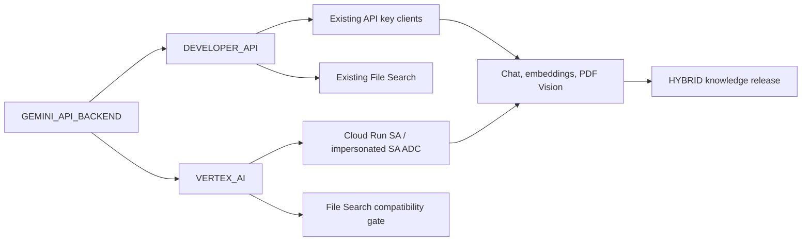

# Gemini 雙介面與 Vertex AI Service Account 遷移規格

> 日期：2026-09-24  
> 狀態：應用與基礎設施契約已實作；lab Cloud Run 已是 VERTEX_AI（無 key mount）。Agent 現行工作樹映像為 `teams-rag-agent-00054-677`（`eba3c8e-wt`），仍載入 `release-8535419976b4`（FOLLOW_CLOUD IN_SYNC、HYBRID、66 chunks）。`deploy-gcp.sh` 對既有 Agent 不再 `--set-env-vars` 覆蓋 PORTAL／release pointer／File Search。3-case Vertex subset **不得**與 Developer API `release-713b5b02dfc2` 基線直接比（不同 release）。`_AllLogs` 已引用 Agent SA `data_access`（`GenerateContent` @ 2026-09-24T10:24:15Z）與 Converter SA `data_access`（`GenerateContent`／`gemini-3.8-flash` @ 2026-09-24T10:43:25Z）。Portal SA 列仍缺（日常 `import-pdf` 只呼叫 converter，未 reindex／未切 pointer）。**已引用** Backoffice SA `data_access`（`GenerateContent`／`gemini-3.8-flash` @ 2026-09-24T11:04:27Z 與 11:04:32Z）。`is_real_model_configured()` 改探設定的 chat model（不再用字面 `probe`）。`invoke_chat_model_answer` 把 Gemini list／dict `content` join 成 string（Developer API 與 Vertex 同一邊界）。image-only 部署 `00055-qf4`（tag `eba3c8e-content`，digest `sha256:5451caf33016e0b1d5a5c12aa2e125b10ee39e521580fc554ee06407c401b2b3`）；Vertex `us`／無 key／`AI_OPS_WORKERS_ENABLED=false`／既有 `RAG_MODEL` 未改。既有 1-case set `eval_set_7af7757ffdf1`／`setver_7a89df5b638b` 的 `REAL_RAG` `run_5be59fbc0b1a` HTTP 202／`COMPLETED`（11:11:22–11:11:43Z），兩側 `COMPLETED`／`HALLUCINATION`（answer 為 string；**沒有** `'list' object has no attribute 'lower'`）。這**不是** 156-case 閘門。`AI_OPS_WORKERS_ENABLED=false`，未新建 worker fleet。Terraform `pdf_converter_image` **已 pin** live `00008-zrb` digest `sha256:6c00f9f11a93f9f8a756c9ed9fadcb9f9b1dbd6ce28282d82a6fb005ace683a3`（`infra/environments/poc/terraform.tfvars.example` 與本機 `infra/terraform/terraform.tfvars`）。針對 `google_cloud_run_v2_service.pdf_converter[0]` 的 plan：`0 add / 1 change / 0 destroy`，唯一 diff 是服務層 `scaling`（`manual_instance_count`／`min_instance_count` 0→null）；image 被 `ignore_changes`，env 不變。**未套用**（不是 image／env 對齊）。**未**套用 BigQuery `operational_events` replace／ingestion bucket。live PDF Vision：converter `00008-zrb`（同一映像 `eba3c8e-vertex-vision2`，`GEMINI_MODEL=gemini-3.8-flash`）對 `tests/fixtures/pdf-vision/` 四份最小 fixture（selectable／scan-like／simple-table／mixed-text-image）`POST /api/v1/convert-pdf` 皆 HTTP 200；markdown 皆抽出標記原文；`gemini-3.8-flash:generateContent` 皆 **HTTP 200、不是 404**。Portal `import-pdf` 匯入 `scan-like.pdf` HTTP 200（`conversion_engine=gemini_vision`、`conversion_gemini_backend=VERTEX_AI`，未降 `legacy_text`）；未切 `release-8535419976b4`。§7 逾時／403／429 樣本仍未跑。第 5.1 節 Top-K 重疊：**無效**（沒有同 release／同後端對照；`scripts/retrieval_ab_test.py` 是 Hybrid vs File Search，Vertex 會 skip File Search）。156-case frozen L3 **已跑完**（853：answer 92.95%、citation P 95.62%、ACL 0、Total P95 4667 ms）；與其他 release 的全量基線比較**無效**。Production、完整 Terraform drift、獨立 eval SA、切換監控仍未完成。**目標未完成。**  
> P0 未決關卡：[vertex-ai-p0-unresolved-gates-20260924.md](./vertex-ai-p0-unresolved-gates-20260924.md)  
> 範圍：Agent、RAG、知識發佈、離線評測、PDF Vision 轉檔與部署設定  
> 核心要求：保留現有 Gemini Developer API key 介面，新增 Vertex AI Service Account 介面；由 `.env` 的單一設定選擇。BU 管理的 Cloud Run 部署固定使用 Vertex AI 與 Service Account，不使用 Gemini／Google API key。  
> File Search：本回合依選項 A（Vertex 停用 sync／parity；Developer API 保留）。

## 1. 決策摘要

1. 保留目前正式 `AgentWorkflow → KnowledgeService → HYBRID` RAG 架構與既有模型角色配置。新增 `GEMINI_API_BACKEND=DEVELOPER_API|VERTEX_AI`；未設定時預設 `DEVELOPER_API`，確保既有本機與評測流程相容。BU 管理的部署腳本與 Terraform 明確指定 `VERTEX_AI`，並在部署前檢查，不能由遺留 `.env` 覆蓋。
2. `google_genai:` 是目前 LangChain 的 provider/model ID 前綴，可以保留；它本身不代表使用哪個 API 後端。LangChain `langchain-google-genai` 4.x 支援兩種後端，client 必須依顯式選項建構，不依賴環境自動判斷。[LangChain chat 參考](https://reference.langchain.com/python/langchain-google-genai/chat_models/ChatGoogleGenerativeAI)、[LangChain integration 參考](https://reference.langchain.com/python/langchain-google-genai/langchain_google_genai)
3. Vertex 模式下，Cloud Run 使用各服務已綁定的使用者管理 Service Account（SA）與 metadata server 提供的短效憑證；本機可用 SA impersonation 建立 ADC。不建立或放入容器 SA JSON key，也不用個人 ADC 充當正式驗收身分。[Cloud Run 認證](https://docs.cloud.google.com/run/docs/ai/authenticate-agents)、[本機 ADC impersonation](https://docs.cloud.google.com/docs/authentication/set-up-adc-local-dev-environment)
4. Gemini File Search 的現行 `FileSearchStore`／`file_search` 工具屬 Developer API 路徑，無法只更換為 Vertex SA client 就存取同一個 store。Developer API 模式保留現有功能；Vertex 模式若要求同等檢索能力，須依第 6 節另建 Vertex AI Search／RAG Engine 資料庫並驗證。[Gemini File Search API](https://ai.google.dev/api/file-search/file-search-stores)、[SDK 功能界線](https://googleapis.github.io/js-genai/release_docs/interfaces/types.Tool.html)
5. PDF Vision 增加 Vertex SA 分支，保留既有 Developer API key 分支。模式由同一設定決定，不能根據 key 是否存在暗中選擇。先完成身分、模型可用性、資料區域、索引相容性及品質驗證，再切換 BU 部署；現有 API key secret 保留供允許 Developer API 的環境使用。

## 2. 現況與問題界線

### 2.1 正式與旁路呼叫清單

| 路徑 | 現況證據 | 必要變更 |
|---|---|---|
| Agent／RAG chat | `agent_service/src/agent_service/graph.py` 的 `build_chat_model()` 呼叫 `init_chat_model()`；`lifespan_wiring.py`、`prompt_runtime.py`、`extractor_engine.py`、`rag_models.py` 會建立或選擇模型 | 統一 Gemini chat client 建構契約；涵蓋啟動模型、治理設定切換、fallback、評測工廠 |
| Hybrid dense retrieval | `agent_service/src/agent_service/retrieval.py` 的 `HybridIndex` 直接呼叫 `init_embeddings()` | 依選定模式建立 embeddings；保留 query／document 嵌入語意與索引檢查 |
| 特殊 reranker／腳本 | `agent_service/src/agent_service/reranker.py` 有 API key 檢查；`reranker_listwise.py`、`scripts/retrieval_ab_test.py` 另行呼叫 `init_chat_model()` | key 檢查只適用 Developer API；所有 Gemini client 都遵守選定模式，禁止腳本旁路 |
| 離線評測 | `agent_service/src/agent_service/eval_credentials.py` 把 `GEMINI_EVAL_API_KEY` 寫回 runtime API key；多個 `scripts/run_*eval*.py` 與 `retrieval_ab_test.py` 使用 | Developer API 模式保留 eval key 隔離；Vertex 模式選 eval SA／project 與 ADC，絕不從失敗模式自動回退 |
| File Search 讀取與發佈 | `agent_service/src/agent_service/gemini_file_search.py`、`knowledge_portal/file_search_release.py` 使用 `genai.Client(api_key=...)`；Portal settings 要求 key；`deploy/deploy-portal.sh` 開啟 sync 與 parity | Developer API 模式保留；Vertex 模式依第 6 節處置 |
| PDF Vision | `services/pdf_converter/upstream/src/utils/pdf_parser.py` 要求 key 並呼叫 `genai.Client(api_key=...)`；根目錄 `start.sh` 依 key 決定模式 | 新增 Vertex 分支並保留 key 分支；維持 Vision 解析、資產與頁碼輸出 |
| GCP 部署 | `deploy/deploy-gcp.sh`、`deploy/deploy-portal.sh`、`infra/terraform/*.tf` 讀取、注入及授權 Google API key secret | BU 部署明確選 Vertex、啟用 API、配置 SA IAM 與 project/location；保留 API key 資源但不掛載到 Vertex revision |
| 文件與本機啟動 | `.env.example`、`README*`、`deploy/README.md`、`infra/terraform/README.md`、`services/pdf_converter/README.md`、`start.sh` 仍說明 key | 補充 `.env` 模式選擇、兩種認證步驟與故障排除 |

### 2.2 保留的不變條件

- 正式知識後端仍為 `HYBRID`；既有租戶與 ACL 過濾、引用來源、release 指標、問答路由維持原行為。
- Agent、RAG answer、relevance／rewrite、embedding 的模型角色與治理切換機制保留；Developer API 既有呼叫方式維持相容。只在 Vertex 不支援某模型或參數時，經評測後調整該模式。
- 不直接修改既有已發佈知識 release。向量模型、版本、維度或前處理如有變動，要建立新 release。
- Google API key 的既有設定及 Secret Manager 資源保留。BU 的 Vertex revision 不注入 key；其他用途的密鑰（Bot、delegation、asset signing 等）也不在本次變更範圍。

## 3. 雙介面架構與認證契約



### 3.1 設定與解析規則

| 名稱 | 用途 | 規則 |
|---|---|---|
| `GEMINI_API_BACKEND` | 全服務 Gemini 後端選擇 | `.env` 可設 `DEVELOPER_API` 或 `VERTEX_AI`；未設定預設 `DEVELOPER_API` 以維持相容；其他值啟動失敗。BU Cloud Run 部署明確固定 `VERTEX_AI` |
| `GEMINI_API_KEY`／`GOOGLE_API_KEY` | Developer API 憑證 | 僅 `DEVELOPER_API` 模式讀取，維持既有優先順序；`VERTEX_AI` 模式不得載入或傳給 SDK |
| `GEMINI_EVAL_API_KEY`／`GOOGLE_EVAL_API_KEY` | Developer API 評測憑證 | 僅 `DEVELOPER_API` 評測使用；Vertex 評測使用 ADC |
| `VERTEX_AI_PROJECT` | Vertex Gemini 請求計費與權限檢查 project | 僅 `VERTEX_AI` 必填；可由既有 `GCP_PROJECT_ID` 對映，但解析後要有單一明確值 |
| `VERTEX_AI_CHAT_LOCATION` | Vertex chat endpoint location | 僅 `VERTEX_AI` 必填；依核准資料區域與模型可用區域指定 |
| `VERTEX_AI_EMBEDDING_LOCATION` | Vertex embedding endpoint location | 僅 `VERTEX_AI` 必填；可與 chat 不同，但要記錄於 release provenance |
| `VERTEX_AI_PDF_LOCATION` | Vertex PDF Vision endpoint location | Vertex PDF Vision 啟用時必填；不能隱式猜測 |
| `GOOGLE_GENAI_USE_VERTEXAI` | SDK 的輔助後端旗標 | `VERTEX_AI` 設 `true`、`DEVELOPER_API` 設 `false`；程式仍明確指定 client 後端 |
| `GOOGLE_CLOUD_PROJECT`／`GOOGLE_CLOUD_LOCATION` | Google SDK 標準環境變數 | Vertex 模式映射為實際 project/location；角色有不同 location 時以顯式參數為準 |

設定優先順序為部署明確注入的環境變數、`.env`、相容預設值；解析後同一程序內固定，不因 key、ADC 或單次錯誤改變。`.env.example` 應把選項放在 Gemini key 與模型設定之前，示意如下（兩組擇一）：

```dotenv
# Existing local mode; omitted GEMINI_API_BACKEND also resolves to DEVELOPER_API.
GEMINI_API_BACKEND=DEVELOPER_API
GEMINI_API_KEY=
```

```dotenv
# Vertex mode; ADC comes from the attached or impersonated Service Account.
GEMINI_API_BACKEND=VERTEX_AI
VERTEX_AI_PROJECT=your-gcp-project
VERTEX_AI_CHAT_LOCATION=<bu-approved-region>
VERTEX_AI_EMBEDDING_LOCATION=<bu-approved-region>
VERTEX_AI_PDF_LOCATION=<bu-approved-region>
```

必須寫入顯式 project 與核准 location。Terraform／BU deploy 不得從 `project_id` 推導 `VERTEX_AI_PROJECT`，也不得把未核准占位 `global` 當預設；P0 尚未記錄核准區域前，`global`、空白與純空白字元一律拒絕。後端選項只控制 Gemini 的 API 路徑，不覆蓋 `KNOWLEDGE_SERVICE_MODE=HYBRID` 或其他 provider 設定。本機 `start.sh` 把同一選項傳給 Agent、Portal、PDF Converter；Cloud Run 各服務由部署明確注入相同模式。同一發佈／查詢流程的後端必須與知識 release 相容。

Vertex 模式中，若 `.env` 仍留有 API key，設定載入器應只讀取選定模式需要的欄位，不把 key 匯入程序環境。若外部環境已注入非空 key，應在建立 Gemini client 前報出配置衝突並 fail closed；不印出 key 值。這是必要的，因目前鎖定的 `langchain-google-genai` 4.3.7 會從 `GOOGLE_API_KEY`／`GEMINI_API_KEY` 自動讀取 key，甚至 Vertex client 也可能改用 key 認證；單設 `vertexai=True` 不足以證明使用 SA。Developer API 模式則不得因 ADC 存在而自動切到 Vertex。Vertex 模式的 Cloud Run 不設定 `GOOGLE_APPLICATION_CREDENTIALS`；本機可用 `gcloud auth application-default login --impersonate-service-account=SA_EMAIL` 取得 ADC。[LangChain API key 欄位](https://reference.langchain.com/python/langchain-google-genai/_common/_BaseGoogleGenerativeAI/google_api_key)、[ADC impersonation 文件](https://docs.cloud.google.com/docs/authentication/set-up-adc-local-dev-environment)

### 3.2 模式切換與錯誤矩陣

| 選定模式 | Key 狀態 | ADC／SA 狀態 | 預期結果 |
|---|---|---|---|
| `DEVELOPER_API` | 有效 | 任意 | 走既有 Developer API client；不使用 ADC |
| `DEVELOPER_API` | 缺失 | 任意 | 明確報 key 缺失；不回退 Vertex |
| `VERTEX_AI` | `.env` 內有 key，但未載入程序 | 有效 | 走 Vertex SA；key 留在檔案但不參與請求 |
| `VERTEX_AI` | 外部環境注入 key | 任意 | 配置衝突，拒絕建立 client；不默默使用 key |
| `VERTEX_AI` | 無 key | ADC／IAM 缺失 | 明確報認證或權限錯誤；不回退 Developer API |

若執行方式會把整份 `.env` 直接 `source`／`load_dotenv` 到環境，應在程式啟動前依模式改成選擇性載入；不要在多執行緒服務中臨時修改全域 `os.environ` 來遮蔽 key。

### 3.3 Client 建構規則

- Gemini chat：由 `build_chat_model()` 及共用的 Gemini 建構設定處理 `google_genai:*`；Developer API 分支維持既有 key 認證；Vertex 分支明確傳 `vertexai=True`、`project`、`location`、不傳 key，並在沒有 key 環境變數的程序中使用 ADC。非 Gemini provider 保留原有行為。`prompt_runtime` 與治理 override 不得自行繞過。
- Gemini embeddings：所有建索引、查詢、Portal 發佈、評測都按同一模式設定，固定 model ID、輸出維度與 query／document 模式；Vertex 分支增加 project/location/ADC。不能只改環境變數而讓 `init_embeddings()` 自行推斷。
- 直接呼叫 Google Gen AI SDK 的 Vision client 在 Developer API 模式用現有 `genai.Client(api_key=...)`；Vertex 模式用 `genai.Client(vertexai=True, project=..., location=...)` 且不得有 key 環境變數。File Search 依第 6 節處理。
- 建構與啟動檢查要能區分「key 缺失」、「ADC 缺失」、「IAM 403」、「模型／區域不可用」、「配額 429」、「不支援參數 400」，避免只回傳模糊的模型失敗；不得在 log、trace、例外中輸出 token 或憑證內容。
- 不在每次請求重新建立 client。延續目前 startup model bundle／快取行為，避免增加認證及連線延遲。

### 3.4 模型與區域決策

目前預設模型為 `google_genai:gemini-3.8-flash`、`google_genai:gemini-3.1-flash-lite`、`google_genai:gemini-embedding-2`；PDF Vision／File Search 可能有獨立模型。Developer API 模式保留現有模型行為；Vertex 部署前須逐一在**目標 project、核准 location、SA 身分**執行真實最小請求，確認模型 ID、配額、API 版本、價格與回應格式。Google 官方顯示 `gemini-3.8-flash` 可用 `global`、`us`、`eu`，不能因 Cloud Run 在 `asia-east1` 就假設模型也可在該區域；`global` 的資料處理／合規影響須由 BU／資安確認。[3.8 Flash 模型頁](https://docs.cloud.google.com/gemini-enterprise-agent-platform/models/gemini/3-8-flash)、[3.1 Flash-Lite Vertex 發佈紀錄](https://docs.cloud.google.com/vertex-ai/generative-ai/docs/release-notes)、[Embedding 2 文件](https://docs.cloud.google.com/gemini-enterprise-agent-platform/models/gemini/embedding-2)

`build_chat_model()` 現在預設傳 `temperature=0.0`。Gemini 3.8 Flash 的官方遷移指南指出該模型的 `temperature`、`top_p`、`top_k` 不再作為有效控制；其他列出的欄位會被拒絕。實作要依模型能力建立參數白名單；Vertex 模式按 Vertex 實測移除不適用參數，Developer API 模式以回歸測試維持既有行為，不再把 `temperature=0` 視為決定性保證。[3.8 Flash 開發指南](https://docs.cloud.google.com/gemini-enterprise-agent-platform/models/guides/gemini-3-8-flash)

## 4. IAM 與 GCP 基礎設施

| Principal | 用途 | 預計權限 |
|---|---|---|
| Agent Cloud Run SA | chat、query embedding、必要的動態治理模型 | 目標 Vertex project 的 `roles/aiplatform.user` 起步；如資安要求更小範圍，再以實測所需 permission 設 custom role |
| Portal Cloud Run SA | 建立 document embeddings／發佈索引 | 同上；保留既有 GCS、Firestore 與呼叫 converter 的權限 |
| PDF Converter Cloud Run SA | Vision model 推論 | 同上；維持內部 Cloud Run ingress 與 Portal 的 `roles/run.invoker` |
| Eval SA | 離線評測／回歸 | 可使用獨立 project 與 quota；授權指定人員 impersonation（`roles/iam.serviceAccountTokenCreator`）及必要 Vertex 權限 |

上述是初始可執行權限基線，需由 IAM 擁有人驗證實際權限與組織政策；不授予 Owner／Editor。Cloud Run 以綁定的 SA 透過 ADC 取得短效 token，官方文件也以 `roles/aiplatform.user` 作為 Vertex 存取範例。[Cloud Run 認證](https://docs.cloud.google.com/run/docs/ai/authenticate-agents)、[Vertex IAM roles](https://docs.cloud.google.com/iam/docs/roles-permissions/aiplatform)

Terraform 與 shell deploy 必須等價：

1. `infra/terraform/locals.tf` 的 required APIs 加入 `aiplatform.googleapis.com`；依實際採用的 Gemini Enterprise Agent Platform API 再核對其他 API 啟用需求。
2. 在 `iam.tf`／服務相應 Terraform 模組給三個呼叫者 SA 必要 Vertex 權限；跨 project 時授權在**模型所在 project**，不是只在 Cloud Run project。
3. `cloud_run.tf`、`knowledge_portal.tf`、`cloud_run_pdf_converter.tf` 為 BU revision 固定 `GEMINI_API_BACKEND=VERTEX_AI`，以非祕密環境變數提供明確 project/location，且不掛載 `GOOGLE_API_KEY` Secret、不授予該 revision 使用的 SA 讀取 Gemini key 的權限。`knowledge_portal.tf` 目前把 File Search sync/parity 固定為 `true`，須與第 6 節決策同步修改；`locals.tf`／`variables.tf` 的 File Search store/model/ACL 設定須一併清查。
4. `deploy/deploy-gcp.sh`、`deploy/deploy-portal.sh` 在 BU 部署路徑明確選 Vertex，檢查 API／SA／model location，不讀取、上傳或注入 Gemini key。若將來支援非 BU 的 Developer API 部署，需另有顯式參數與政策核准，不能因 key 存在自動選用。
5. `infra/terraform/secrets.tf` 的 Google API key secret、`variables.tf`、`outputs.tf` 及既有讀取方式保留，以維持 Developer API 介面。Terraform plan 應顯示 BU Vertex 服務**不再引用**該 Secret，但不刪除 Secret 本身；若 Secret 權限由其他非 BU 服務使用，不能一併撤銷。不得把祕密值放入 plan、log 或驗收紀錄。

## 5. RAG 與知識 release 相容性

### 5.1 Embedding 不能只比對模型字串

`HybridIndex.load()` 現在只比較 embedding model ID（允許有無 provider 前綴）。雙介面並存時必須額外紀錄並檢查：`backend`、model ID／版本、Vertex endpoint location（Developer API 可為空）、輸出維度、嵌入前處理、文件／查詢模式與建置時間。舊 release 未記錄這些欄位時，不能把「字串相同」視為相容證明。

遷移前對固定文件與查詢樣本，以 Developer API 與 Vertex 後端比較維度、向量距離／排序、Top-K 重疊率與正式 golden eval。只有可重現地證明兩邊相容，才允許跨模式共用舊向量；否則為 Vertex 建立新的不可變 release、重建 document vectors、用同一 Vertex 設定產生 query vectors，經驗收後原子切換 active release。Developer API 舊 release 保留，供使用該模式的環境繼續載入。新 release 的 provenance 需保留 backend、project、location、模型與維度；SA email 可記錄，token 不可記錄。Embedding 2 可設定輸出維度，故維度必須明確固定。[Embedding 2 使用文件](https://docs.cloud.google.com/gemini-enterprise-agent-platform/models/embeddings/get-multimodal-embeddings)

### 5.2 RAG 品質與成本

- 保留既有 ACL、稀疏／密集融合、候選選取、citation、拒答與 handoff；針對同一 frozen eval set 比較遷移前後的 retrieval recall、citation correctness、answer correctness、ACL leakage、P50／P95 latency、token／成本。
- 評測報告標記 backend/project/location/release ID 與各 role 的 model ID；絕不把不同 release 的結果當成同一基準直接比較。
- Vertex 模式遇到 403／429／400 時不觸發 Developer API key fallback；Developer API 模式也不因 key 故障改走 Vertex。可依既有 timeout、重試與降載策略回報可觀測失敗。沒有經過驗證的模型替代不能自動啟用。
- `google_genai:` provider ID 保留以減少治理資料與既有設定遷移；模型清單／fallback 仍須逐一驗證在**選定後端**可用。

## 6. Gemini File Search 的明確決策關卡

目前正式查詢使用 `HYBRID`，但 Portal 的 `deploy/deploy-portal.sh` 明確設 `KNOWLEDGE_PORTAL_GEMINI_FILE_SEARCH_SYNC_ENABLED=true` 與 `KNOWLEDGE_PORTAL_REQUIRE_FILE_SEARCH_PARITY=true`。這表示**只停用 File Search sync 會讓發佈流程依現有檢查失敗**；此處不能當成無影響的設定清理。Developer API 模式維持 File Search 現況；Vertex 模式不得嘗試以 SA 直接呼叫現有 File Search store。

### 6.1 Service Account 能與不能做的事

- **現有 Gemini File Search store：不能直接用 Vertex SA client 連線。**程式使用 `genai.Client(api_key=...)` 存取 `fileSearchStores/...`，API endpoint 是 `generativelanguage.googleapis.com`；Vertex 的 `genai.Client(vertexai=True, project=..., location=...)` 改走另一個後端。官方 SDK 將 `fileSearch` tool 標為不支援 Vertex AI。這是**資源與 API 不相容**，不只是目前程式缺少 SA 參數。[Gemini File Search REST API](https://ai.google.dev/api/file-search/file-search-stores)、[Google Gen AI SDK tool 定義](https://googleapis.github.io/js-genai/release_docs/interfaces/types.Tool.html)
- **Vertex 上的文件檢索：可以使用 SA，但要換服務與資料庫。**可評估 Vertex AI Search（現稱 Agent Search）或 RAG Engine，將來源文件重新匯入其 datastore／corpus，重新實作發佈同步、檢索、metadata filter／ACL 與 citation 對映。除了 Vertex 權限，Search 方案還需檢查 Discovery Engine IAM 與 API；RAG Engine 需檢查其服務帳號、區域與配額。這是功能遷移，不是原 store 的認證切換。[Vertex grounding with Agent Search](https://docs.cloud.google.com/gemini-enterprise-agent-platform/models/grounding/grounding-with-vertex-ai-search)、[RAG Engine 概觀](https://docs.cloud.google.com/gemini-enterprise-agent-platform/build/rag-engine/rag-overview)
- **「綁定 SA 的 Gemini authorization API key」仍是 API key。**即使 key 綁定 SA 身分，也不符合 BU「不能使用 Gemini API key、統一走 Vertex AI」的原要求。Google 另有 Gemini Developer API OAuth 指南；但本專案鎖定的 `google-genai` 2.24.0 在 Developer API client 沒有 key 時會報錯，不能把該指南視為目前 File Search 的可用 SA／ADC 介面。即使日後以其他 SDK 或 REST 驗證成功，後端仍是 Gemini Developer API，不等同 Vertex AI。[Gemini API key 類型](https://ai.google.dev/gemini-api/docs/api-key)、[Gemini API OAuth 指南](https://ai.google.dev/gemini-api/docs/oauth)

| 選項 | 何時採用 | 實作契約 |
|---|---|---|
| A. Vertex 模式停用 File Search sync／parity | BU 確認 BU 正式產品只要求 HYBRID | 先審查目前 active backend、Portal 發佈／回退依賴與 ACL；只在 Vertex 部署中將 sync 與 parity 一起關閉；Developer API 模式仍可使用原 File Search；知識發佈、查詢、ACL、citation 回歸通過後切換。這是建議的首階段路徑 |
| B. Vertex 模式維持等價能力 | BU 要求 File Search 作為 Vertex 部署的產品／發佈驗收條件 | Vertex 部署在此關卡停住；另寫 Vertex AI Search／RAG Engine 替代方案，定義 store、匯入、ACL、引用、成本、索引一致性、cutover 與回退，先通過等價評測。Developer API 功能可留在允許的其他環境，但不能用於 BU 部署 |

`gemini_file_search.py`、`file_search_release.py`、Portal settings、`scripts/gemini_file_search_spike.py`、`migrate_legacy_file_search_acl.py`、`acl_verification.py`、`retrieval_ab_test.py` 要加入選定後端檢查：Developer API 保留原功能，Vertex 使用不支援的功能時清楚回報設定錯誤；不能由選定的 Vertex 模式偷偷改走 key。歷史 File Search store 不在此次變更中刪除。

## 7. PDF Vision 轉檔

目前 `services/pdf_converter/upstream/src/utils/pdf_parser.py` 在初始化時強制要求 Google API key，`start.sh` 的 `auto` 模式亦依 key 是否存在決定啟用 Gemini；Terraform 的 PDF Converter Cloud Run 直接掛載 key。遷移須將採用的 upstream 版本固定在 repo 可追溯的 commit／fork 或補丁，增加選定模式分支：Developer API 保留目前 `genai.Client(api_key=...)` 行為；Vertex 使用 `genai.Client(vertexai=True, project=..., location=...)` 與 converter SA ADC。`start.sh` 的模式選擇改依 `GEMINI_API_BACKEND`，不能由 key 是否存在推斷。

驗收樣本至少涵蓋可選取文字 PDF、掃描 PDF、圖表／表格、混合頁、無文字但有圖像、超時或 Vertex 403／429。比較 Markdown 內容、頁碼、source map、圖像資產、OCR 正確性、Portal 匯入與 citation。若所選模式的 Vision 功能尚未完成，對需要 Vision 的工作回傳明確錯誤並阻擋發佈；不能由 `auto` 默默切換 `legacy_text`，讓品質看似成功。`PDF_CONVERTER_ENGINE=gemini_vision` 的現有 Portal 介面可保持相容，但 provider provenance 應標示實際後端。

## 8. 本機、評測與文件契約

- 本機在 `.env` 選 `DEVELOPER_API` 時，`start.sh` 仍可讀既有 key 或 Secret Manager key；選 `VERTEX_AI` 時改做 ADC／Vertex preflight，且不載入 key。README 提供兩種設定及 Vertex 模式的 SA impersonation、principal 驗證、ADC 撤銷步驟。
- `eval_credentials.py` 依模式分支：Developer API 維持 `GEMINI_EVAL_API_KEY`／`GOOGLE_EVAL_API_KEY` 隔離；Vertex 選 eval project／location 與 impersonated SA。評測腳本共用模式預檢，報告記錄後端。若 eval 在不同 project，確認模型、區域、配額與計費政策一致。
- `.env.example`、所有受影響 README 與部署文件更新模式選擇、環境變數表、IAM 與故障排除。範例可保留空白 key 欄位，但不得含真實 key、SA JSON 或敏感值。
- 靜態檢查涵蓋 `api_key=`、`GOOGLE_API_KEY`／`GEMINI_API_KEY`、`genai.Client()`、`init_chat_model()`、`init_embeddings()` 及 Terraform Secret env；確認每個呼叫點都有模式約束，而非盲目刪除 Developer API 功能。

## 9. 實作順序與交付物

| 階段 | 工作 | 完成條件 |
|---|---|---|
| P0：決策與前測 | BU 確認 File Search 選項、資料處理區域、PDF Vision 是否為上線必要能力；盤點目標 project、SA、模型／區域／quota | 決策紀錄與 Vertex SA smoke 結果齊備；Developer API 現況基線保留 |
| P1：應用程式 | 加入 `GEMINI_API_BACKEND` 解析與雙分支；chat／embedding／reranker／評測遵守選定模式；加 backend provenance | 單元及受控整合測試證明 Developer API 行為保留、Vertex 使用 SA，且兩模式不互相回退 |
| P2：旁路能力 | 依決策處理 File Search；改造並固定雙模式 PDF Vision converter；改寫 `start.sh` 與 eval 腳本 | Developer API File Search／PDF 維持可用；Vertex Portal 發佈及 PDF Vision 端到端通過 |
| P3：基礎設施 | Terraform 與兩支 deploy script 對齊 Vertex API、SA IAM、project/location 與 BU revision 無 key secret 掛載 | `terraform plan` 審查通過；三個 Cloud Run 服務以各自 SA 執行 smoke；Google API key secret 保留 |
| P4：資料與品質 | 向量相容性驗證；必要時重建 release；跑 frozen RAG 與 workflow eval、壓測 | 第 10 節門檻達成，active release 可追溯 |
| P5：切換與文件 | BU 環境分階段部署／導流；更新雙模式文件及操作手冊 | BU revision 為 Vertex 且無 Gemini key 掛載，監控穩定；Developer API 在允許環境仍可使用 |

建議每階段各有可審查 diff 與驗證紀錄；P0 的 BU 決策未完成前，不將 P2／P3 直接部署至正式環境。

## 10. 驗證與驗收標準

### 10.1 自動化與真實請求

1. Formatter、linter、type checker、相關單元測試及架構檢查通過；新增雙模式測試：Developer API client 使用 key，Vertex chat／embedding／PDF SDK client 使用 `vertexai=True`、project、location、ADC；非 Gemini provider 不受影響。
2. Developer API 測試在有 key、無 ADC 的環境執行既有 chat、embedding、File Search、PDF Vision 功能；缺 key 時應明確報錯。Vertex 測試在無 key 的環境以指定 SA 對每個正式模型／location 執行真實 chat、structured output／tool calling、embedding document/query、PDF Vision 最小請求；無 IAM SA 的 403 不回退到 key。
3. 驗證 `.env` 留有 key 但 Vertex 模式不載入、外部環境注入 key 時 Vertex 模式拒絕啟動、Developer API 模式有 ADC 仍走 key。Portal 發佈、active release 載入、Teams／Agent 端到端問答、ACL 隔離、citation、掃描 PDF 匯入、兩模式離線評測通過。File Search 依第 6 節選定方案驗證。
4. 檢查 BU Cloud Run revision env、Terraform plan、部署 script、logs／traces：Gemini API key 不被 BU Vertex 路徑讀取、注入、傳送或列印；Developer API 的 `genai.Client(api_key=...)` 路徑仍存在但只能在選定模式執行。

### 10.2 品質與營運門檻

- Frozen eval 的 ACL leakage 必須為零；citation correctness、retrieval recall、answer correctness 不得低於切換前經核准的基線。若基線缺失，先建立並凍結，不用臨時挑選少數樣本代替。
- P95 延遲、失敗率、429、token／成本需與切換前比較。沿用既有 RAG 優化規格的 contextual-turn P95 增幅不超過 10% 及 Layer-3 Total P95 目標 4.5 秒；若切換前尚未達 4.5 秒，至少不得因本次遷移再惡化，並保留原改善工作項。成本及失敗率門檻由服務 SLO 與 BU 預算在 P0 簽定。若模型參數調整或重建索引，需分開標註原因。
- 連續觀測至少一個完整知識發佈週期及正常高峰流量；監控依角色、模型、project/location、SA、error class 區分，但不得以高基數標籤放入個資或原始提示。
- 在 BU 切換記錄中確認「實際以 SA 呼叫 Vertex AI」：以 Cloud Audit Logs／Vertex 指標、受控請求和程式設定交叉佐證，不能只看 `GOOGLE_GENAI_USE_VERTEXAI=true`。Developer API 模式另確認既有功能無回歸。

## 11. 部署、回退與失敗處理

1. 先配置 API、IAM 與模型可用性，再部署支援 Vertex 的新 revision；以小流量／受控租戶驗證後逐步放量。索引如重建，先發佈候選 release 並完成評測，再切換 active pointer。
2. BU 環境回退首選先前已驗證、**同樣使用 Vertex SA** 的 revision／release。程式保留 Developer API 模式不代表 BU 部署可切回 key；若沒有 Vertex 版可用，暫停 Gemini 相關流量／發佈並依既有服務降級或人工 handoff 流程處理。非 BU 且允許 key 的環境仍可在 `.env` 選 `DEVELOPER_API`。
3. 對 403（權限）、404／400（模型、區域、參數）、429（配額）、ADC 失效、向量維度不符與 PDF Vision 失敗設明確告警與 runbook。重試只處理暫時性錯誤，不重試權限／設定錯誤。
4. 保留舊知識 release 供資料回退，直到新 release 驗收；切換後的 query embedding 必須與被選中的 release 相容，否則拒絕載入而不是以稀疏搜尋掩蓋錯配。

## 12. 待 BU／平台團隊確認事項

| 決策 | 建議與影響 |
|---|---|
| BU 的 File Search parity 是否仍是正式需求？ | 建議選 A，BU Vertex 環境只要求 HYBRID，保留其他環境的 Developer API File Search；若 parity 是硬需求，先完成選 B 的替代方案 |
| Gemini 資料處理位置可用 `global`／`us`／`eu` 嗎？ | 由 BU／資安指定；若只允許 `asia-east1`，需先確認每個目標模型可用，否則目前模型組合不能直接上線 |
| PDF Vision 是否必須與 Agent 同日切換？ | 建議是；若分階段，Vision 匯入需明確停止，不能靜默降級 |
| Eval 是否使用獨立 project 與 SA？ | 建議獨立，以隔離 quota／成本；評測環境須與正式模型版本和 location 可比較 |
| 向量是否允許復用？ | 預設不假定可復用；以第 5.1 節相容性實測決定，否則重建 |

## 13. 本規格的完成定義

實作完成時，`.env` 可明確選 `DEVELOPER_API` 或 `VERTEX_AI`，未設定維持現有 Developer API 行為；Developer API 的 chat／embedding／File Search／PDF Vision／評測功能保留。BU 的 Agent／RAG／Portal／PDF Converter／評測部署使用核准 SA principal 經 Vertex AI 完成，沒有 key 掛載或跨模式自動回退。正式 HYBRID RAG、知識發佈、PDF Vision、ACL、citation 與既有評測門檻均通過；Terraform 和部署 script 與實際 Cloud Run 設定一致，Google API key secret 保留供允許的 Developer API 環境使用。
