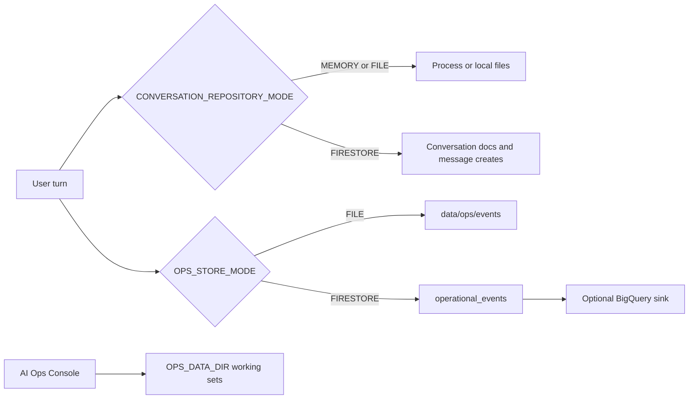

# Conversation and operations state

Conversation context, tickets, operational events, and backoffice working sets are different stores. A local file or an in-memory map is only authoritative when that mode is explicitly selected. On Cloud Run, conversation continuity and shared operational events require Firestore because instance disk is not shared and does not survive scale-to-zero.

## Conversation context

A conversation is isolated by tenant, Teams conversation, and Teams user. The repository key is `{tenant}::{teamsConversationId}::{teamsUserId}`. A missing tenant is stored as `-`, so a local run still gets a deterministic key and cannot collide with a tenant-scoped conversation. Different users in the same Teams conversation do not share context.

`CONVERSATION_REPOSITORY_MODE` selects the implementation:

| Mode | Store | When it is safe |
| --- | --- | --- |
| `MEMORY` | Process memory. This is the default. | Single-process tests and a local process that is not recycled. |
| `FILE` | Files under `conversation_store_path`, or `data/conversations`. | One local process. Not shared across Cloud Run instances. |
| `FIRESTORE` | Firestore collection named by `CONVERSATION_FIRESTORE_COLLECTION`. | Multi-instance and scale-to-zero. This is the Cloud Run mode. |

Firestore layout:

- `{collection}/{conversationId}` holds metadata: isolation key, tenant, activity timestamps, and `expiresAt`.
- `{collection}/{conversationId}/messages/{messageId}` is one document per message. Appending a message is a document create, not an update of an array, so two instances cannot clobber each other's turn.
- `{collection}_keys/{sha256(conversationKey)}` maps the isolation key to the newest conversation id, so lookup stays a point read.

Message order comes from `sortKey` (`{createdAt microseconds}-{per-instance counter}-{random}`). Two messages written by different instances in the same microsecond are concurrent; their relative order is not a contract.

Retention and timeout are separate. Every document carries `expiresAt`, but Firestore does not delete on that field until an operator enables a TTL policy. Conversation timeout does not wait for TTL. `find_conversation` treats a document as absent when `lastActivityAt` is older than the timeout, even if the document has not been collected yet.

Related: [Issue resolution workflow](/openwiki/workflows/issue-resolution.md).

## Operational events

`OPS_STORE_MODE` selects the primary operational-event store. The default is `FILE`, under `OPS_STORE_PATH` (`data/ops/events` when unset). `MEMORY` and `FIRESTORE` are the other primary modes. `FIRESTORE` writes append-only documents keyed by `event_id`; a second append of the same id is rejected.

BigQuery is not the primary store. It is an optional sink (`OPS_BIGQUERY_ENABLED`). A sink requires durable delivery. In production, that delivery path requires `OPS_STORE_MODE=FIRESTORE` and a Firestore journal. File mode can deliver through a local SQLite outbox, which is not shared across instances. The journal records the event before sinks run, so a sink failure does not drop the accepted primary write.

Freshness watermarks follow the same mode: a file under the ops directory, or a Firestore collection when the operational store is Firestore.

Related: [Quality and governance operations](/openwiki/workflows/quality-operations.md), [Cloud deployment](/openwiki/operations/cloud-deployment.md).

## Backoffice working sets

The AI Ops Console reads and writes file datasets under `OPS_DATA_DIR`, which defaults to `data/ops`. Those files are the local working set for FAQs, examples, quality cases, budgets, prompt candidates, governance, pricing rules, evaluation gates, and source records. They are not a second copy of the conversation transcript or the operational-event log. Point the directory with `OPS_DATA_DIR` or the per-store path variables when a deployment must not use the repository checkout.

## Tickets

The mock ticket service is a test stand-in, not the enterprise ticket system. `MOCK_TICKET_STORE_MODE=MEMORY` (the default) keeps tickets in the process. `FIRESTORE` writes each ticket as a document in `MOCK_TICKET_COLLECTION` (`mock_tickets` by default) so a recycled Cloud Run instance still finds it. When `MOCK_TICKET_TOKEN` is set, mutating calls must present that bearer token; the token value is not part of this wiki.

