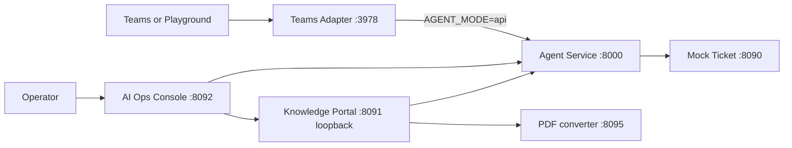

# Runtime topology

This repository is several processes, not one server. `./start.sh` is the local composer. Each process owns its own port and must not be treated as a library of the others. Users and Teams clients enter through the public edges. Knowledge Portal and the PDF converter stay behind the AI Ops Console.

## Processes

| Process | Local port | Who calls it |
| --- | --- | --- |
| Teams Adapter (`teams-agent`) | `3978` (`PORT`) | Teams, the Dev Tunnel, and the Playground. It calls Agent Service. |
| Agent Service | `8000` (`RAG_PORT` / `PORT`) | The adapter, the portal, and the backoffice. Not a user entry. |
| AI Ops Console | `8092` | Operators. This is the only operations product entry. |
| Knowledge Portal | `8091` under `start.sh`, bound to `127.0.0.1` | The console's knowledge bridge. Not a browser entry. |
| Mock Ticket | `8090` | Agent Service in local ticket tests. |
| PDF converter | `8095` | Knowledge Portal, for PDF-to-Markdown. |
| Agents Playground | `3979` | Local testers. It forwards chat to the adapter. |

`start.sh` refuses to start if Knowledge Portal and Mock Ticket share a port. The portal binary's own default is `8090`, which collides with Mock Ticket, so an orchestrated run must keep `KNOWLEDGE_PORTAL_PORT=8091`. Do not open `8091` as a product UI.

## Call directions

`start.sh` starts the adapter with `AGENT_MODE=api` and `AGENT_API_URL` pointed at `http://127.0.0.1:{RAG_PORT}/agent/chat`. The adapter binary itself defaults to `AGENT_MODE=echo` and will not call Agent Service unless `AGENT_MODE=api` and `AGENT_API_URL` are set. A process started outside `start.sh` can therefore look healthy while answering with echo behavior.

The Playground is a test client, not a second adapter. Its `ADAPTER_TARGET_URL` is the Teams Adapter. Its own `/_adapter/api/messages` path is the bot endpoint the playground UI posts to; the gateway then forwards to the adapter.

The console talks to the portal on `KNOWLEDGE_PORTAL_INTERNAL_URL`. `start.sh` sets that to the loopback portal and sets `KNOWLEDGE_PORTAL_PUBLIC_URL` to the console origin so browsers stay on `8092`. The knowledge bridge is on by default (`AI_OPS_KNOWLEDGE_BRIDGE_ENABLED=true`) and will not start without a delegation secret. Do not copy that secret into docs or chat.

The PDF converter is an integration helper for the portal (`POST /api/v1/convert-pdf`). It is not part of the Teams message path. Production prefers the upstream converter image; the in-repo service is the contract shim and local fallback.

## Knowledge data plane

Cloud formal knowledge is not stored on Agent Service disk. Firestore holds release state and the active-release pointer; private GCS holds immutable release artifacts (manifest, index, sources, assets, catalog). When `KNOWLEDGE_RELEASE_STORE_MODE=GCS`, a background syncer mirrors the cloud active release into the local `knowledge_cache` directory (default under the Agent data dir). Playground and local Agent RAG load that verified snapshot; they do not query Firestore or GCS on each chat turn. Follow-cloud selection can hot-switch after a successful sync; pinned and local-sandbox selections keep their loaded release.

Related: [Local GCS knowledge sync](/openwiki/workflows/local-gcs-knowledge-sync.md), [Knowledge release](/openwiki/workflows/knowledge-release.md), [Local runtime](/openwiki/operations/local-runtime.md), [Teams inbound messaging](/openwiki/workflows/teams-inbound.md), [Cloud deployment](/openwiki/operations/cloud-deployment.md).
