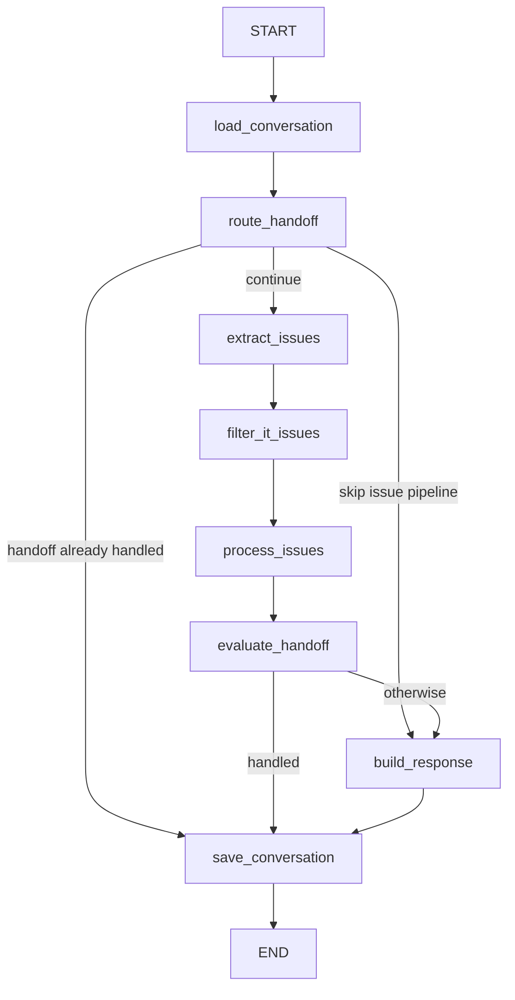

# Issue resolution workflow

One user turn is one LangGraph invocation. Conversation memory is loaded at the start and saved at the end. That is not a checkpointer. An interrupted turn does not resume at `process_issues`. Retry starts again at `START`.

## Graph

`route_handoff` can short-circuit. If the turn is a handoff reply already handled, the graph saves and stops. If the turn should skip issue extraction, it builds a response and saves. Otherwise it extracts issues.

## Inside one issue

`MAX_ISSUES_PER_MESSAGE` defaults to 3. Non-IT issues are filtered before `process_issues`. Remaining issues do not block each other.

For each issue, the order is fixed:

1. A deterministic ticket intent of delete-denied or cancel returns that result and does not search.
2. `CREATE` or `QUERY` ticket intent calls the ticket handler. Query returns the current user's tickets. Create still requires the confirmation path. The extractor marking a route as `TICKET` is not enough.
3. `NEED_MORE_INFO` runs a retrieval probe first. If the probe is answerable it returns that knowledge result; otherwise it returns the missing questions with `CLARIFICATION_REQUIRED` and does not invent an answer.
4. Route `FAQ` loads the FAQ entry for the user's groups and returns the answer verbatim. No model rewrite. A miss or a disabled entry falls through to knowledge search. It does not fail the turn.
5. Route `KNOWLEDGE` searches. Retrieval details are in [Retrieval backends](/openwiki/workflows/retrieval.md).
6. Route `TICKET` without a `CREATE` or `QUERY` intent does not call the ticket API. It returns `NO_KNOWLEDGE`.

A ticket create or query, a handoff offer, and an operational-event append are external side effects. They must stay idempotent before anyone enables LangGraph interrupt/resume. Production Cloud Run leaves ticket mode disabled. The HTTP ticket adapter is tested against the mock service, not a real service desk.

Related: [Teams inbound messaging](/openwiki/workflows/teams-inbound.md), [Conversation and operations state](/openwiki/architecture/conversation-and-ops-state.md).
