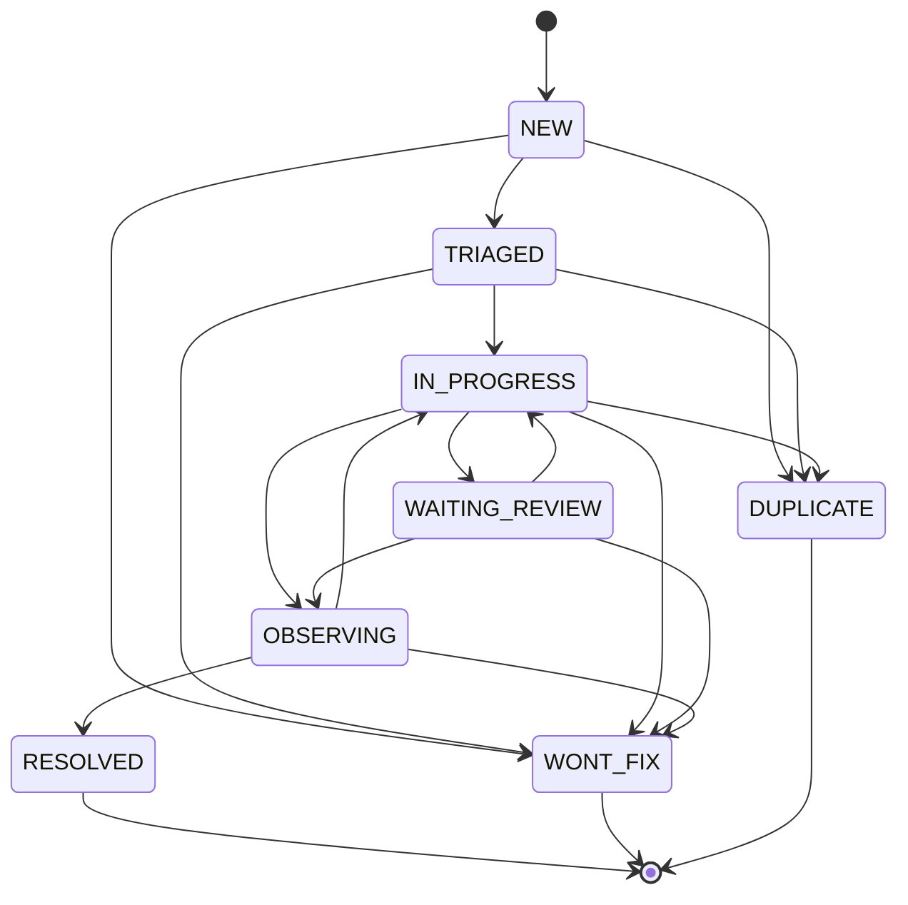

# Quality and governance operations

Quality cases and evaluation gates are separate mechanisms. A case tracks an operator's response to a bad answer. A gate decides whether a candidate may become the active knowledge or FAQ target. Closing a case does not publish knowledge. Publishing knowledge does not close a case.

## Quality case lifecycle

Allowed transitions are closed. Any other move is rejected.

`RESOLVED`, `WONT_FIX`, and `DUPLICATE` are terminal. Candidates can be merged into a case only while they are open. Linking an FAQ from `IN_PROGRESS` or `WAITING_REVIEW` moves the case to `OBSERVING`. Observation metrics are refused unless the case is already `OBSERVING`.

The console is the operator surface. It does not replace the knowledge release path. A knowledge edit still has to go through review and publish before retrieval changes. See [Knowledge release](/openwiki/workflows/knowledge-release.md).

## Evaluation gate

An activation checker, when wired, evaluates the candidate run against the gate policy before the active pointer moves. Blocking reasons include:

- The run's manifest hash is not the target being activated.
- The set version is not in the policy's required set.
- The run has no summary.
- Coverage is below the policy minimum.
- A zero-tolerance policy has any critical failure.
- Pass rate is below the policy minimum.
- Regressions exceed the policy maximum.

`ENFORCE` fails closed and raises. A missing checker is treated as report-only allow so local unit tests that do not wire the gate service can still run. Do not treat a missing checker as proof that production allows the activation. When the checker is injected, an enforce failure must stop the activation.

## Governance inputs

Prompt and model governance is a different store from the case file. Candidate prompt text and datasets are rejected if they contain secret material or injection markers. Production model credentials stay secret references, not copied values. A governance change that is not activated through the release gate does not by itself change what the agent answers.

Related: [Verification](/openwiki/testing/verification.md), [Cloud deployment](/openwiki/operations/cloud-deployment.md).
