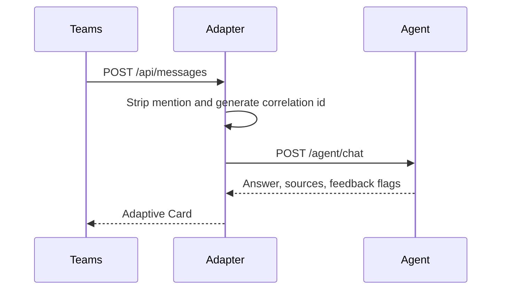

# Teams inbound messaging

Teams never calls Agent Service. It calls the adapter's `POST /api/messages`. The Microsoft Teams SDK registers that route and validates the Bot Framework JWT. The adapter then calls Agent Service when it is in `api` mode. See [Runtime topology](/openwiki/architecture/runtime-topology.md) and [Identity and access](/openwiki/integrations/identity-and-access.md).

## Message path

`on_message` wraps the turn so a handler exception still replies to the user. The SDK reports the error and does not send that reply itself. The user sees a service-unavailable message with a correlation id, not a stack trace.

Empty text after mention stripping gets a short acknowledgement and does not call the agent. A help command reports the current adapter mode and does not call the agent either.

A real turn generates one correlation id and sends it as both `requestId` and `correlationId`. The adapter does not regenerate that id for retries inside the turn. User email comes from the activity when Teams populated it. Graph is used only when that email is missing and directory mode is enabled.

## Card and feedback

The reply is an Adaptive Card built by `build_agent_activity`. Feedback buttons are attached only when the agent response has feedback enabled, a conversation id is present, and the issue result is feedback-eligible. A button submit carries a marker. `on_message` treats that marker as feedback and does not start a new issue turn. The gateway posts it to `/feedback` on the same Agent Service host as `AGENT_API_URL`. Echo mode does not send feedback.

## What else is on the adapter port

`/healthz` and `/readyz` are probes and return no user data. `/rag-assets/{path}` is how Teams loads cited images. Those URLs are HMAC-signed and expiring because the Teams client fetches them without a bearer token. Source viewer routes use enterprise SSO and viewer tokens. They are not the messaging path.

Related: [Issue resolution workflow](/openwiki/workflows/issue-resolution.md).
